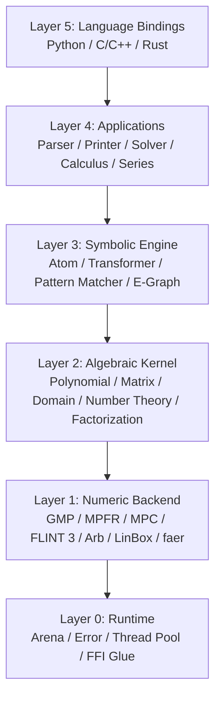

# oCAS Architecture

This document describes the architecture of **oCAS**, an LGPL-3.0+ Rust computer algebra system.

## Design Principles

1. **Performance first**: zero-copy parsing, arena allocation, hash consing, SIMD, parallelization, and mature LGPL numerical backends.
2. **License clarity**: default build uses only LGPL-compatible backends. GPL-only backends are isolated in `ocas-gpl`.
3. **Layered design**: each layer depends only on lower layers; language bindings sit at the top.
4. **Multi-language consistency**: Rust is the source of truth; Python and C/C++ are thin wrappers.
5. **Backend pluggability**: polynomial, matrix, and number backends can be swapped via traits.

## Layered Architecture



## Crate Responsibilities

| Crate | Layer | Responsibility |
|---|---|---|
| `ocas-core` | 0 + 1 | Arena allocator, unified errors, thread pool, FFI glue, backend wrappers |
| `ocas-domain` | 2 | Algebraic domains: integers, rationals, finite fields, algebraic numbers, real balls, complex numbers |
| `ocas-poly` | 2 | Dense and sparse polynomial representations, GCD, factorization, Gröbner bases, series |
| `ocas-atom` | 3 | Expression tree (`Atom`), normalization, transformers, pattern matching, e-graph integration |
| `ocas-calc` | 4 | Differentiation, integration, equation solving, series expansion |
| `ocas-eval` | 4 | Interpreter, AST compiler, JIT via Cranelift/LLVM |
| `ocas-parse` | 4 | Lexer, parser, Mathematica/Python syntax support |
| `ocas` | 5 | Top-level Rust API and prelude |
| `ocas-py` | 5 | Python bindings via PyO3 |
| `ocas-c` | 5 | C/C++ bindings via cbindgen + C-ABI shim |
| `ocas-gpl` | - | Optional GPL-only backends isolated in a separate crate |
| `ocas-tests` | - | Integration tests, regression tests, benchmarks |

## Data Flows

### Parse → Normalize → Simplify

```text
Input string
    │
    ▼
Lexer (logos)
    │
    ▼
Parser (chumsky / recursive descent)
    │
    ▼
Raw Atom (arena allocated)
    │
    ▼
Normalizer
    │
    ▼
Canonical Atom  ──▶  E-Graph (optional, egg)
    │
    ▼
Simplified Atom
```

### Evaluate

```text
Atom + variable bindings
    │
    ▼
Backend selector (domain-driven)
    │
    ├──▶ Interpreter (generic, slow)
    ├──▶ AST compiler (instruction sequence + constant folding)
    └──▶ JIT compiler (Cranelift / LLVM)
                │
                ▼
        DomainValue
```

### Differentiate

```text
Atom + variable
    │
    ▼
Recursive rule engine
    │
    ▼
Basic derivative table
    │
    ▼
Intermediate Atom
    │
    ▼
Simplifier
    │
    ▼
Derivative Atom
```

### Factor

```text
Atom (polynomial)
    │
    ▼
Convert to internal polynomial representation
    │
    ▼
Backend selector
    │
    ├──▶ FLINT 3 (univariate / multivariate)
    ├──▶ NTL (finite field factorization)
    └──▶ Pure-Rust fallback (Wang / EEZ)
                │
                ▼
        Factor list + remainder
```

### Solve

```text
Equation or system
    │
    ▼
Classifier
    │
    ├──▶ Linear: faer / LinBox
    ├──▶ Polynomial: Gröbner basis + root isolation
    └──▶ Transcendental: numerical / heuristic solver
                │
                ▼
        Solution set (exact or numeric)
```

## Memory Management

### Arena Allocation

- Each expression tree lives in an `Arena`.
- Sub-nodes are bump-allocated; the entire tree is freed at once when the arena is dropped.
- This avoids the overhead of per-node `Box`/`Rc` allocation and improves cache locality.

### External Object Lifetimes

| Object | Strategy |
|---|---|
| GMP `mpz_t` / `mpq_t` | Rust wrapper with `Drop` |
| FLINT objects | Rust wrapper with `Drop` |
| Shared immutable expressions | `Arc<Atom>` or borrowed reference |
| Python/C objects | Opaque pointer + reference count; Rust owns final drop |

### Multi-threading

- `Arena` is thread-local by default.
- Read-only expression trees can be shared across threads via `Arc` or immutable references.
- Parallel computation uses `rayon`.

## Error Handling

- Unified error type `OcasError` in `ocas-core`.
- Categories:
  - `ParseError { span, message }`
  - `DomainError { expected, found }`
  - `NumericOverflow`
  - `UnsupportedOperation`
  - `BackendError`
- Rust API: `Result<T, OcasError>`.
- FFI layer: `ocas_error_t` out-pointer + C string message.
- Python bindings: map to custom Python exception classes.

## Multi-Language Binding Strategy

### Rust API

- The native API is the most complete and has zero overhead.
- Exposed through the `ocas` crate prelude.

### Python API

- Built with PyO3.
- Wraps Rust types as Python classes (`Expression`, `Polynomial`, `Domain`, `Matrix`).
- Python objects hold a reference to the Rust arena; freeing the Python object drops the arena.

### C/C++ API

- cbindgen generates C headers from Rust `#[no_mangle]` functions.
- A hand-written C-ABI shim provides stable opaque pointers:
  ```c
  ocas_expr_t* ocas_parse(const char* s, ocas_error_t* err);
  void ocas_expr_free(ocas_expr_t* e);
  const char* ocas_expr_to_string(ocas_expr_t* e);
  ```
- C++ users can wrap these in RAII classes.

## License Boundaries

### LGPL-Compatible Default Stack

The following backends can be linked directly into the LGPL-3.0+ core without forcing GPL:

- GMP (LGPL-3.0+ / GPL-2.0+)
- MPFR (LGPL-3.0+)
- MPC (LGPL-3.0+)
- FLINT 3 / Arb (LGPL-2.1+)
- LinBox (LGPL-2.1+)
- Givaro (LGPL-2.1+ / CeCILL-B)
- Piranha (LGPL option)
- faer (MIT / Apache-2.0)
- ndarray (MIT / Apache-2.0)
- SymEngine (MIT)
- Cranelift / LLVM (Apache-2.0 with LLVM exceptions)
- egg (MIT)
- PyO3 (MIT / Apache-2.0)

### GPL-Only Optional Backends

The following are isolated in `ocas-gpl` and disabled by default:

- NTL (GPL-2.0+)
- Singular (GPL-2.0+ / GPL-3.0)
- PARI/GP (GPL-2.0+)
- GiNaC (GPL-2.0+)
- SageMath interfaces (GPL-3.0)
- Normaliz (GPL-3.0+)
- polymake (GPL-2.0+)

Enabling `ocas-gpl` will produce a combined work under GPL terms.

## Feature Flags

```toml
[features]
default = ["gmp", "mpfr", "flint"]
gmp = ["ocas-core/gmp"]
mpfr = ["ocas-core/mpfr"]
flint = ["ocas-core/flint"]
linbox = ["ocas-core/linbox"]
llvm = ["ocas-eval/llvm"]
gpl = ["ocas-gpl"]
python = ["ocas-py"]
```

## Testing Strategy

| Level | Tool | Purpose |
|---|---|---|
| Unit tests | `cargo test` | Per-crate correctness |
| Property tests | `proptest` | Algebraic identities |
| Fuzz tests | `cargo fuzz` | Parser and FFI robustness |
| Regression tests | `ocas-tests` | Compare with SymPy/SageMath outputs |
| Benchmarks | `criterion.rs` | Polynomial GCD, factorization, Gröbner bases |
| License audit | `cargo-deny` | Prevent accidental GPL contamination |

## Performance Strategies

- **Zero-copy parsing**: tokens reference the input string when possible.
- **Hash consing**: structurally identical subexpressions share memory.
- **Backend specialization**: select the fastest backend for each domain and size.
- **SIMD**: use `std::simd` / `packed_simd` for dense polynomial evaluation and numerical kernels.
- **Parallelization**: `rayon` for map operations, matrix kernels, and Gröbner basis selection.
- **JIT**: Cranelift for repeated expression evaluation; LLVM for heavily optimized AOT kernels.

## Open Questions

- Whether to use `egg` directly or fork it for CAS-specific cost functions.
- How to expose algebraic numbers and interval arithmetic cleanly across all three language APIs.
- Whether to support Mathematica syntax natively or only as a compatibility shim.

## See Also

- [README.md](README.md)
- [ROADMAP.md](ROADMAP.md)
- [CONTRIBUTING.md](CONTRIBUTING.md)
