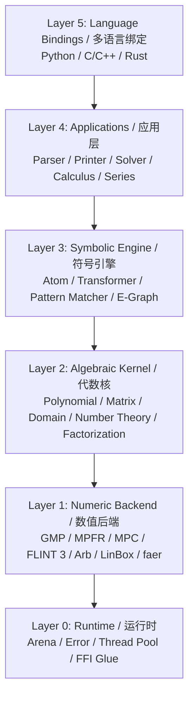

# oCAS Architecture / oCAS 架构

**English**

This document describes the architecture of **oCAS**, an LGPL-3.0+ Rust computer algebra system.

**中文**

本文档描述 **oCAS** 的架构，这是一个基于 LGPL-3.0+ 许可证的 Rust 计算机代数系统。

---

## Design Principles / 设计原则

**English**

1. **Performance first**: zero-copy parsing, arena allocation, hash consing, SIMD, parallelization, and mature LGPL numerical backends.
2. **License clarity**: default build uses only LGPL-compatible backends. GPL-only backends are isolated in `ocas-gpl`.
3. **Layered design**: each layer depends only on lower layers; language bindings sit at the top.
4. **Multi-language consistency**: Rust is the source of truth; Python and C/C++ are thin wrappers.
5. **Backend pluggability**: polynomial, matrix, and number backends can be swapped via traits.

**中文**

1. **性能优先**：零拷贝解析、arena 分配、hash consing、SIMD、并行化以及成熟的 LGPL 数值后端。
2. **许可证清晰**：默认构建仅使用 LGPL 兼容后端；GPL 专属后端隔离在 `ocas-gpl` 中。
3. **分层设计**：每一层只依赖更底层；语言绑定位于顶层。
4. **多语言一致性**：Rust 是权威实现；Python 与 C/C++ 是薄封装。
5. **后端可插拔**：多项式、矩阵与数值后端可通过 trait 替换。

---

## Layered Architecture / 分层架构



---

## Crate Responsibilities / Crate 职责

| Crate | Layer / 层级 | Responsibility / 职责 |
|---|---|---|
| `ocas-core` | 0 + 1 | Arena allocator, unified errors, thread pool, FFI glue, backend wrappers / arena 分配器、统一错误、线程池、FFI 胶水、后端封装 |
| `ocas-domain` | 2 | Algebraic domains: integers, rationals, finite fields, algebraic numbers, real balls, complex numbers / 代数域：整数、有理数、有限域、代数数、实数球、复数 |
| `ocas-poly` | 2 | Dense and sparse polynomial representations, GCD, factorization, Gröbner bases, series / 稠密与稀疏多项式表示、最大公因式、因式分解、Gröbner 基、级数 |
| `ocas-atom` | 3 | Expression tree (`Atom`), normalization, transformers, pattern matching, e-graph integration / 表达式树（Atom）、规范化、转换器、模式匹配、e-graph 集成 |
| `ocas-calc` | 4 | Differentiation, integration, equation solving, series expansion / 微分、积分、方程求解、级数展开 |
| `ocas-eval` | 4 | Interpreter, AST compiler, JIT via Cranelift/LLVM / 解释器、AST 编译器、Cranelift/LLVM JIT |
| `ocas-parse` | 4 | Lexer, parser, Mathematica/Python syntax support / 词法分析器、语法分析器、Mathematica/Python 语法支持 |
| `ocas` | 5 | Top-level Rust API and prelude / 顶层 Rust API 与 prelude |
| `ocas-py` | 5 | Python bindings via PyO3 / 基于 PyO3 的 Python 绑定 |
| `ocas-c` | 5 | C/C++ bindings via cbindgen + C-ABI shim / 基于 cbindgen 与 C-ABI 封装的 C/C++ 绑定 |
| `ocas-gpl` | - | Optional GPL-only backends isolated in a separate crate / 隔离在单独 crate 中的可选 GPL 专属后端 |
| `ocas-tests` | - | Integration tests, regression tests, benchmarks / 集成测试、回归测试、基准测试 |

---

## Data Flows / 数据流

### Parse → Normalize → Simplify / 解析 → 规范化 → 化简

```text
Input string / 输入字符串
    │
    ▼
Lexer (tokens) / 词法分析
    │
    ▼
Parser (chumsky / recursive descent) / 语法分析
    │
    ▼
Raw Atom (arena allocated) / 原始 Atom（arena 分配）
    │
    ▼
Normalizer / 规范化
    │
    ▼
Canonical Atom  -->  E-Graph (optional, egg) / 规范 Atom --> E-Graph（可选）
    │
    ▼
Simplified Atom / 化简后的 Atom
```

### Evaluate / 求值

```text
Atom + variable bindings / Atom + 变量绑定
    │
    ▼
Backend selector (domain-driven) / 后端选择器（按域驱动）
    │
    ├──▶ Interpreter (generic, slow) / 解释器（通用、较慢）
    ├──▶ AST compiler (instruction sequence + constant folding) / AST 编译器
    └──▶ JIT compiler (Cranelift / LLVM) / JIT 编译器
                │
                ▼
        DomainValue / 域值
```

### Differentiate / 求导

```text
Atom + var / Atom + 变量
    │
    ▼
Recursive rule engine / 递归规则引擎
    │
    ▼
Basic derivative table / 基本导数表
    │
    ▼
Intermediate Atom / 中间 Atom
    │
    ▼
Simplifier / 化简器
    │
    ▼
Derivative Atom / 导数 Atom
```

### Factor / 因式分解

```text
Atom (polynomial) / Atom（多项式）
    │
    ▼
Convert to internal polynomial representation / 转换为内部多项式表示
    │
    ▼
Backend selector / 后端选择器
    │
    ├──▶ FLINT 3 (univariate / multivariate) / 单/多变元
    ├──▶ NTL (finite field factorization) / 有限域因式分解
    └──▶ Pure-Rust fallback (Wang / EEZ) / 纯 Rust 回退
                │
                ▼
        Factor list + remainder / 因式列表 + 余式
```

### Solve / 求解

```text
Equation or system / 方程或方程组
    │
    ▼
Classifier / 分类器
    │
    ├──▶ Linear: faer / LinBox / 线性
    ├──▶ Polynomial: Gröbner basis + root isolation / 多项式
    └──▶ Transcendental: numerical / heuristic solver / 超越方程
                │
                ▼
        Solution set / 解集
```

---

## Memory Management / 内存管理

### Arena Allocation / Arena 分配

**English**

- Each expression tree lives in an `Arena`.
- Sub-nodes are bump-allocated via `Arena::allocate_with`, which constructs the
  value inside a closure; the entire tree is freed at once when the arena is
  dropped.
- This avoids the overhead of per-node `Box`/`Rc` allocation and improves cache
  locality.

### 0.1.0 limitation / 0.1.0 限制

**English**

The current `Arena` intentionally does not run destructors for allocated
values. It is therefore only safe to store `Copy` types or types that do not
own resources requiring explicit cleanup. A type-erased drop mechanism will be
added once expression trees need to store owned strings or other `Drop` types.

**中文**

当前 `Arena` 故意不运行已分配值的析构函数。因此，仅可安全存放 `Copy`
类型或无需显式清理资源的类型。当表达式树需要存放拥有的字符串或其他
`Drop` 类型时，将添加类型擦除的 drop 机制。

**中文**

- 每个表达式树存在于一个 `Arena` 中。
- 子节点通过 bump allocation 分配；arena 被 drop 时整棵树一次性释放。
- 这避免了每个节点使用 `Box`/`Rc` 的开销，并提升缓存局部性。

### External Object Lifetimes / 外部对象生命周期

| Object / 对象 | Strategy / 策略 |
|---|---|
| GMP `mpz_t` / `mpq_t` | Rust wrapper with `Drop` / 带 Drop 的 Rust 包装 |
| FLINT objects / FLINT 对象 | Rust wrapper with `Drop` / 带 Drop 的 Rust 包装 |
| Shared immutable expressions / 共享不可变表达式 | `Arc<Atom>` or borrowed reference / Arc 或借用引用 |
| Python/C objects / Python/C 对象 | Opaque pointer + reference count; Rust owns final drop / 不透明指针 + 引用计数 |

### Multi-threading / 多线程

**English**

- `Arena` is thread-local by default.
- Read-only expression trees can be shared across threads via `Arc` or immutable references.
- Parallel computation uses `rayon`.

**中文**

- `Arena` 默认线程本地。
- 只读表达式树可通过 `Arc` 或不可变引用跨线程共享。
- 并行计算使用 `rayon`。

---

## Error Handling / 错误处理

**English**

- Unified error type `OcasError` in `ocas-core`.
- Categories:
  - `ParseError { span, message }`
  - `DomainError { expected, found }`
  - `NumericOverflow`
  - `UnsupportedOperation`
  - `BackendError`
- Rust API returns `Result<T, OcasError>`.
- FFI layer provides `ocas_error_t` out-pointer and C string message.
- Python bindings map to custom Python exception classes.

**中文**

- `ocas-core` 中统一错误类型 `OcasError`。
- 分类：
  - `ParseError { span, message }`
  - `DomainError { expected, found }`
  - `NumericOverflow`
  - `UnsupportedOperation`
  - `BackendError`
- Rust API 返回 `Result<T, OcasError>`。
- FFI 层提供 `ocas_error_t` 输出指针与 C 字符串消息。
- Python 绑定映射到自定义 Python 异常类。

---

## Multi-Language Binding Strategy / 多语言绑定策略

### Rust API

**English**

- The native API is the most complete and has zero overhead.
- Exposed through the `ocas` crate prelude.

**中文**

- 原生 API 最完整且零开销。
- 通过 `ocas` crate 的 prelude 暴露。

### Python API

**English**

- Built with PyO3.
- Wraps Rust types as Python classes (`Expression`, `Polynomial`, `Domain`, `Matrix`).
- Python objects hold a reference to the Rust arena; freeing the Python object drops the arena.

**中文**

- 基于 PyO3 构建。
- 将 Rust 类型包装为 Python 类（`Expression`、`Polynomial`、`Domain`、`Matrix`）。
- Python 对象持有 Rust arena 引用；释放 Python 对象时 arena 被 drop。

### C/C++ API

**English**

- cbindgen generates C headers from Rust `#[no_mangle]` functions.
- A hand-written C-ABI shim provides stable opaque pointers:
  ```c
  ocas_expr_t* ocas_parse(const char* s, ocas_error_t* err);
  void ocas_expr_free(ocas_expr_t* e);
  const char* ocas_expr_to_string(ocas_expr_t* e);
  ```
- C++ users can wrap these in RAII classes.

**中文**

- cbindgen 从 Rust `#[no_mangle]` 函数生成 C 头文件。
- 手写 C-ABI 封装提供稳定的不透明指针：
  ```c
  ocas_expr_t* ocas_parse(const char* s, ocas_error_t* err);
  void ocas_expr_free(ocas_expr_t* e);
  const char* ocas_expr_to_string(ocas_expr_t* e);
  ```
- C++ 用户可将其包装为 RAII 类。

---

## License Boundaries / 许可证边界

### LGPL-Compatible Default Stack / LGPL 兼容默认栈

**English**

The following backends can be linked directly into the LGPL-3.0+ core without forcing GPL:

**中文**

以下后端可直接链接到 LGPL-3.0+ 核心而不会强制 GPL：

| Backend / 后端 | License / 许可证 | Notes / 备注 |
|---|---|---|
| GMP | LGPL-3.0+ / GPL-2.0+ | |
| MPFR | LGPL-3.0+ | |
| MPC | LGPL-3.0+ | |
| FLINT 3 / Arb | LGPL-2.1+ | |
| LinBox | LGPL-2.1+ | |
| Givaro | LGPL-2.1+ / CeCILL-B | |
| Piranha | LGPL option / LGPL 可选 | |
| faer | MIT / Apache-2.0 | |
| ndarray | MIT / Apache-2.0 | |
| SymEngine | MIT | |
| Cranelift / LLVM | Apache-2.0 with LLVM exceptions | |
| egg | MIT | |
| PyO3 | MIT / Apache-2.0 | |

### GPL-Only Optional Backends / GPL 专属可选后端

**English**

The following are isolated in `ocas-gpl` and disabled by default:

**中文**

以下后端隔离在 `ocas-gpl` 中，默认禁用：

- NTL (GPL-2.0+)
- Singular (GPL-2.0+ / GPL-3)
- PARI/GP (GPL-2.0+)
- GiNaC (GPL-2.0+)
- SageMath interfaces (GPL-3.0)
- Normaliz (GPL-3.0+)
- polymake (GPL-2.0+)

**English**

Enabling `ocas-gpl` will produce a combined work under GPL terms.

**中文**

启用 `ocas-gpl` 将产生受 GPL 条款约束的合并作品。

---

## Feature Flags / 功能开关

```toml
[features]
default = ["gmp", "mpfr", "flint"]
gmp = ["ocas-core/gmp"]
mpfr = ["ocas-domain/mpfr"]
flint = ["ocas-poly/flint"]
llvm = ["ocas-eval/llvm"]
gpl = ["ocas-gpl"]
python = ["ocas-py"]
```

---

## Testing Strategy / 测试策略

| Level / 层级 | Tool / 工具 | Purpose / 目的 |
|---|---|---|
| Unit tests / 单元测试 | `cargo test` | Per-crate correctness / 每个 crate 的正确性 |
| Property tests / 属性测试 | `proptest` | Algebraic identities / 代数恒等式 |
| Fuzz tests / 模糊测试 | `cargo fuzz` | Parser and FFI robustness / 解析器与 FFI 鲁棒性 |
| Regression tests / 回归测试 | `ocas-tests` | Compare with SymPy/SageMath outputs / 与 SymPy/SageMath 输出对比 |
| Benchmarks / 基准测试 | `criterion.rs` | Polynomial GCD, factorization, Gröbner bases / 多项式 GCD、因式分解、Gröbner 基 |
| License audit / 许可证审计 | `cargo-deny` | Prevent accidental GPL contamination / 防止意外 GPL 污染 |

---

## Performance Strategies / 性能策略

**English**

- **Zero-copy parsing**: tokens reference the input string when possible.
- **Hash consing**: structurally identical subexpressions share memory.
- **Backend specialization**: select the fastest backend for each domain and size.
- **SIMD**: use `std::simd` / `packed_simd` for dense polynomial evaluation and numerical kernels.
- **Parallelization**: `rayon` for map operations, matrix kernels, and Gröbner basis selection.
- **JIT**: Cranelift for repeated expression evaluation; LLVM for heavily optimized AOT kernels.

**中文**

- **零拷贝解析**：token 尽可能引用输入字符串。
- **Hash consing**：结构相同的子表达式共享内存。
- **后端特化**：为每个域和规模选择最快的后端。
- **SIMD**：在稠密多项式求值与数值核中使用 `std::simd` / `packed_simd`。
- **并行化**：map 操作、矩阵核、Gröbner 基筛选使用 `rayon`。
- **JIT**：重复表达式求值使用 Cranelift；重度优化 AOT 核使用 LLVM。

---

## Open Questions / 待决问题

**English**

- Whether to use `egg` directly or fork it for CAS-specific cost functions.
- How to expose algebraic numbers and interval arithmetic cleanly across all three language APIs.
- Whether to support Mathematica syntax natively or only as a compatibility shim.

**中文**

- 直接使用 `egg` 还是为其定制 CAS 专用代价函数进行 fork。
- 如何在三种语言 API 中干净地暴露代数数与区间算术。
- 原生支持 Mathematica 语法还是仅作为兼容层。

---

## See Also / 参见

- [README.md](README.md)
- [ROADMAP.md](ROADMAP.md)
- [CONTRIBUTING.md](CONTRIBUTING.md)
