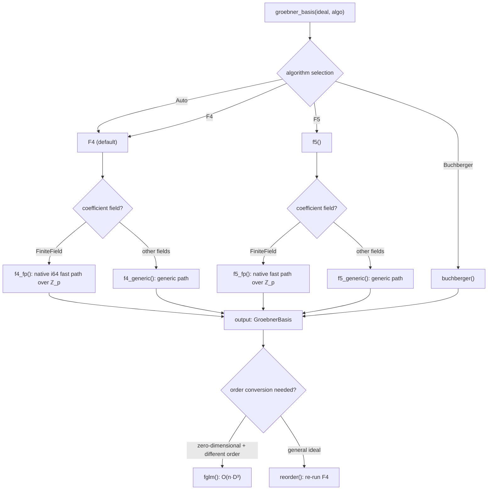

# Gröbner Basis Implementation

This chapter details the **implementation details** of Gröbner basis computation in oCAS — algorithm selection, data structures, key optimizations, and the internal pipeline. For the mathematical theory see [Gröbner Basis Theory](../math/groebner-theory.md); for API signatures see [Rust API Reference](../api/rust-groebner.md).

---

## Architecture Overview



The unified entry point `groebner_basis` accepts an `Algorithm` enum:

| Variant | Behavior |
|---|---|
| `Auto` | currently routes to F4 (the F5 switch point will be calibrated against cyclic-n benchmarks in the future) |
| `Buchberger` | classical S-polynomial iteration |
| `F4` | matrix batch reduction |
| `F5` | signature criterion |

All algorithms output a **reduced Gröbner basis** (`GroebnerBasis::minimize().auto_reduce()`).

---

## The Buchberger Algorithm

`GroebnerBasis::buchberger` implements the classical Buchberger algorithm:

1. Initialize the basis with the input polynomial set
2. Construct all critical pairs (S-polynomials)
3. For each pair, compute the S-polynomial and reduce it by multi-step division against the current basis
4. If the remainder is nonzero, add it to the basis and update the critical pairs
5. Repeat until no new polynomials are added
6. Finally call `minimize()` (remove redundancy) and `auto_reduce()` (mutually reduce)

```rust
pub fn buchberger<D: Domain, O: MonomialOrder>(
    ideal: &[SparseMultivariatePolynomial<D, O>],
) -> GroebnerBasis<D, O> {
    GroebnerBasis::buchberger(ideal).minimize().auto_reduce()
}
```

Buchberger suits small ideals and teaching scenarios. Production should use F4.

---

## The F4 Algorithm

F4 (Faugère 1999) replaces pairwise S-polynomial reduction with **batch sparse-matrix row echelon computation**. It is the default Gröbner basis algorithm in oCAS.

### Main Loop

The structure of the `f4` main loop:

```
initialize basis ← input polynomials
initialize pairs ← empty critical-pair set
for each initial polynomial: update_pairs(basis, pairs, simplifications, poly)

while pairs is not empty:
    (1) select all critical pairs from pairs with the minimum lcm degree
    (2) symbolic preprocessing: build the reduction matrix
    (3) row echelonization: Gaussian elimination
    (4) extract the surviving rows → new basis elements
    (5) for each new basis element: update_pairs(...)
```

### Critical Pairs and the Gebauer–Moeller Criterion

`CriticalPair` stores the indices of two basis elements and the precomputed lcm:

```rust
struct CriticalPair {
    idx1: usize,       // index of the first basis element
    idx2: usize,       // index of the second basis element
    lcm: SmallVec<[usize; 4]>,  // lcm of LM(idx1) and LM(idx2)
    degree: usize,     // total degree of the lcm
}
```

`update_pairs` implements Gebauer–Moeller critical-pair management, following the description in Becker–Weispfenning's *A Computational Approach to Commutative Algebra*. Its core consists of three criteria:

**First criterion (Chain Criterion)**: for an existing pair $(f_i, f_j)$, if there is an $f_k$ such that $\text{lcm}(f_i, f_k)$ divides $\text{lcm}(f_i, f_j)$ and $\text{lcm}(f_j, f_k)$ divides $\text{lcm}(f_i, f_j)$, then $(f_i, f_j)$ is redundant.

**Second criterion (Update Criterion)**: when a new polynomial is added, scan the existing pairs; if the lcm of the new polynomial's LM with one element of a pair strictly divides the pair's lcm, that pair can be removed.

**Redundant-pair cleanup**: remove pairs whose leading terms are already reducible by other elements of the basis.

### Symbolic Preprocessing

For the selected critical pairs, F4 builds a **sparse matrix** in which:
- each row corresponds to a polynomial (an S-polynomial or a multiple of a basis element)
- each column corresponds to a distinct monomial appearing in the matrix
- monomials are sorted in descending order of the current term order (column 0 = largest monomial)

The worklist algorithm of the preprocessing:

1. Add the two components of the S-polynomial pair to the matrix
2. For each monomial $\mathbf{x}^\alpha$ in the matrix, if there is a basis element $f_i$ with $\text{LT}(f_i) \mid \mathbf{x}^\alpha$, add $f_i \cdot (\mathbf{x}^\alpha / \text{LT}(f_i))$ to the matrix
3. Repeat until the worklist is empty

### DivisorIndex: Fast Divisor Queries

A naive implementation needs an $O(\text{number of monomials} \times \text{basis size})$ linear scan to find reducers. oCAS replaces this with `DivisorIndex`:

```rust
struct DivisorIndex {
    buckets: HashMap<u64, Vec<usize>>,
}
```

**Principle**: the **support** of each monomial (the set of variables with positive exponent) is represented as a 64-bit mask. Basis elements are bucketed by the support mask of their leading monomial. On a query, the support of a reducer of $\mathbf{x}^\alpha$ must be a submask of $\text{support}(\alpha)$ — enumerate the submasks (bit operations) and do an exact divisibility check in the corresponding bucket.

When selecting a reducer, the basis element with the **fewest terms** is preferred (ties broken by basis index), matching Buchberger's linear-scan behavior.

### SimpCache: Multiple Cache

```rust
type SimpCache<P> = Vec<(SmallVec<[usize; 4]>, P)>;
```

`get_simplified` looks up the already computed multiple `basis_poly * x^diff` for a given exponent difference `diff` in the cache. On a hit it returns directly, avoiding repeated multiplication. The cache persists across rounds, so the same S-polynomial multiple is constructed only once.

### Row Echelonization

Once the matrix is built, sparse Gaussian elimination is performed:

**ℤ_p fast path** (`echelonize_fp`):

```rust
fn echelonize_fp(
    matrix: &mut Vec<Vec<(i64, usize)>>,
    ncols: usize,
    prime: i64,
    pivots: &mut Vec<Option<usize>>,
)
```

- Sort the rows by leading column in ascending order
- Scan column by column: find the first nonzero row in the current column as the pivot
- Make the pivot row monic (multiply by the modular inverse of the leading coefficient)
- Eliminate the current column of the remaining rows with the pivot row
- `sub_scaled_fp` performs the sparse row subtraction: a two-pointer merge of two rows sorted by ascending column, skipping the leading column (the pivot is monic, so the leading column cancels automatically); the resulting coefficients are normalized to $[0, p)$, zero coefficients dropped

**Generic path** (`echelonize_generic`):

Same structure as the ℤ_p path, but uses the domain's generic `sub`/`mul`/`div` operations. `sub_scaled_generic` is likewise a two-pointer merge with zero coefficients dropped.

### The Native ℤ_p Fast Path (FpPoly)

When the coefficient domain is `FiniteField`, F4 automatically switches to `f4_fp`, in which all polynomial operations use `FpPoly` — a polynomial representation with pure `i64` modular arithmetic:

```rust
struct FpPoly {
    terms: Vec<(SmallVec<[usize; 4]>, i64)>,  // sorted descending by order; coefficients ∈ [0, p)
    n_vars: usize,
}
```

**Constraint**: $p < 2^{31}$, ensuring that the product of two residues still fits in `i64`.

`register_row_fp` implements a row cache across rounds, keyed by `(basis_idx, diff)`, avoiding repeated construction of the same S-polynomial or reducer multiple.

`monic_fp` computes the modular inverse with the extended Euclid algorithm
(`mod_inv`), normalizing the leading coefficient.

**Performance impact**: the ℤ_p path completely avoids `BigInt` allocations and uses lazy modular arithmetic in the row echelon step, bringing finite-field timings close to rational timings.

### Basis Post-Processing

After the F4 loop:

1. **`minimize()`**: remove redundant elements whose leading terms are divisible by the leading term of another basis element
2. **`auto_reduce()`**: for each basis element, reduce its tail (the non-leading part) by the remaining basis elements

---

## The F5 Algorithm

F5 (Faugère 2002) is a **signature-based** Gröbner basis algorithm. Its core idea: attach a "signature" to each polynomial and use the syzygy criterion to reject zero reducers **before** matrix construction, yielding order-of-magnitude speedups on hard ideals (such as cyclic-n).

Since version 0.19.0, F5 has been a production-grade implementation.

### Signatures and the pot Order

```rust
struct Signature {
    module_pos: usize,                     // index of the input generator (0-based)
    monomial: SmallVec<[usize; 4]>,        // multiplier monomial
}
```

A signature records the "history" of a polynomial: `module_pos` is the index of the input generator it originates from, and `monomial` is the monomial multiple applied to the module basis vector $\mathbf{e}_{\text{module\_pos}}$ of that generator.

Signatures are compared with the **pot** (position-over-term) order: first compare `module_pos` (smaller is more senior), then compare `monomial` with the monomial order $O$.

### LabeledPoly: Polynomials with Signatures

```rust
struct LabeledPoly<D: Domain, O: MonomialOrder> {
    poly: SparseMultivariatePolynomial<D, O>,
    sig: Signature,
}
```

Every polynomial in the F5 basis carries a signature. `LabeledPoly` implements the `BasisPoly` trait, so it can reuse F4's critical-pair management (`update_pairs`) and simplification cache.

### SyzygySet: Tracking Zero Reductions

```rust
struct SyzygySet {
    lms: HashMap<usize, Vec<SmallVec<[usize; 4]>>>,
}
```

When a matrix row reduces to zero, its signature is a syzygy. F5's syzygy criterion: **if the signature of a future row is a monomial multiple of a known syzygy signature, that row will also reduce to zero and can be skipped immediately**.

Internally, the leading monomials of the known syzygies are stored grouped by module position (`module_pos`). A query `(k, t)` checks whether any LM under position `k` divides `t`.

### The F5 Main Loop

The structure of `f5` resembles F4 with key differences:

```
for each input generator g_i (i = 0, 1, ...):
    attach the signature (i, 1) (unit monomial) to g_i
    add (i, 1) to the basis
    update_pairs(...)

while pairs is not empty:
    select a batch of critical pairs
    for each pair:
        construct the S-polynomial and compute its signature sig
        if syzygies.is_syzygy(sig):  ← key optimization: skip
            continue
    build_and_reduce(selected, basis, syzygies):
        (1) construct the matrix rows with signatures
        (2) row echelonization
        (3) rows that reduce to zero → add their signatures to syzygies
        (4) surviving rows → new basis elements (signatures retained)
    for each new basis element: update_pairs(...)
```

### The ℤ_p Fast Path of F5

Like F4, F5 has an `f5_fp` variant using `LabeledFpPoly` (`FpPoly` + signature):

```rust
struct LabeledFpPoly {
    poly: FpPoly,
    sig: Signature,
}
```

All polynomial operations run in `i64` modular arithmetic; `BigInt` conversions happen only at the input-reading and output-writing boundaries.

---

## The FGLM Order-Conversion Algorithm

FGLM (Faugère–Gianni–Lazard–Mora 1993) converts the Gröbner basis of a **zero-dimensional** ideal from one monomial order to another at a cost of $O(n \cdot D^3)$ field operations ($D$ being the staircase dimension) — far cheaper than re-running F4 on a general ideal.

### Core Idea

The **staircase** of a zero-dimensional ideal (the set of monomials not divisible by any leading monomial) is finite. FGLM traverses the monomials of the staircase in increasing **target order**, computes their normal forms with respect to the current basis, and detects linear dependencies:

```
compute_staircase(lms, n_vars):
    BFS from the unit monomial
    monomial m ∈ staircase ⟺ no LM divides m
    if the BFS does not terminate → positive dimension, return None

fglm(gb, TargetOrder):
    staircase ← compute_staircase(gb.lms)
    seen ← []  // normal forms of the traversed monomials (staircase coordinates)
    new_basis ← []

    traverse the monomials m of the staircase in increasing TargetOrder:
        nf ← normal_form_monomial(m, gb, staircase)
        coeffs ← find_relation(seen, nf)
        if coeffs exist:  // nf = Σ c_i · seen_i → linear dependency
            new_poly ← m - Σ c_i · m_i  // new basis element in target order
            new_basis.push(new_poly)
            mark_multiples(visited, m)  // skip multiples of m
        else:
            seen.push(nf)

    return GroebnerBasis::new(new_basis)
```

### Normal Form Computation

`normal_form_monomial` reduces a monomial $m$ against the source basis GB and expresses the result as a linear combination of staircase coordinates — a vector of length $\dim(R/I)$, one component per basis monomial of the staircase.

### Linear-Dependency Detection

`find_relation` uses Gaussian elimination over the field to detect whether coefficients $c_i$ exist such that $\text{nf} = \sum c_i \cdot \text{seen}_i$. If they exist, these coefficients determine the new basis polynomials.

### When None Is Returned

When the ideal is positive-dimensional (the staircase is infinite), `fglm` returns `None`. In that case one should use `reorder` instead (re-run F4 in the new order).

---

## Hilbert Series Computation

The `hilbert` module computes the Hilbert series and related invariants from a Gröbner basis.

### Hilbert Numerator (Inclusion–Exclusion)

For a monomial ideal $\langle m_1, \dots, m_s \rangle$, the Hilbert numerator is computed by inclusion–exclusion:

$$N(t) = \sum_{k=0}^{s} (-1)^k \sum_{|S|=k} t^{\deg \text{lcm}(S)}$$

`hilbert_numerator` iterates over all subsets of the generators, computes the degree of the lcm, and accumulates with the inclusion–exclusion sign. It is practical for up to about 20 generators.

### The Regularity Bound

`regularity_bound` returns the highest degree with a nonzero coefficient in the Hilbert numerator. This is an **early-termination hint** for F4 (Bayer–Stillman): F4 can stop selecting critical pairs whose degree exceeds the regularity bound — because all remaining S-polynomials will reduce to zero. Currently the bound is **advisory**; it does not change the computed result.

### The Full Hilbert Series

`hilbert_series` uses **Macaulay's theorem**: the Hilbert series of $R/I$ equals the Hilbert series of $R/\text{LT}(I)$ (where $\text{LT}(I)$ is the leading-term ideal).

```rust
struct HilbertSeries {
    numerator: Vec<i64>,       // coefficients of N(t), from the constant term upward
    denominator_power: usize,  // power of the denominator (1-t)^n (= number of variables)
}
```

Four methods are provided:
- `hilbert_function(d)`: the value of $\dim_k (R/I)_d$ at degree $d$
- `dimension()`: the Krull dimension of $R/I$
- `degree()`: the degree of the projective variety
- `hilbert_polynomial()`: Lagrange interpolation computes the full polynomial coefficients

The staircase dimension `staircase_dimension` is given by the value of the
inclusion–exclusion numerator at $t = 1$ (the enumeration grows
exponentially with the number of generators, so it is practical up to
about 20); it returns `None` when the ideal is positive-dimensional (the
numerator coefficients sum to 0).

---

## Ideal Operations

The `ocas_poly::ideal` module implements complete ideal arithmetic on top of Gröbner bases. All operations use the `Lex` order for consistency.

### Membership Testing

`ideal_contains(gens, f, algo)`:
1. Compute a Gröbner basis GB of the generators
2. Reduce $f$ against GB
3. The remainder is zero $\iff f \in I$

### Sum and Product

**Ideal sum** $I + J = \langle f_1, \dots, f_m, g_1, \dots, g_n \rangle$:
merge the two generator sets and compute the GB.

**Ideal product** $I \cdot J = \langle f_i \cdot g_j \rangle$:
take all pairwise products and compute the GB.

### Quotient (Rabinowitsch Trick)

$I : J = \{f : f \cdot g \in I, \forall g \in J\}$

For a single generator $g$, `quotient_single_generator` proceeds:

1. Introduce a new variable $w$ in the extended ring $k[x_1, \dots, x_n, w]$
2. Compute $\text{GB}(I' \cup \{1 - wg'\})$
3. Eliminate $w$ (take the elements of the Lex GB not containing $w$)
4. The result is $I : g \subset k[x_1, \dots, x_n]$

For multiple generators $J = \langle g_1, \dots, g_k \rangle$, compute $I : g_j$ separately and intersect.

### Saturation

$I : J^\infty = \bigcup_k (I : J^k)$

`ideal_saturate` iterates $I : J$, $(I : J) : J$, …, until stabilization (two consecutive results equal).

### Intersection (Auxiliary Variable Method)

$I \cap J = \langle t \cdot f_i, (1-t) \cdot g_j \rangle \cap k[x_1, \dots, x_n]$

`intersect_generators`:
1. Introduce an auxiliary variable $t$ (index 0)
2. Construct $t \cdot f_i$ and $(1-t) \cdot g_j$
3. Compute the Lex GB
4. Eliminate $t$ (take the elements not containing $t$)

### Elimination

`eliminate(gens, elim_vars, algo)`:

Exploits the natural elimination property of the Lex order: under Lex, a reduced GB automatically contains generators of the elimination ideal. Take the polynomials of the GB that do not involve the first `elim_vars` variables.

---

## Zero-Dimensional Solving

`solve_polynomial_system` classifies the equation system and computes real solutions.

### Dimension Detection

`is_zero_dimensional` checks that for each variable $x_i$ the GB contains a pure power $x_i^N$ as some leading monomial. Equivalently, the staircase (standard monomials) is finite.

### Solving by Triangular Decomposition

For zero-dimensional systems, `solve_triangular` performs:

1. Take the Lex GB (which naturally has triangular form)
2. **Back-substitute** starting from the last variable (smallest in Lex):
   - extract the polynomial involving only the single variable $x_n$ → univariate equation → compute real roots
   - substitute each root of $x_n$ into the polynomials involving $x_{n-1}, x_n$
   - recursively solve for $x_{n-1}$, …
3. Real roots are computed by Sturm root isolation (at `f64` precision)

`compute_vector_space_dim` returns the vector-space dimension of $k[x_1, \dots, x_n]/I$ (the product of the degrees of the univariate polynomials in each variable).

### Classification of Solutions

```rust
enum PolynomialSystemSolution {
    ZeroDimensional(ZeroDimSolutions),  // finitely many real solutions
    PositiveDimensional(GroebnerBasis), // infinite solution set; returns the Lex GB
    Empty,                               // no solution (ideal = ⟨1⟩)
}
```

---

## Primary Decomposition and Radicals

### Zero-Dimensional Radicals

`radical_zero_dim`: take the **square-free decomposition** of each univariate polynomial in the Lex GB, replace the original polynomials by their square-free factors, and recompute the GB.

### Positive-Dimensional Radicals

`radical_via_jacobian` (a simplified Kemper algorithm, characteristic 0):

1. Compute the partial derivatives $\partial f_i / \partial x_j$ of all generators with respect to all variables
2. Take the GCD of all nonzero partial derivatives as $h$
3. $\sqrt{I} = I : h^\infty$ (implemented via saturation)

If the Jacobian is trivial (all derivatives zero or $h = 1$), it falls back to returning the original GB.

### Zero-Dimensional Primary Decomposition

`primary_decomp_zero_dim`:

1. Take the **irreducible factorization** of the univariate polynomials in the Lex GB
2. Each irreducible factor $p_i^{e_i}$ corresponds to one primary component
3. Separate the components by saturation: $Q_i = I : \prod_{j \neq i} p_j^\infty$
4. The associated prime ideal is $\mathfrak{p}_i = \langle p_i \rangle$

Returns `Vec<PrimaryComponent>`, each containing:
- `primary`: the GB of the primary ideal
- `prime`: the GB of the associated prime ideal

### Primality and Primary Testing

- `is_prime_ideal`: for zero-dimensional ideals, checks whether the univariate polynomial is irreducible; conservatively returns `false` for positive-dimensional ideals
- `is_primary_ideal`: checks whether there is exactly one associated prime ideal

---

## The Monomial Order System

oCAS supports a rich set of monomial order configurations (0.19.1+):

| Order | Description |
|---|---|
| `Lex` | lexicographic: $x_1 > x_2 > \cdots$, suitable for elimination |
| `Grlex` | graded lexicographic: total degree first, then lexicographic |
| `Grevlex` | graded reverse lexicographic: total degree first, then reverse lexicographic |
| `WeightOrder` | weighted order: descending by $\sum w_i e_i$ |
| `BlockOrder` | block elimination: variables grouped into blocks, each with an independent sub-order |
| `MatrixOrder` | general weight-matrix order (0.23.0+) |

`MatrixOrder::elimination_order(elim_vars, n_vars)` generates an elimination order: it eliminates the first `elim_vars` variables first, comparing the rest by Grevlex.

### Order-Conversion Strategy

| Scenario | Recommended strategy |
|---|---|
| zero-dimensional + Lex needed | compute with Grevlex first, then convert to Lex with `fglm` |
| general ideal + different order needed | `reorder` (re-run F4 in the new order) |
| elimination | use Lex directly or `MatrixOrder::elimination_order` |

---

## Benchmark Data

Criterion timings (cyclic systems, on this machine):

| System | Buchberger | F4 | Speedup |
|---|---|---|---|
| cyclic-3 ℚ | 308 µs | 147 µs | 2.1× |
| cyclic-4 ℚ | 3.99 ms | 2.13 ms | 1.9× |
| cyclic-3 ℤ₁₃ | 582 µs | 276 µs | 2.1× |
| cyclic-4 ℤ₁₃ | 6.19 ms | 2.80 ms | 2.2× |

The native `i64` ℤ_p fast path brings finite-field timings close to rational timings.

---

## See Also

- **Mathematical theory**: [Gröbner Basis Theory](../math/groebner-theory.md) — mathematical foundations of the Buchberger/F4/F5 algorithms, Hilbert-function theory
- **FGLM and elimination**: [FGLM and Elimination Theory](../math/fglm-elimination.md) — mathematical principles of order conversion, Gröbner-basis implementations of ideal operations
- **API reference**: [Rust Gröbner Bases and Ideals](../api/rust-groebner.md) — function signatures, parameters, return values, complete examples
- **Polynomials**: [Polynomials](../api/rust-polynomials.md) — representation of `SparseMultivariatePolynomial` and the monomial-order traits
- **Coefficient domains**: [Coefficient Domains](../api/rust-domains.md) — the `Domain` trait and the domain implementations
