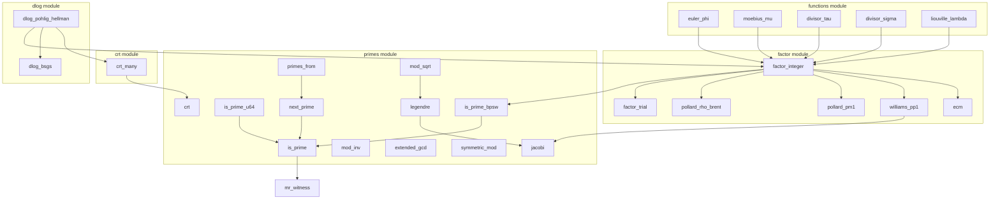

# Rust API Reference: Number Theory

This chapter documents the complete API of the oCAS number theory module `ocas_domain::number_theory`. The module provides primality testing, integer factorization, the Chinese remainder theorem, discrete logarithms, quadratic-residue symbols, and multiplicative number-theoretic functions. It is the infrastructure underlying polynomial factorization (Berlekamp, Cantor–Zassenhaus, Hensel lifting), rational reconstruction, and modular GCD algorithms.

**Module path**: `ocas_domain::number_theory`

**Submodules**:

| Submodule | Purpose |
|---|---|
| `primes` | Primality testing, prime generation, modular inverse, extended Euclid, quadratic residues |
| `factor` | Complete integer factorization (trial division, Pollard rho/p−1/p+1, ECM) |
| `crt` | Multi-modulus Chinese remainder theorem |
| `dlog` | Discrete logarithms (BSGS, Pohlig–Hellman) |
| `functions` | Multiplicative number-theoretic functions (φ, μ, τ, σ_k, λ) |

**Imports**:

```rust
use ocas_domain::number_theory::{
    is_prime, next_prime, primes_from, mod_inv, extended_gcd, symmetric_mod,
    crt, legendre, jacobi, mod_sqrt,
    factor::factor_integer,
    functions::{euler_phi, moebius_mu, divisor_tau, divisor_sigma, liouville_lambda},
};
// or import precisely from the submodules
use ocas_domain::number_theory::primes::is_prime_bpsw;
use ocas_domain::number_theory::primes::is_prime_u64;
use ocas_domain::number_theory::crt::crt_many;
use ocas_domain::number_theory::dlog::{dlog_bsgs, dlog_pohlig_hellman};
```

---

## Primality testing

### is_prime

**Signature**: `pub fn is_prime(n: &Integer) -> bool`

**Description**: Determines whether `n` is prime.

**Parameters**:

| Parameter | Type | Description |
|---|---|---|
| `n` | `&Integer` | The integer under test |

**Return value**: `bool` — `true` if `n` is a (strong) pseudoprime or a proven prime.

**Implementation details**:

- For $n < 3.317 \times 10^{24}$, a **deterministic** test using the fixed set of 12 Miller–Rabin witnesses $\{2, 3, 5, 7, 11, 13, 17, 19, 23, 29, 31, 37\}$.
- For larger `n`, falls back to a strong pseudoprime test (composite numbers pass with extremely low probability).
- Handles $n \leq 3$ and even numbers explicitly.

**Example**:

```rust
use ocas_domain::Integer;
use ocas_domain::number_theory::is_prime;

assert!(is_prime(&Integer::from(97)));
assert!(!is_prime(&Integer::from(561)));   // Carmichael number, not prime
assert!(is_prime(&Integer::from(2_147_483_647_i64))); // Mersenne prime M31
```

**See also**: [`is_prime_bpsw`](#is_prime_bpsw), [`is_prime_u64`](#is_prime_u64), [`next_prime`](#next_prime)

---

### is_prime_bpsw

**Signature**: `pub fn is_prime_bpsw(n: &Integer) -> bool`

**Description**: BPSW pseudoprime test — base-2 strong Miller–Rabin plus a strong Lucas pseudoprime test (with Selfridge parameter selection).

**Parameters**:

| Parameter | Type | Description |
|---|---|---|
| `n` | `&Integer` | The integer under test |

**Return value**: `bool` — `true` if `n` passes the BPSW test.

**Implementation details**:

1. First a base-2 strong Miller–Rabin test (shares the `mr_witness` core with `is_prime`).
2. Then a strong Lucas test: Selfridge parameter selection — take the first $D$ from the sequence $5, -7, 9, -11, \ldots$ with $\text{jacobi}(D, n) = -1$, and set $P = 1$, $Q = (1 - D)/4$.
3. Write $n + 1 = d \cdot 2^r$ ($d$ odd) and compute the Lucas sequences $(U_k, V_k)$ with a binary ladder. `n` passes when $U_d \equiv 0$ or $V_{d \cdot 2^i} \equiv 0 \pmod{n}$ for some $0 \leq i < r$.

**Known properties**: No composite number is currently known to pass the BPSW test (as of 2026). For $n < 3.317 \times 10^{24}$ the result is deterministic.

**Example**:

```rust
use ocas_domain::Integer;
use ocas_domain::number_theory::primes::is_prime_bpsw;

assert!(is_prime_bpsw(&Integer::from(97)));
assert!(!is_prime_bpsw(&Integer::from(561)));    // Carmichael number
assert!(!is_prime_bpsw(&Integer::from(2047)));   // base-2 strong pseudoprime, but not prime
```

**See also**: [`is_prime`](#is_prime), [`factor_integer`](#factor_integer) (uses BPSW internally as the final primality check)

---

### is_prime_u64

**Signature**: `pub fn is_prime_u64(n: u64) -> bool`

**Description**: Deterministic primality test for integers in the `u64` range.

**Parameters**:

| Parameter | Type | Description |
|---|---|---|
| `n` | `u64` | The integer under test |

**Return value**: `bool`.

**Implementation details**: converts `n` to an `Integer` internally and calls `is_prime`. The 12 Miller–Rabin witnesses cover the entire `u64` range ($< 3.317 \times 10^{24}$), so the result is **deterministic**.

**Example**:

```rust
use ocas_domain::number_theory::primes::is_prime_u64;

assert!(is_prime_u64(97));
assert!(!is_prime_u64(561));
assert!(is_prime_u64(u64::MAX - 58)); // 2^64 − 59, the largest u64 prime
```

**See also**: [`is_prime`](#is_prime)

---

## Prime generation

### next_prime

**Signature**: `pub fn next_prime(n: &Integer) -> Integer`

**Description**: Returns the smallest prime strictly greater than `n`.

**Parameters**:

| Parameter | Type | Description |
|---|---|---|
| `n` | `&Integer` | The starting integer |

**Return value**: `Integer` — the smallest prime greater than `n`.

**Implementation details**: starts from $n + 1$ (or from 2 if $n < 2$) and tests odd candidates in turn.

**Example**:

```rust
use ocas_domain::Integer;
use ocas_domain::number_theory::next_prime;

assert_eq!(next_prime(&Integer::from(10)), Integer::from(11));
assert_eq!(next_prime(&Integer::from(13)), Integer::from(17));
assert_eq!(next_prime(&Integer::from(0)), Integer::from(2));
```

**See also**: [`primes_from`](#primes_from), [`is_prime`](#is_prime)

---

### primes_from

**Signature**: `pub fn primes_from(n: &Integer) -> PrimesFrom`

**Description**: Creates an iterator over the consecutive primes after `n`.

**Parameters**:

| Parameter | Type | Description |
|---|---|---|
| `n` | `&Integer` | The starting integer |

**Return value**: `PrimesFrom` — an iterator implementing `Iterator<Item = Integer>` that yields the primes strictly greater than `n` in order.

**Use cases**: scanning for primes in Hensel lifting (looking for a prime that does not divide the leading coefficient and keeps $f \bmod p$ square-free).

**Example**:

```rust
use ocas_domain::Integer;
use ocas_domain::number_theory::primes_from;

let mut it = primes_from(&Integer::from(100));
assert_eq!(it.next().unwrap().to_string(), "101");
assert_eq!(it.next().unwrap().to_string(), "103");
```

**See also**: [`next_prime`](#next_prime)

---

## Modular arithmetic

### mod_inv

**Signature**: `pub fn mod_inv(a: &Integer, m: &Integer) -> Option<Integer>`

**Description**: Computes the multiplicative inverse of `a` modulo `m`, i.e. an `x` such that $a \cdot x \equiv 1 \pmod{m}$.

**Parameters**:

| Parameter | Type | Description |
|---|---|---|
| `a` | `&Integer` | The element to invert |
| `m` | `&Integer` | The modulus |

**Return value**: `Option<Integer>` — `Some(x)` with $0 \leq x < m$, or `None`.

**Error conditions**: returns `None` when $\gcd(a, m) \neq 1$ or $m \leq 1$.

**Example**:

```rust
use ocas_domain::Integer;
use ocas_domain::number_theory::mod_inv;

assert_eq!(mod_inv(&Integer::from(3), &Integer::from(11)), Some(Integer::from(4)));
// 3 × 4 = 12 ≡ 1 (mod 11)
assert_eq!(mod_inv(&Integer::from(2), &Integer::from(4)), None);
// gcd(2, 4) = 2 ≠ 1, the inverse does not exist
```

**See also**: [`extended_gcd`](#extended_gcd)

---

### extended_gcd

**Signature**: `pub fn extended_gcd(a: &Integer, b: &Integer) -> (Integer, Integer, Integer)`

**Description**: Extended Euclid algorithm — computes $g = \gcd(a, b)$ and Bézout coefficients $x, y$ such that $g = a \cdot x + b \cdot y$.

**Parameters**:

| Parameter | Type | Description |
|---|---|---|
| `a` | `&Integer` | The first integer |
| `b` | `&Integer` | The second integer |

**Return value**: `(g, x, y)` — `g` is non-negative and satisfies $g = a \cdot x + b \cdot y$.

**Example**:

```rust
use ocas_domain::Integer;
use ocas_domain::number_theory::extended_gcd;

let (g, x, y) = extended_gcd(&Integer::from(240), &Integer::from(46));
assert_eq!(g, Integer::from(2));
// Verify the Bézout identity: 240·x + 46·y = 2
assert_eq!(&x * &Integer::from(240) + &y * &Integer::from(46), g);
```

**See also**: [`mod_inv`](#mod_inv)

---

### symmetric_mod

**Signature**: `pub fn symmetric_mod(a: &Integer, m: &Integer) -> Integer`

**Description**: Reduces `a` to the symmetric interval $(-m/2, m/2]$.

**Parameters**:

| Parameter | Type | Description |
|---|---|---|
| `a` | `&Integer` | The integer to reduce |
| `m` | `&Integer` | The modulus (positive) |

**Return value**: `Integer` — the representative in $(-m/2, m/2]$.

**Use cases**: recovering integer coefficients from modular representations in Hensel lifting.

**Example**:

```rust
use ocas_domain::Integer;
use ocas_domain::number_theory::symmetric_mod;

// mod 7, interval (-3.5, 3.5]
assert_eq!(symmetric_mod(&Integer::from(3), &Integer::from(7)), Integer::from(3));
assert_eq!(symmetric_mod(&Integer::from(5), &Integer::from(7)), Integer::from(-2));
assert_eq!(symmetric_mod(&Integer::from(6), &Integer::from(7)), Integer::from(-1));
```

**See also**: [`crt`](#crt)

---

## Chinese remainder theorem

### crt

**Signature**: `pub fn crt(r1: &Integer, m1: &Integer, r2: &Integer, m2: &Integer) -> Option<(Integer, Integer)>`

**Description**: Combines two congruences $x \equiv r_1 \pmod{m_1}$ and $x \equiv r_2 \pmod{m_2}$.

**Parameters**:

| Parameter | Type | Description |
|---|---|---|
| `r1` | `&Integer` | The first remainder |
| `m1` | `&Integer` | The first modulus |
| `r2` | `&Integer` | The second remainder |
| `m2` | `&Integer` | The second modulus |

**Return value**: `Option<(Integer, Integer)>` — `Some((r, m))` where $m = \operatorname{lcm}(m_1, m_2)$, $0 \leq r < m$, $r \equiv r_1 \pmod{m_1}$, and $r \equiv r_2 \pmod{m_2}$.

**Error conditions**: returns `None` when the system is inconsistent ($r_1 - r_2$ not divisible by $\gcd(m_1, m_2)$). The moduli **need not be coprime**.

**Example**:

```rust
use ocas_domain::Integer;
use ocas_domain::number_theory::crt;

// x ≡ 2 (mod 3), x ≡ 3 (mod 5)  =>  x ≡ 8 (mod 15)
let (r, m) = crt(&Integer::from(2), &Integer::from(3),
                 &Integer::from(3), &Integer::from(5)).unwrap();
assert_eq!(r, Integer::from(8));
assert_eq!(m, Integer::from(15));
```

**See also**: [`crt_many`](#crt_many)

---

### crt_many

**Signature**: `pub fn crt_many(congruences: &[(Integer, Integer)]) -> Option<(Integer, Integer)>`

**Description**: Combines multiple congruences $x \equiv r_i \pmod{m_i}$.

**Parameters**:

| Parameter | Type | Description |
|---|---|---|
| `congruences` | `&[(Integer, Integer)]` | The list of congruences, each an `(r_i, m_i)` pair |

**Return value**: `Option<(Integer, Integer)>` — `Some((R, M))` where $M = \operatorname{lcm}(m_1, \ldots, m_k)$ and $0 \leq R < M$.

**Error conditions**:

- Returns `None` for an empty list.
- Returns `None` when any pair is inconsistent.

**Implementation details**: folds pairwise via [`crt`](#crt); the moduli need not be pairwise coprime.

**Example**:

```rust
use ocas_domain::Integer;
use ocas_domain::number_theory::crt::crt_many;

// Sunzi Suanjing problem: x ≡ 2 (mod 3), x ≡ 3 (mod 5), x ≡ 2 (mod 7)
let cs = [
    (Integer::from(2), Integer::from(3)),
    (Integer::from(3), Integer::from(5)),
    (Integer::from(2), Integer::from(7)),
];
let (r, m) = crt_many(&cs).unwrap();
assert_eq!(r, Integer::from(23));
assert_eq!(m, Integer::from(105)); // 3 × 5 × 7 = 105
```

**See also**: [`crt`](#crt), [`dlog_pohlig_hellman`](#dlog_pohlig_hellman) (uses CRT internally to combine partial results)

---

## Quadratic residues

### legendre

**Signature**: `pub fn legendre(a: &Integer, p: &Integer) -> i8`

**Description**: Computes the Legendre symbol $\left(\frac{a}{p}\right)$.

**Parameters**:

| Parameter | Type | Description |
|---|---|---|
| `a` | `&Integer` | The integer under test |
| `p` | `&Integer` | An odd prime (primality is guaranteed by the caller) |

**Return value**:

| Value | Meaning |
|---|---|
| `1` | $a$ is a quadratic residue (QR) modulo $p$ |
| `-1` | $a$ is a quadratic non-residue (QNR) modulo $p$ |
| `0` | $p \mid a$ |

**Note**: primality of `p` is guaranteed by the caller; the function is internally equivalent to `jacobi(a, p)`.

**Example**:

```rust
use ocas_domain::Integer;
use ocas_domain::number_theory::legendre;

assert_eq!(legendre(&Integer::from(2), &Integer::from(7)), 1);  // 2 is a QR mod 7
assert_eq!(legendre(&Integer::from(3), &Integer::from(7)), -1); // 3 is a QNR mod 7
```

**See also**: [`jacobi`](#jacobi), [`mod_sqrt`](#mod_sqrt)

---

### jacobi

**Signature**: `pub fn jacobi(a: &Integer, n: &Integer) -> i8`

**Description**: Computes the Jacobi symbol $\left(\frac{a}{n}\right)$ — a generalization of the Legendre symbol, defined for any positive odd `n`.

**Parameters**:

| Parameter | Type | Description |
|---|---|---|
| `a` | `&Integer` | The integer under test |
| `n` | `&Integer` | A positive odd integer |

**Return value**: `i8` — `0`, `1`, or `-1`.

**Implementation details**: computed via quadratic reciprocity, including 2-adic stripping and the mod-8/mod-4 sign rules.

**Note**: if `n` is even or non-positive, the result is undefined (the function returns `0`).

**Example**:

```rust
use ocas_domain::Integer;
use ocas_domain::number_theory::jacobi;

assert_eq!(jacobi(&Integer::from(2), &Integer::from(15)), 1);
assert_eq!(jacobi(&Integer::from(7), &Integer::from(15)), -1);
```

**See also**: [`legendre`](#legendre)

---

### mod_sqrt

**Signature**: `pub fn mod_sqrt(a: &Integer, p: &Integer) -> Option<Integer>`

**Description**: Computes a square root of $a$ modulo the odd prime $p$, i.e. an $x$ such that $x^2 \equiv a \pmod{p}$.

**Parameters**:

| Parameter | Type | Description |
|---|---|---|
| `a` | `&Integer` | The radicand |
| `p` | `&Integer` | An odd prime |

**Return value**: `Option<Integer>` — `Some(x)` with $0 \leq x < p$ (the other root is $p - x$).

**Error conditions**: returns `None` when $p \leq 2$ or when $a$ is a quadratic non-residue (`legendre(a, p) = -1`). The primality of `p` is the caller's responsibility — the function does not check it, and behavior for odd composite `p` is undefined.

**Implementation details**:

- Fast path $x = a^{(p+1)/4} \bmod p$ when $p \equiv 3 \pmod{4}$.
- Otherwise the full Tonelli–Shanks algorithm: find a non-residue $z$, maintaining the invariants $c, t, r, m$.

**Example**:

```rust
use ocas_domain::Integer;
use ocas_domain::number_theory::mod_sqrt;

// 2 is a QR mod 7: roots are 3 and 4 (3² = 9 ≡ 2, 4² = 16 ≡ 2 mod 7)
let r = mod_sqrt(&Integer::from(2), &Integer::from(7)).unwrap();
assert!(r == Integer::from(3) || r == Integer::from(4));
```

**See also**: [`legendre`](#legendre)

---

## Integer factorization

### factor_integer

**Signature**: `pub fn factor_integer(n: &Integer) -> Vec<(Integer, u32)>`

**Description**: Completely factors $|n|$ into prime factors, returning `(prime, exponent)` pairs in ascending order.

**Parameters**:

| Parameter | Type | Description |
|---|---|---|
| `n` | `&Integer` | The integer to factor |

**Return value**: `Vec<(Integer, u32)>` — the list of prime factors, in ascending order of prime. Returns an empty list for $n \in \{0, \pm 1\}$.

**Factorization strategy**:

1. **Trial division** (`factor_trial`): removes small factors $\leq 1000$.
2. For the remaining composite cofactor, an **escalating strategy** that tries, in stages:
   - Pollard rho–Brent variant (batched gcd + backtracking)
   - Pollard $p-1$ stage 1 (smoothness bound doubling by $\times 4$)
   - Williams $p+1$ stage 1 (Lucas $V$ sequences, random $P$ with $\text{jacobi}(P^2-4, n) = -1$)
   - ECM Lenstra (Suyama parametrization, Montgomery curves in projective coordinates, curve budget $\approx B_1/550$)
3. Every leaf is verified with the BPSW primality test.

**Example**:

```rust
use ocas_domain::Integer;
use ocas_domain::number_theory::factor::factor_integer;

let f = factor_integer(&Integer::from(2 * 2 * 3 * 5 * 101 * 1000003));
assert_eq!(f, vec![
    (Integer::from(2), 2),
    (Integer::from(3), 1),
    (Integer::from(5), 1),
    (Integer::from(101), 1),
    (Integer::from(1000003), 1),
]);

// empty list
assert!(factor_integer(&Integer::from(0)).is_empty());
assert!(factor_integer(&Integer::from(1)).is_empty());
```

**See also**: [`is_prime_bpsw`](#is_prime_bpsw), [`euler_phi`](#euler_phi), [`moebius_mu`](#moebius_mu)

---

### factor_integer_with_rng

**Signature**: `pub fn factor_integer_with_rng(n: &Integer, rng: &mut Xoshiro256PlusPlus) -> Vec<(Integer, u32)>`

**Description**: Same as [`factor_integer`](#factor_integer), but accepts an explicit RNG for reproducible factorization results.

**Parameters**:

| Parameter | Type | Description |
|---|---|---|
| `n` | `&Integer` | The integer to factor |
| `rng` | `&mut Xoshiro256PlusPlus` | The random number generator (from the `rand_xoshiro` crate) |

**Return value**: `Vec<(Integer, u32)>`.

**Use cases**: when deterministic results are needed in tests.

**See also**: [`factor_integer`](#factor_integer)

---

### factor_trial

**Signature**: `pub fn factor_trial(n: &Integer, limit: u64) -> (Vec<(Integer, u32)>, Integer)`

**Description**: Trial division that removes prime factors $\leq \text{limit}$.

**Parameters**:

| Parameter | Type | Description |
|---|---|---|
| `n` | `&Integer` | The integer to factor |
| `limit` | `u64` | The trial-division bound |

**Return value**: `(factors, cofactor)` — `factors` is the list of factors found, and `cofactor` has no prime factor $\leq \text{limit}$ (but is not necessarily prime).

**Example**:

```rust
use ocas_domain::Integer;
use ocas_domain::number_theory::factor::factor_trial;

let (factors, rest) = factor_trial(&Integer::from(2 * 2 * 3 * 7 * 1000003), 100);
assert_eq!(factors, vec![
    (Integer::from(2), 2),
    (Integer::from(3), 1),
    (Integer::from(7), 1),
]);
assert_eq!(rest, Integer::from(1000003));
```

**See also**: [`factor_integer`](#factor_integer)

---

### pollard_rho_brent

**Signature**: `pub fn pollard_rho_brent(n: &Integer, rng: &mut Xoshiro256PlusPlus) -> Option<Integer>`

**Description**: Pollard rho in the Brent variant — searches for a non-trivial factor of an odd composite `n`.

**Parameters**:

| Parameter | Type | Description |
|---|---|---|
| `n` | `&Integer` | An odd composite number |
| `rng` | `&mut Xoshiro256PlusPlus` | The random number generator |

**Return value**: `Option<Integer>` — `Some(d)` is a non-trivial factor of `n`; `None` means all retries failed (very rare).

**Implementation details**: a batched-gcd + backtracking strategy improves the success rate, with a bounded number of retries.

**Example**:

```rust
use ocas_domain::Integer;
use ocas_domain::number_theory::factor::pollard_rho_brent;
use rand::SeedableRng;
use rand_xoshiro::Xoshiro256PlusPlus;

let n = Integer::from(1000003) * Integer::from(1000033);
let mut rng = Xoshiro256PlusPlus::seed_from_u64(42);
let d = pollard_rho_brent(&n, &mut rng).unwrap();
assert!(d == Integer::from(1000003) || d == Integer::from(1000033));
```

**See also**: [`factor_integer`](#factor_integer)

---

### pollard_pm1

**Signature**: `pub fn pollard_pm1(n: &Integer, b1: u64, rng: &mut Xoshiro256PlusPlus) -> Option<Integer>`

**Description**: Pollard $p-1$ method (stage 1) — finds a factor `p` of `n` when $p-1$ is $B_1$-smooth.

**Parameters**:

| Parameter | Type | Description |
|---|---|---|
| `n` | `&Integer` | An odd composite number |
| `b1` | `u64` | The smoothness bound |
| `rng` | `&mut Xoshiro256PlusPlus` | The random number generator |

**Return value**: `Option<Integer>`.

**Implementation details**: computes $a^M \bmod n$ where $M = \prod q^e \leq B_1$ ($q$ ranging over primes with $q^e \leq B_1$), periodically testing $\gcd(a^M - 1, n)$.

**Example**:

```rust
use ocas_domain::Integer;
use ocas_domain::number_theory::factor::pollard_pm1;
use rand::SeedableRng;
use rand_xoshiro::Xoshiro256PlusPlus;

// 65537 is prime, 65536 = 2^16 is 2^17-smooth
let n = Integer::from(65537) * Integer::from(1000003);
let mut rng = Xoshiro256PlusPlus::seed_from_u64(7);
let d = pollard_pm1(&n, 1 << 17, &mut rng).unwrap();
assert_eq!(n.mod_floor(&d), Integer::from(0));
```

**See also**: [`williams_pp1`](#williams_pp1), [`ecm`](#ecm)

---

### williams_pp1

**Signature**: `pub fn williams_pp1(n: &Integer, b1: u64, rng: &mut Xoshiro256PlusPlus) -> Option<Integer>`

**Description**: Williams $p+1$ method (stage 1) — finds a factor `p` of `n` when $p+1$ is $B_1$-smooth.

**Parameters**:

| Parameter | Type | Description |
|---|---|---|
| `n` | `&Integer` | An odd composite number |
| `b1` | `u64` | The smoothness bound |
| `rng` | `&mut Xoshiro256PlusPlus` | The random number generator |

**Return value**: `Option<Integer>`.

**Implementation details**: uses Lucas $V$ sequences ($Q = 1$) with a random $P$ chosen so that $\text{jacobi}(P^2 - 4, n) = -1$.

**Example**:

```rust
use ocas_domain::Integer;
use ocas_domain::number_theory::factor::williams_pp1;
use rand::SeedableRng;
use rand_xoshiro::Xoshiro256PlusPlus;

// 31 is prime, 31 + 1 = 2^5 is 64-smooth
let n = Integer::from(31) * Integer::from(1000003);
let mut rng = Xoshiro256PlusPlus::seed_from_u64(13);
let d = williams_pp1(&n, 64, &mut rng).unwrap();
assert_eq!(n.mod_floor(&d), Integer::from(0));
```

**See also**: [`pollard_pm1`](#pollard_pm1), [`ecm`](#ecm)

---

### ecm

**Signature**: `pub fn ecm(n: &Integer, b1: u64, max_curves: u32, rng: &mut Xoshiro256PlusPlus) -> Option<Integer>`

**Description**: Lenstra's elliptic curve method (ECM, stage 1) — finds a factor `p` of `n` when the group order of some curve over $\mathbb{F}_p$ is $B_1$-smooth.

**Parameters**:

| Parameter | Type | Description |
|---|---|---|
| `n` | `&Integer` | An odd composite number |
| `b1` | `u64` | The smoothness bound |
| `max_curves` | `u32` | The maximum number of curves to try |
| `rng` | `&mut Xoshiro256PlusPlus` | The random number generator |

**Return value**: `Option<Integer>`.

**Implementation details**:

- Suyama parametrization: build a Montgomery curve from $\sigma \notin \{0, 1, 5\}$ with $a24 = (A+2)/4$ and $A = \frac{(v-u)^3(3u+v)}{4u^3v} - 2$, where $u = \sigma^2 - 5$ and $v = 4\sigma$.
- Montgomery ladder scalar multiplication in projective coordinates $(X:Z)$.
- Curve budget $\approx B_1 / 550$.

**Example**:

```rust
use ocas_domain::Integer;
use ocas_domain::number_theory::factor::ecm;
use rand::SeedableRng;
use rand_xoshiro::Xoshiro256PlusPlus;

let n = Integer::from(1000003) * Integer::from(1000033);
let mut rng = Xoshiro256PlusPlus::seed_from_u64(99);
let d = ecm(&n, 2_000, 50, &mut rng).unwrap();
assert!(d == Integer::from(1000003) || d == Integer::from(1000033));
```

**See also**: [`factor_integer`](#factor_integer), [`pollard_pm1`](#pollard_pm1)

---

## Discrete logarithms

### dlog_bsgs

**Signature**: `pub fn dlog_bsgs(base: &Integer, target: &Integer, modulus: &Integer) -> Option<Integer>`

**Description**: Solves $base^x \equiv \text{target} \pmod{\text{modulus}}$ with the baby-step giant-step (BSGS) algorithm, searching $x < \text{modulus}$.

**Parameters**:

| Parameter | Type | Description |
|---|---|---|
| `base` | `&Integer` | The base |
| `target` | `&Integer` | The target value |
| `modulus` | `&Integer` | The modulus |

**Return value**: `Option<Integer>` — `Some(x)` with $0 \leq x < \text{modulus}$, or `None` if no solution exists.

**Error conditions**:

- $\gcd(\text{base}, \text{modulus}) \neq 1$ (the base is not a unit).
- No such $x$ exists.

**Complexity**: $O(\sqrt{\text{modulus}})$ time and space. Only suitable for small `modulus`.

**Implementation details**: a HashMap stores the baby steps; giant-step lookups take $O(\sqrt{m})$.

**Example**:

```rust
use ocas_domain::Integer;
use ocas_domain::number_theory::dlog::dlog_bsgs;

// 2 is a primitive root mod 11; 2^7 = 128 ≡ 7 (mod 11)
let x = dlog_bsgs(&Integer::from(2), &Integer::from(7), &Integer::from(11)).unwrap();
assert_eq!(Integer::from(2).modpow(&x, &Integer::from(11)), Integer::from(7));
```

**See also**: [`dlog_pohlig_hellman`](#dlog_pohlig_hellman)

---

### dlog_pohlig_hellman

**Signature**: `pub fn dlog_pohlig_hellman(base: &Integer, target: &Integer, p: &Integer) -> Option<Integer>`

**Description**: Solves $base^x \equiv \text{target} \pmod{p}$ with the Pohlig–Hellman algorithm ($p$ prime).

**Parameters**:

| Parameter | Type | Description |
|---|---|---|
| `base` | `&Integer` | The base |
| `target` | `&Integer` | The target value |
| `p` | `&Integer` | The prime modulus |

**Return value**: `Option<Integer>` — `Some(x)`, or `None` if there is no solution or the input does not satisfy the preconditions.

**Error conditions**:

- `p` is composite.
- `base` is not a unit modulo `p`.
- `target` is not in the subgroup generated by `base`.

**Implementation details**:

1. Factor the order of `base` with `factor_integer`.
2. For each prime power $q^e$, recover the discrete logarithm digit by digit with BSGS (digit recovery).
3. Combine the partial results with `crt_many`.
4. Finally verify $\text{base}^x \equiv \text{target} \pmod{p}$.

**Complexity**: dominated by the largest prime factor $q$, giving $O(\sqrt{q})$. Extremely efficient when the order is smooth.

**Example**:

```rust
use ocas_domain::Integer;
use ocas_domain::number_theory::dlog::dlog_pohlig_hellman;

// p = 101, p − 1 = 2²·5² (smooth). 2 is a primitive root mod 101.
let p = Integer::from(101);
let base = Integer::from(2);
let target = base.modpow(&Integer::from(83), &p);
let x = dlog_pohlig_hellman(&base, &target, &p).unwrap();
assert_eq!(x, Integer::from(83));
```

**See also**: [`dlog_bsgs`](#dlog_bsgs), [`factor_integer`](#factor_integer), [`crt_many`](#crt_many)

---

## Multiplicative number-theoretic functions

All multiplicative functions are computed by factoring via [`factor_integer`](#factor_integer) and combining the results.

### euler_phi

**Signature**: `pub fn euler_phi(n: &Integer) -> Integer`

**Description**: Euler's totient function $\varphi(n)$ — the number of integers in $[1, |n|]$ coprime to $n$.

**Parameters**:

| Parameter | Type | Description |
|---|---|---|
| `n` | `&Integer` | The input integer |

**Return value**: `Integer` — $\varphi(|n|)$.

**Formula**: $|n| \cdot \prod_{p \mid n} \left(1 - \frac{1}{p}\right)$, over the distinct prime factors of `n`.

**Convention**: $\varphi(0) = 0$, $\varphi(\pm 1) = 1$.

**Example**:

```rust
use ocas_domain::Integer;
use ocas_domain::number_theory::functions::euler_phi;

assert_eq!(euler_phi(&Integer::from(9)), Integer::from(6));
// φ(9) = 9 × (1 − 1/3) = 6, numbers coprime to 9 are {1,2,4,5,7,8}
assert_eq!(euler_phi(&Integer::from(36)), Integer::from(12));
assert_eq!(euler_phi(&Integer::from(97)), Integer::from(96)); // prime p: φ(p) = p−1
```

**See also**: [`factor_integer`](#factor_integer)

---

### moebius_mu

**Signature**: `pub fn moebius_mu(n: &Integer) -> i8`

**Description**: The Möbius function $\mu(n)$.

**Parameters**:

| Parameter | Type | Description |
|---|---|---|
| `n` | `&Integer` | The input integer |

**Return value**: `i8`.

**Definition**:

$$
\mu(n) = \begin{cases} 1 & n = \pm 1 \\ (-1)^k & n \text{ has } k \text{ distinct prime factors (square-free)} \\ 0 & n \text{ is divisible by the square of a prime} \end{cases}
$$

**Convention**: $\mu(0) = 0$.

**Example**:

```rust
use ocas_domain::Integer;
use ocas_domain::number_theory::functions::moebius_mu;

assert_eq!(moebius_mu(&Integer::from(1)), 1);
assert_eq!(moebius_mu(&Integer::from(6)), 1);   // 6 = 2·3, 2 prime factors → (−1)² = 1
assert_eq!(moebius_mu(&Integer::from(30)), -1); // 30 = 2·3·5, 3 prime factors → (−1)³ = −1
assert_eq!(moebius_mu(&Integer::from(12)), 0);  // 4 = 2² divides 12
```

**See also**: [`factor_integer`](#factor_integer)

---

### divisor_tau

**Signature**: `pub fn divisor_tau(n: &Integer) -> Integer`

**Description**: The divisor function $\tau(n)$ (also written $d(n)$) — the number of positive divisors of $|n|$.

**Parameters**:

| Parameter | Type | Description |
|---|---|---|
| `n` | `&Integer` | The input integer |

**Return value**: `Integer` — $\tau(|n|)$.

**Formula**: if $n = \prod p_i^{e_i}$, then $\tau(n) = \prod (e_i + 1)$.

**Convention**: $\tau(0) = 0$.

**Example**:

```rust
use ocas_domain::Integer;
use ocas_domain::number_theory::functions::divisor_tau;

assert_eq!(divisor_tau(&Integer::from(12)), Integer::from(6));
// 12 = 2²·3¹ → (2+1)(1+1) = 6, divisors are {1,2,3,4,6,12}
assert_eq!(divisor_tau(&Integer::from(97)), Integer::from(2)); // a prime has only 1 and itself
```

**See also**: [`divisor_sigma`](#divisor_sigma), [`factor_integer`](#factor_integer)

---

### divisor_sigma

**Signature**: `pub fn divisor_sigma(n: &Integer, k: u32) -> Integer`

**Description**: The divisor function $\sigma_k(n)$ — the sum of the $k$-th powers of the positive divisors of $|n|$.

**Parameters**:

| Parameter | Type | Description |
|---|---|---|
| `n` | `&Integer` | The input integer |
| `k` | `u32` | The power (non-negative integer) |

**Return value**: `Integer` — $\sigma_k(|n|)$.

**Formula**: $\sigma_k(n) = \prod \frac{p_i^{k(e_i+1)} - 1}{p_i^k - 1}$.

**Special values**:

- $\sigma_0(n) = \tau(n)$ (number of divisors)
- $\sigma_1(n) = \sigma(n)$ (sum of divisors — perfect-number test: $n$ is perfect if and only if $\sigma_1(n) = 2n$)

**Convention**: $\sigma_k(0) = 0$.

**Example**:

```rust
use ocas_domain::Integer;
use ocas_domain::number_theory::functions::divisor_sigma;

assert_eq!(divisor_sigma(&Integer::from(12), 1), Integer::from(28));
// σ₁(12) = 1+2+3+4+6+12 = 28
assert_eq!(divisor_sigma(&Integer::from(12), 2), Integer::from(210));
// σ₂(12) = 1+4+9+16+36+144 = 210
assert_eq!(divisor_sigma(&Integer::from(12), 0), Integer::from(6));
// σ₀(12) = τ(12) = 6
```

**See also**: [`divisor_tau`](#divisor_tau), [`factor_integer`](#factor_integer)

---

### liouville_lambda

**Signature**: `pub fn liouville_lambda(n: &Integer) -> i8`

**Description**: The Liouville function $\lambda(n) = (-1)^{\Omega(n)}$, where $\Omega(n)$ is the total number of prime factors counted with multiplicity.

**Parameters**:

| Parameter | Type | Description |
|---|---|---|
| `n` | `&Integer` | The input integer |

**Return value**: `i8` — `1` or `-1`.

**Convention**: $\lambda(0) = 0$, $\lambda(\pm 1) = 1$.

**Example**:

```rust
use ocas_domain::Integer;
use ocas_domain::number_theory::functions::liouville_lambda;

assert_eq!(liouville_lambda(&Integer::from(12)), -1);
// 12 = 2²·3, Ω = 3 → (−1)³ = −1
assert_eq!(liouville_lambda(&Integer::from(6)), 1);
// 6 = 2·3, Ω = 2 → (−1)² = 1
```

**See also**: [`factor_integer`](#factor_integer), [`moebius_mu`](#moebius_mu)

---

## Module dependency graph


