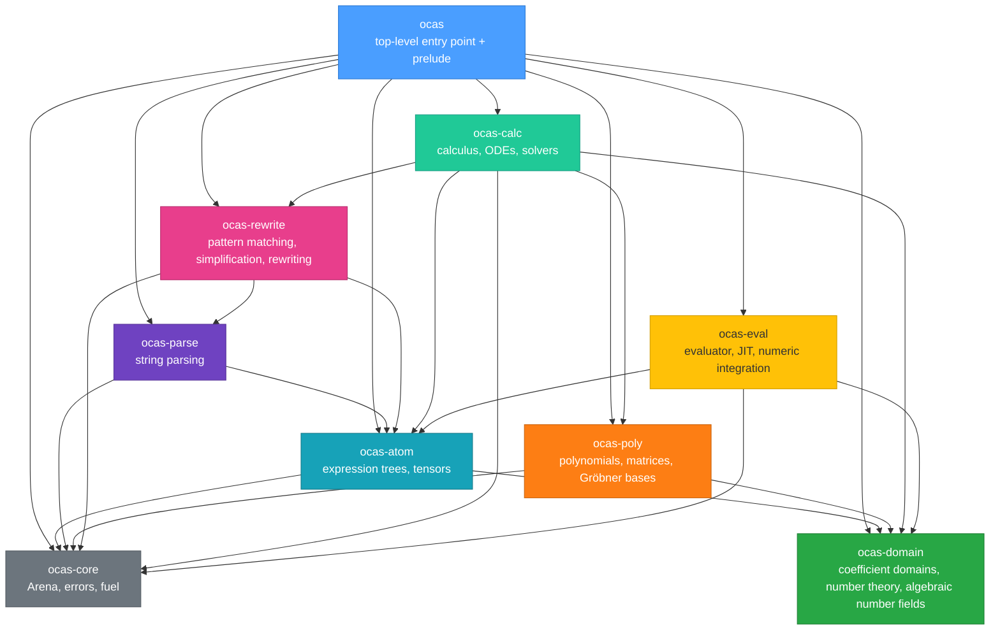

# Rust API Reference

oCAS's Rust API uses a layered crate architecture. The top-level `ocas` crate re-exports all commonly used types and functions through its `prelude` module, so a single import is all you need:

```rust
use ocas::prelude::*;
```

## Module Hierarchy



| Crate | Responsibility |
|---|---|
| `ocas-core` | `Arena` bump allocator, unified error type `OcasError`, fuel counter `Fuel` |
| `ocas-domain` | Coefficient-domain traits (`Domain`, `EuclideanDomain`) and implementations (integers, rationals, finite fields, real balls, complex numbers, double-precision floats, algebraic number fields), number-theory function library, hyper-dual automatic differentiation |
| `ocas-atom` | Expression tree (`Atom`, `AtomNode`, `AtomArena`), hash-consing, tensor system |
| `ocas-parse` | String → `Atom` parser |
| `ocas-poly` | Polynomials (dense univariate, sparse multivariate, rational function fields), matrices, Gröbner-basis algorithms (Buchberger/F4/F5), ideal operations, FGLM order conversion |
| `ocas-rewrite` | Pattern matching (AC matching), simplification (fixed-point iteration), bottom-up transformation, E-graph (optional) |
| `ocas-calc` | Symbolic differentiation, integration (Risch pipeline), Taylor expansion, ODE solving, Diophantine/linear/polynomial-system solvers |
| `ocas-eval` | Stack-VM interpreter, JIT compilation (Cranelift), SIMD batch evaluation, Vegas Monte Carlo numeric integration |

## Prelude Contents

`use ocas::prelude::*` imports all of the following items. The most commonly used types can also be accessed directly as `ocas::TypeName`.

### Expression Trees

| Name | Kind | Description |
|---|---|---|
| `Atom` | struct | `Copy` handle pointing to an expression node in the arena |
| `AtomArena` | struct | Hash-consing constructor that builds expressions from an `Arena` |
| `AtomNode` | enum | Node variants: `Num`/`Var`/`Fun`/`Add`/`Mul`/`Pow` |
| `Symbol` | struct | Interned string identifier, `Copy` |
| `normalize` | fn | Normalizes an expression (sorting, merging like terms) |
| `parse` | fn | Parses a string into an `Atom` |
| `ParseError` | enum | Parse error |

### Coefficient Domains

| Name | Kind | Description |
|---|---|---|
| `Domain` | trait | Basic coefficient-domain arithmetic (`zero`/`one`/`add`/`mul`/`sub`/`neg`, etc.) |
| `EuclideanDomain` | trait | Euclidean domain (+ `div_rem`/`gcd`/`lcm`) |
| `Integer` | struct | Arbitrary-precision integer |
| `IntegerDomain` | struct | Integer domain implementation |
| `Rational` | struct | Arbitrary-precision rational number |
| `RationalDomain` | struct | Rational number field implementation |
| `FiniteField` | struct | 𝔽ₚ finite field |
| `FiniteFieldElement` | struct | Finite-field element |
| `RealBall` | struct | Real ball arithmetic (requires the `mpfr` feature) |
| `RealBallDomain` | struct | Real ball domain implementation |
| `Complex` | struct | Complex number |
| `ComplexDomain` | struct | Complex number field implementation |
| `DoubleF64` | struct | Double-precision float (~31 significant digits) |
| `DoubleF64Domain` | struct | Double-precision float domain implementation |
| `AlgebraicExtension` | struct | Algebraic number field ℚ(α) or GF(p^d) |
| `AlgebraicElement` | struct | Algebraic number field element |
| `AlgebraicNumberField` | struct | Algebraic number field constructor |
| `Assumption` | enum | Assumption variants (`Positive`/`Negative`/`Integer`/`Real`/`Complex`, and 8 more) |
| `Assumptions` | struct | Assumption set |
| `SymbolAssumptions` | struct | Per-symbol assumption management |

### Polynomials

| Name | Kind | Description |
|---|---|---|
| `DenseUnivariatePolynomial` | struct | Dense univariate polynomial |
| `SparseMultivariatePolynomial` | struct | Sparse multivariate polynomial |
| `RationalPolynomial` | struct | Element p/q of a rational function field |
| `RootInterval` | struct | An interval containing exactly one real root (`low`/`high` bounds) |
| `MonomialOrder` | trait | Monomial order trait |
| `Lex` | struct | Lexicographic order |
| `Grlex` | struct | Graded lexicographic order |
| `Grevlex` | struct | Graded reverse lexicographic order |
| `WeightOrder` | struct | Weighted order |
| `BlockOrder` | struct | Block elimination order |
| `SubOrder` | struct | Sub-order |
| `monomial_divides` | fn | Monomial divisibility test |
| `monomial_lcm` | fn | Monomial least common multiple |
| `monomial_are_coprime` | fn | Monomial coprimality test |

### Matrices

| Name | Kind | Description |
|---|---|---|
| `Matrix` | struct | Matrix over a domain (Bareiss determinant, Gaussian-elimination solving) |
| `MatrixError` | enum | Matrix operation error |

### Gröbner Bases

| Name | Kind | Description |
|---|---|---|
| `GroebnerBasis` | struct | Gröbner-basis result (polynomial list plus metadata) |
| `buchberger` | fn | Buchberger algorithm entry point |
| `f4` | fn | F4 algorithm entry point (matrix row-echelon batching) |

### Calculus

| Name | Kind | Description |
|---|---|---|
| `diff` | fn | Symbolic differentiation |
| `integrate` | fn | Symbolic integration (layered pipeline) |
| `integrate_heuristic` | fn | Heuristic integration (without Risch) |
| `integrate_with_fuel` | fn | Integration with a fuel limit |
| `taylor` | fn | Taylor expansion |
| `substitute` | fn | Expression substitution |
| `apart` | fn | Partial-fraction decomposition |

### Solvers

| Name | Kind | Description |
|---|---|---|
| `solve_linear_rational` | fn | Linear system Ax=b over ℚ |
| `solve_linear_integer` | fn | Linear system Ax=b over ℤ |
| `solve_diophantine` | fn | Diophantine equation ax+by=c |
| `DiophantineSolution` | struct | Diophantine solution (particular solution + steps) |
| `SolveError` | enum | Solve error |
| `solve_polynomial_system` | fn | Polynomial system solving (zero-dimensional / positive-dimensional / empty) |
| `classify_ode` | fn | ODE type classification |
| `dsolve` | fn | Symbolic ODE solving |
| `dsolve_ivp` | fn | ODE initial-value problem (Laplace) |
| `dsolve_system` | fn | 2×2 ODE system solving |
| `ODE` | struct | ODE description |
| `ODESolution` | enum | ODE solution (explicit/implicit/parametric/series/system/unsolved) |
| `ODEType` | enum | ODE type enumeration |

### Rewriting & Simplification

| Name | Kind | Description |
|---|---|---|
| `Pattern` | enum | Match pattern (`Literal`/`Wildcard`/`Add`/`Mul`/`Pow`/`Fun`) |
| `Rule` | struct | Rewrite rule |
| `Bindings` | struct | Pattern binding results |
| `MatchError` | enum | Match error (incl. `BudgetExhausted`) |
| `WildcardLevel` | enum | Wildcard level (`Single`/`Sequence`/`NullSequence`) |
| `match_pattern` | fn | AC pattern matching |
| `simplify` | fn | Fixed-point simplification |
| `simplify_with_fuel` | fn | Simplification with a fuel limit |
| `transform` | fn | Bottom-up transformation |

### Evaluation & JIT

| Name | Kind | Description |
|---|---|---|
| `ExpressionEvaluator` | struct | Stack-VM interpreter |
| `FunctionMap` | struct | Custom function registry |
| `EvaluationDomain` | trait | Evaluation-domain constraint |
| `EvaluationError` | enum | Evaluation error |
| `EvalTree` | struct | Evaluation tree |
| `Instr` | enum | Instruction enum |
| `Instruction` | struct | Instruction details |
| `Slot` | enum | Operand slot (`Param`/`Const`/`Temp`) |
| `PowfExtension` | trait | Floating-point power extension |
| `VectorEvaluator` | struct | SIMD batch evaluation (requires the `simd` feature) |
| `JitEngine` | struct | JIT compilation engine (requires the `jit` feature) |
| `JitCompiledFunction` | struct | JIT compilation result |

### Numeric Integration

| Name | Kind | Description |
|---|---|---|
| `Vegas` | struct | Vegas Monte Carlo integrator |
| `VegasOptions` | struct | Vegas options (bin count, sample count, iterations, etc.) |
| `IntegrateResult` | struct | Integration result (value + error) |
| `Integrator` | struct | Integrator interface |
| `StatisticsAccumulator` | struct | Inverse-variance weighted accumulator |
| `integrate_1d` | fn | 1-D numeric integration convenience function |

### Automatic Differentiation

| Name | Kind | Description |
|---|---|---|
| `DualShape` | struct | Derivative layout description |
| `HyperDual` | struct | Hyper-dual number |
| `DualCoeff` | trait | Dual coefficient constraint |
| `new_first_order` | fn | First-order dual convenience constructor |

### Tensors

| Name | Kind | Description |
|---|---|---|
| `Tensor` | struct | Named-index tensor |
| `IndexSlot` | struct | Index slot (label + position) |
| `IndexPosition` | enum | `Upper` (contravariant) / `Lower` (covariant) |
| `Symmetry` | enum | `None`/`Symmetric`/`Antisymmetric` |
| `Contracted` | enum | Contraction result (`Scalar`/`Product`) |
| `TensorProduct` | struct | Tensor product |
| `contract` | fn | Index contraction |
| `symmetrise_sign` | fn | Antisymmetrization sign |

### Runtime

| Name | Kind | Description |
|---|---|---|
| `Arena` | struct | Bump allocator |
| `OcasError` | enum | Unified error type |
| `Result` | type | `Result<T, OcasError>` |
| `Fuel` | struct | Fuel counter (prevents infinite loops) |

## Feature Flags Quick Reference

Enable optional backends and acceleration features via the `features` key in `Cargo.toml`:

```toml
[dependencies]
ocas = { version = "0.24", features = ["gmp", "jit"] }
```

| Feature | Default | Description | Sub-crate features involved |
|---|---|---|---|
| `gmp` | no | Use GMP arbitrary-precision arithmetic (significantly speeds up big-integer operations) | `ocas-domain/gmp`, `ocas-poly/gmp`, `ocas-core/gmp` |
| `mpfr` | no | Enable MPFR real ball arithmetic (the `RealBall` type) | `ocas-domain/mpfr` |
| `flint` | no | Use the FLINT number-theory library to accelerate polynomial operations | `ocas-poly/flint` |
| `python` | no | Enable Python bindings (PyO3) | `dep:ocas-py` |
| `gpl` | no | Enable GPL-licensed feature modules | `dep:ocas-gpl` |
| `egg` | no | Enable E-graph simplification (the `egg_simplify` function) | `ocas-rewrite/egg` |
| `jit` | no | Enable Cranelift JIT compilation (the `compile_jit` method) | `ocas-eval/jit` |
| `simd` | no | Enable SIMD batch evaluation (`VectorEvaluator`) | `ocas-eval/simd` |
| `mimalloc` | no | Use the mimalloc global allocator (accelerates many-small-allocation workloads) | `dep:mimalloc` |
| `system-libs` | no | Link against preinstalled system GMP/MPFR/MPC (required on MinGW) | `ocas-domain/system-libs` |
| `ntt` | no | NTT number-theoretic transform acceleration for polynomial multiplication over 𝔽ₚ | `ocas-poly/ntt` |
| `sprs` | no | Sparse matrix backend (used for the F4 prep phase) | `ocas-poly/sprs` |
| `fast-poly` | no | fast_polynomial Estrin evaluation acceleration | `ocas-eval/fast-poly` |

> **Tip**: `default = []` — all backends are off by default for maximum portability (including Windows MSVC). Recommended development configuration: `features = ["gmp", "jit"]`.

## Subpage Index

| Topic | File | Contents |
|---|---|---|
| Expression system | [rust-expressions](./rust-expressions.md) | `Arena`, `Atom`, `AtomArena`, `Symbol`, pattern matching, parsing |
| Coefficient domains | [rust-domains](./rust-domains.md) | `Domain` trait, integers/rationals/finite fields/real balls/complex/doubles/algebraic number fields, assumption system |
| Polynomials | [rust-polynomials](./rust-polynomials.md) | Dense univariate, sparse multivariate, rational function fields, monomial orders |
| Matrices | [rust-matrix](./rust-matrix.md) | `Matrix` (Bareiss determinant, Gaussian elimination) |
| Calculus | [rust-calculus](./rust-calculus.md) | `diff`, `integrate`, `taylor`, integration pipeline layers |
| Solvers | [rust-solvers](./rust-solvers.md) | Linear systems, Diophantine equations, polynomial systems, ODE solving |
| Rewriting & simplification | [rust-rewrite](./rust-rewrite.md) | `Pattern`, `Rule`, `simplify`, `transform`, E-graph |
| Evaluation & JIT | [rust-evaluation](./rust-evaluation.md) | `ExpressionEvaluator`, JIT, SIMD, `FunctionMap` |
| Automatic differentiation | [rust-autodiff](./rust-autodiff.md) | `DualShape`, `HyperDual`, `DualCoeff` |
| Tensors | [rust-tensors](./rust-tensors.md) | `Tensor`, contraction, symmetry, canonicalization, Young projection |
| Number theory | [rust-ntheory](./rust-ntheory.md) | Primality, factorization, discrete logarithms, CRT, number-theoretic functions, quadratic residues |
| Gröbner bases & ideals | [rust-groebner](./rust-groebner.md) | Buchberger/F4/F5, FGLM, ideal operations, primary decomposition |
| Factoring | [rust-factoring](./rust-factoring.md) | Univariate/multivariate ℤ[x]/𝔽ₚ[x] factoring, algebraic number fields, rational functions |
| Numeric integration | [rust-numeric-integration.md](./rust-numeric-integration.md) | Vegas Monte Carlo, `integrate_1d` |

## Quick Start

```rust
use ocas::prelude::*;
use ocas_core::arena::Arena;

fn main() {
    // 1. Create the arena and expression context
    let arena = Arena::new();
    let ctx = AtomArena::new(&arena);

    // 2. Build the expression sin(x)
    let x = ctx.var("x");
    let expr = ctx.fun("sin", &[x]);

    // 3. Differentiate symbolically (diff takes a Symbol as the variable)
    let deriv = diff(&ctx, expr, Symbol::new("x"));
    assert_eq!(deriv.to_string(), "cos(x)");

    // 4. Simplify (an empty rule set keeps the expression unchanged)
    let simplified = simplify(&ctx, expr, &[], 100);
    assert_eq!(simplified.to_string(), "sin(x)");

    println!("d/dx sin(x) = {}", deriv);
}
```

## See Also

- [Architecture Overview](../architecture.md) — overall design and data flow
- [Mathematics Overview](../math/overview.md) — background mathematics and learning paths
- [Python API Reference](./python.md) — Python bindings
- [C/C++ API Reference](./c.md) — C/C++ bindings
