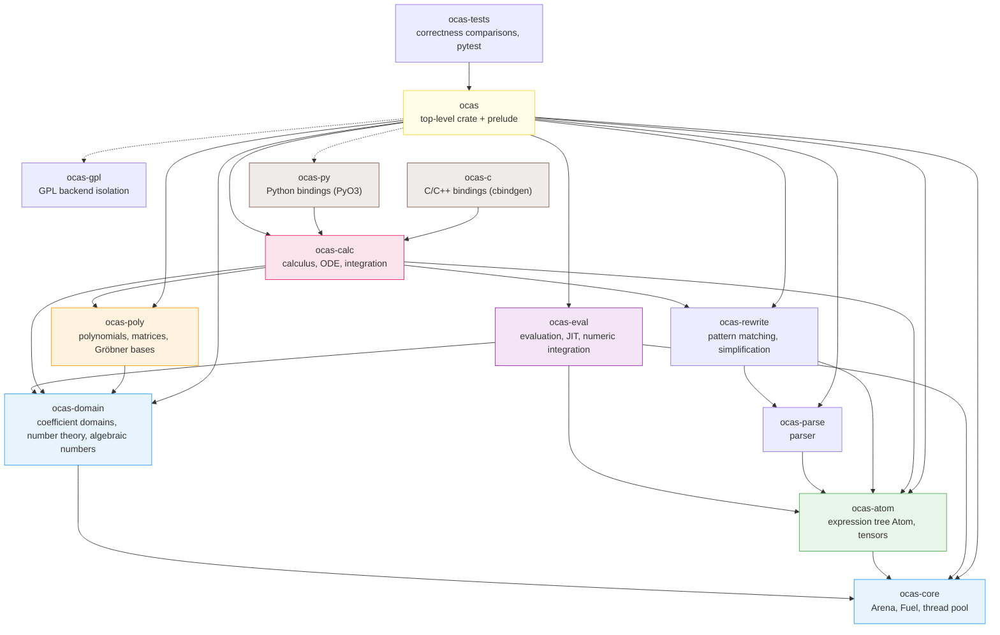

# Introduction

**oCAS** (Open Computer Algebra System) is a high-performance computer algebra system (CAS) written in Rust, released under the **LGPL-3.0-or-later** license. The project aims to match or exceed Symbolica and SageMath in core symbolic-computation performance, while providing multi-language interfaces through Python (PyO3) and C/C++ (cbindgen) bindings.

oCAS uses a layered crate architecture: 13 workspace members from the low-level arena allocator up to the top-level language bindings, with dependencies strictly pointing downward. All coefficient domains (arbitrary-precision integers/rationals, finite fields, real balls, complex numbers, double-precision floats) are abstracted behind a unified `Domain` trait, and the polynomial algebra, Gröbner basis, symbolic calculus, and ODE solving modules share the same expression infrastructure.

---

## Version Feature Matrix

The table below lists the key features added in each oCAS release (0.1 → 0.24):

| Version | Date | Key additions |
|---|---|---|
| **0.1.0** | 2026-06-29 | Workspace setup, arena allocator, unified error types, minimal C ABI example, cross-platform CI |
| **0.2.0** | 2026-06-30 | Expression tree `Atom` (hash consing), parser based on `logos`/`chumsky`, normalizer |
| **0.3.0** | 2026-06-30 | Coefficient domains (`Integer`/`Rational`/`FiniteField`/`RealBall`/`Complex`), dense/sparse polynomials, optional GMP/FLINT backends |
| **0.4.0** | 2026-07-01 | Rewrite engine (wildcard patterns, AC matching, `Rule`/`simplify`), optional egg e-graph equality saturation |
| **0.5.0** | 2026-07-01 | Symbolic differentiation `diff`, Taylor expansion `taylor`, heuristic integration `integrate` |
| **0.6.0** | 2026-07-08 | Stabilized prelude API, rustdoc examples, proptest property tests, Criterion benchmarks, SymPy comparison tooling |
| **0.7.0** | 2026-07-01 | Root isolation (Sturm's theorem), linear system solvers (ℚ/ℤ), Diophantine equations, Buchberger Gröbner bases |
| **0.8.0** | 2026-07-02 | Evaluation engine (stack VM, CSE optimization, SIMD vectorization, Cranelift JIT backend) |
| **0.9.0** | 2026-07-02 | Python bindings (PyO3 `Expression`/`ExpressionEvaluator`), C calculus API, C++ RAII wrappers, 33 pytest cases |
| **0.10.0** | 2026-07-02 | Python `Polynomial`/`Matrix` classes, Bareiss determinant, `FiniteField` implements `EuclideanDomain`, mdBook documentation site |
| **0.11.0** | 2026-07-03 | Correctness comparison framework (16 modules, 82 tests), complete ℤ/𝔽_p factorization (Cantor–Zassenhaus + Hensel), number theory primitives, multivariate GCD |
| **0.12.0** | 2026-07-04 | `RationalPolynomial` rational function type, Brown PRS resultant, Karatsuba fast multiplication, partial fraction decomposition `apart`/`together` |
| **0.13.0** | 2026-07-06 | F4 Gröbner basis algorithm (Gebauer–Moeller filtering, SimpCache, ℤ_p i64 fast path) |
| **0.14.0** | 2026-07-18 | Risch symbolic integration (Hermite reduction, RDE, trigonometric/special functions), FGLM change of order, Hilbert bound |
| **0.15.0** | 2026-07-20 | Multi-output JIT, f32 mixed precision, streaming evaluation (constant memory), arena reset + workspace pool, native i64 F4 pipeline |
| **0.16.0** | 2026-07-21 | Arbitrary multivariate factorization (Wang EEZ), $n$-ary GCD (dense recursive evaluation–interpolation) |
| **0.17.0** | 2026-07-22 | Algebraic number field factorization (Trager norm algorithm), $\mathrm{GF}(p^d)$ construction |
| **0.18.0** | 2026-07-23 | Resource control `Fuel`, hyper-dual automatic differentiation `HyperDual`, Vegas Monte Carlo integration, tensor foundations (index slots/contraction/symmetrization) |
| **0.19.0** | 2026-07-23 | F5 signature reduction algorithm (cyclic-6 ℤ₁₃ speedup ~1400× to 2.63s), unified Gröbner dispatch entry point, Rust 1.97 toolchain |
| **0.20.0** | 2026-07-27 | ODE solvers (5 first-order + 2 second-order + power series), ODE classification engine `classify_ode` |
| **0.20.1** | 2026-07-27 | Integrating factors, variation of parameters (VOP), extended method of undetermined coefficients (resonance/trig/superposition), reduction of order |
| **0.21.0** | 2026-07-30 | BPSW primality testing, integer factorization (Pollard rho/p−1/p+1/ECM), discrete logarithms, modular polynomial GCD (Brown), 12 number theory Python bindings |
| **0.22.0** | 2026-08-02 | McKay graph-isomorphism canonical labeling engine, tensor expression canonicalization, Young projectors, backtracking AC matching, multi-pattern replacement |
| **0.23.0** | 2026-08-02 | Ideal operations (membership/sum/product/quotient/saturation/intersection), elimination orders, zero-dimensional solving, primary decomposition, Hilbert series, rational root theorem |
| **0.24.0** | 2026-08-03 | Heuristic integration (LIATE integration by parts/trig substitution/Weierstrass), DoubleF64 double-precision floats (~31 significant digits) |

---

## Module Architecture

oCAS consists of 13 crates with the following dependency graph (arrow A → B
means A depends on B; `ocas-py`/`ocas-c` also depend on `ocas-eval`,
`ocas-rewrite` and other core crates — only representative edges are shown;
dashed edges are optional dependencies):

**Crate overview**:

| crate | Responsibility |
|---|---|
| `ocas-core` | Arena allocator, `Fuel` resource control, `ThreadPool`, GMP type aliases |
| `ocas-domain` | Coefficient domain traits (`Domain`/`EuclideanDomain`), `Integer`/`Rational`/`FiniteField`/`RealBall`/`Complex`/`DoubleF64`/`AlgebraicExtension`, number theory functions, assumption system |
| `ocas-poly` | Dense univariate/sparse multivariate polynomials, `RationalPolynomial`, matrices, GCD, factorization, Gröbner bases (Buchberger/F4/F5), FGLM, ideal operations |
| `ocas-atom` | `Atom`/`Arena`/`Symbol` expression tree, hash consing, tensors (graph canonicalization/Young projectors) |
| `ocas-parse` | Expression parser based on `logos`/`chumsky` |
| `ocas-rewrite` | Wildcard pattern matching (AC backtracking), `Rule`/`simplify`/`transform`, optional egg e-graph |
| `ocas-calc` | Symbolic differentiation `diff`, layered integration pipeline (rational → Risch → trigonometric → special functions → heuristic), Taylor expansion, ODE solvers (first/second-order, series, Laplace, systems), partial fractions |
| `ocas-eval` | Stack VM interpreter, SIMD vectorized evaluation, Cranelift JIT, streaming evaluation, Vegas Monte Carlo numeric integration |
| `ocas` | Top-level re-export crate + `prelude::*` |
| `ocas-py` | PyO3 Python bindings (25 classes + 32 functions) |
| `ocas-c` | C/C++ FFI bindings (91 `#[no_mangle]` exports) + `ocas.hpp` RAII wrappers |
| `ocas-gpl` | GPL-licensed backend isolation (GMP/MPFR/FLINT) |
| `ocas-tests` | Correctness comparison framework (SymPy/SageMath/Symbolica), pytest suite, C API integration tests |

---

## Key Features

- **13 crates** — layered Rust architecture from the arena runtime to language bindings, with dependencies strictly downward.
- **7 coefficient domains** — arbitrary-precision integers/rationals, finite fields $\mathbb{F}_p$, real balls, complex numbers, double-precision floats (DoubleF64 ~31 digits), algebraic number fields $\mathbb{Q}(\alpha)$ / $\mathrm{GF}(p^d)$.
- **Polynomial algebra** — dense univariate/sparse multivariate polynomials, Karatsuba multiplication, GCD (Brown's modular GCD), multivariate GCD, factorization (Cantor–Zassenhaus + Hensel + Wang EEZ), algebraic number field factorization (Trager).
- **Gröbner bases** — three algorithms (Buchberger / F4 / F5), FGLM change of order, ideal operations (membership/sum/product/quotient/saturation/intersection/elimination/radical/primary decomposition), Hilbert series.
- **Symbolic calculus** — differentiation, Taylor expansion, layered integration pipeline (rational → Risch → trigonometric → special functions → heuristic → unevaluated form).
- **ODE solving** — first-order (separable/linear/Bernoulli/exact/homogeneous/integrating factors), second-order (constant coefficient/Cauchy–Euler/reduction of order/undetermined coefficients/variation of parameters), power-series and Frobenius solutions, Laplace IVP, 2×2 systems.
- **Evaluation engine** — stack VM interpreter, SIMD batch evaluation (f64x4), Cranelift JIT (f64/f32), streaming evaluation (constant memory).
- **Automatic differentiation** — forward mode with hyper-dual numbers `HyperDual<T>`, first- and higher-order partial derivatives.
- **Tensor algebra** — index slots, explicit contraction, McKay graph-isomorphism canonicalization (1-WL refinement + path invariant pruning), Young projectors.
- **Numeric integration** — adaptive Monte Carlo (Vegas), supporting high-dimensional definite integrals.
- **Number theory** — BPSW primality testing, integer factorization (trial division/Pollard rho/p−1/p+1/ECM), discrete logarithms (BSGS + Pohlig–Hellman), Euler φ / Möbius / divisor functions.
- **Rewriting and simplification** — AC backtracking pattern matching, wildcards (`x__`/`x___`), fixpoint simplification, fuel-limited simplification, optional egg e-graph equality saturation.
- **Three-language bindings** — Rust prelude API, Python (PyO3, 25 classes + 32 functions), C/C++ (cbindgen, 91 exports + RAII wrappers).
- **Correctness framework** — cross-validation against SymPy, SageMath, and Symbolica across multiple mathematical modules (1174 `#[test]`/`#[tokio::test]` annotations as of 0.24.0).
- **Optional numeric backends** — GMP/MPFR/FLINT behind feature flags, with GPL backends isolated in `ocas-gpl`.

---

## Quick Navigation

| Topic | Description | Entry point |
|---|---|---|
| **Rust API reference** | Per-item documentation of all public types and functions | [API reference overview](./api/rust.md) |
| **Python API reference** | PyO3 binding signatures, parameters, exceptions, examples | [Python API](./api/python.md) |
| **C/C++ API reference** | FFI prototypes, error codes, memory management, examples | [C/C++ API](./api/c.md) |
| **Mathematical foundations** | Progressive exposition from polynomial algebra to the Risch algorithm | [Math overview](./math/overview.md) |
| **Algorithm details** | Implementation details of Gröbner bases, factorization, number theory, integration, ODEs | [Algorithms](./algorithms/groebner.md) |
| **Solvers** | Linear/Diophantine/polynomial-system/ODE solvers | [Solvers](./solvers.md) |
| **Rewriting and simplification** | Pattern matching, rule-based simplification, e-graphs | [Rewriting](./rewrite.md) |
| **Evaluation and JIT** | VM interpreter, SIMD, Cranelift JIT | [Evaluation](./evaluation.md) |
| **Numeric integration** | Vegas adaptive Monte Carlo | [Numeric integration](./numeric-integration.md) |
| **Automatic differentiation** | Forward-mode AD with hyper-dual numbers | [Autodiff](./autodiff.md) |
| **Tensors** | Indices, contraction, canonicalization, Young projectors | [Tensors](./tensors.md) |
| **Benchmarks and performance** | Criterion benchmarks, SymPy/SageMath comparisons | [Performance](./performance.md) |
| **Correctness** | Cross-system validation tests | [Correctness](./correctness.md) |
| **Build guide** | Backend selection, Windows build, contributing | [Build](./backends.md) |

---

## Project Status

oCAS is currently at version **0.24.0**. The core symbolic engine, polynomial algebra, Gröbner bases and algebraic geometry, ODE solving, JIT evaluation, three-language bindings, and the correctness comparison framework are feature-complete. The roadmap to a stable 1.0 can be found in the
[roadmap](https://github.com/charleshzh/ocas/blob/main/docs/planning/ROADMAP_EN.md).
