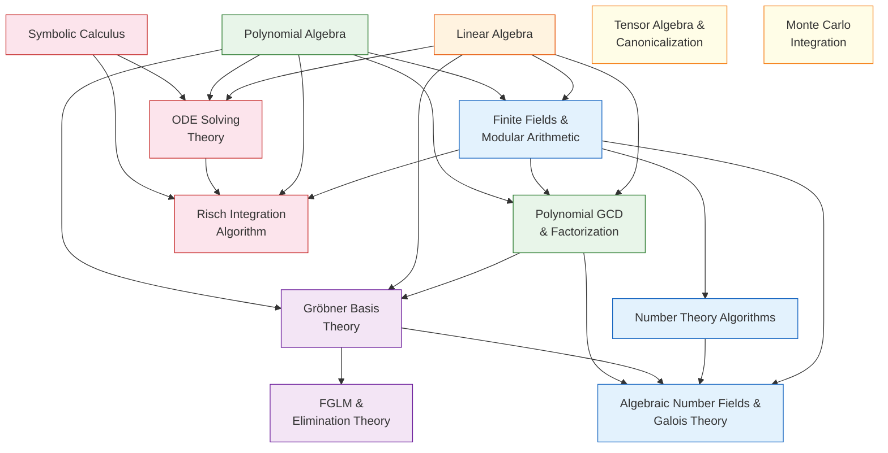

# Mathematics Overview

This chapter systematically introduces the mathematical theory involved in oCAS, from basic concepts to advanced algorithms, providing the complete mathematical background needed to understand the source implementation. Every article follows a progressive structure: "Prerequisites → Basic Concepts → Core Theory → oCAS Implementation → Advanced Topics → References".

---

## Knowledge Map

The diagram below shows the dependencies between the mathematical topics. An arrow indicates that the source topic is recommended to be studied before the target topic.

---

## Recommended Learning Paths

Depending on your interests, choose one of the following paths for systematic study.

### Path A: Polynomial Algebra & Symbolic Computation

For readers who want to understand the core algorithms of symbolic computation (polynomial arithmetic, elimination, solving systems of equations).

$$\text{Polynomial Algebra} \;\to\; \text{GCD/Factorization} \;\to\; \text{Gröbner Bases} \;\to\; \text{FGLM/Elimination}$$

| Step | Topic | Key Takeaways | File |
|:---:|------|---------|------|
| 1 | [Polynomial Algebra](./polynomial-algebra.md) | Polynomial rings, monomial orders, the division algorithm | `polynomial-algebra.md` |
| 2 | [Linear Algebra](./linear-algebra.md) | Matrix operations, the Bareiss algorithm, Gaussian elimination | `linear-algebra.md` |
| 3 | [Finite Fields & Modular Arithmetic](./finite-fields.md) | Construction of $\mathbb{F}_p$, modular inverses, NTT | `finite-fields.md` |
| 4 | [Polynomial GCD & Factorization](./poly-gcd-factoring.md) | Euclid's algorithm, Hensel lifting, Berlekamp's algorithm | `poly-gcd-factoring.md` |
| 5 | [Gröbner Basis Theory](./groebner-theory.md) | Buchberger's algorithm, F4/F5, Hilbert functions | `groebner-theory.md` |
| 6 | [FGLM & Elimination Theory](./fglm-elimination.md) | Order-change algorithms, ideal operations, primary decomposition | `fglm-elimination.md` |

### Path B: Number Theory & Algebraic Number Fields

For readers who want to understand integer factorization, primality testing, discrete logarithms, and the construction of algebraic number fields.

$$\text{Finite Fields} \;\to\; \text{Number Theory Algorithms} \;\to\; \text{Algebraic Number Fields}$$

| Step | Topic | Key Takeaways | File |
|:---:|------|---------|------|
| 1 | [Finite Fields & Modular Arithmetic](./finite-fields.md) | Construction of $\mathbb{F}_p$ and $\mathbb{F}_{p^d}$, cyclicity of the multiplicative group | `finite-fields.md` |
| 2 | [Number Theory Algorithms](./number-theory-algorithms.md) | BPSW primality, ECM factorization, BSGS discrete logarithms, Tonelli–Shanks | `number-theory-algorithms.md` |
| 3 | [Algebraic Number Fields & Galois Theory](./algebraic-number-fields.md) | Representation of $\mathbb{Q}(\alpha)$, Trager's norm algorithm, $\mathrm{GF}(p^d)$ | `algebraic-number-fields.md` |

### Path C: Symbolic Calculus & Differential Equations

For readers who want to understand symbolic differentiation, integration, ODE solving, and the Risch algorithm.

$$\text{Symbolic Calculus} \;\to\; \text{ODE Solving} \;\to\; \text{Risch Integration}$$

| Step | Topic | Key Takeaways | File |
|:---:|------|---------|------|
| 1 | [Symbolic Calculus](./symbolic-calculus.md) | Differentiation rules, Taylor expansion, expression-tree transformations | `symbolic-calculus.md` |
| 2 | [ODE Solving Theory](./ode-theory.md) | Separable/linear/Bernoulli/constant-coefficient/series solutions/Laplace transforms | `ode-theory.md` |
| 3 | [The Risch Integration Algorithm](./risch-algorithm.md) | Differential-field towers, Hermite reduction, the logarithmic derivative identity, RDE | `risch-algorithm.md` |

---

## Topic Quick-Reference Table

The table below lists the oCAS source module and the chapter file in this document for each mathematical topic.

| Topic | Level | oCAS Module | Math Chapter |
|------|:----:|-----------|----------|
| [Polynomial Algebra](./polynomial-algebra.md) | Foundations | `ocas-poly` (`dense.rs`, `sparse.rs`) | `polynomial-algebra.md` |
| [Finite Fields & Modular Arithmetic](./finite-fields.md) | Foundations | `ocas-domain` (`finite_field.rs`) | `finite-fields.md` |
| [Linear Algebra](./linear-algebra.md) | Foundations | `ocas-poly` (`matrix.rs`) | `linear-algebra.md` |
| [Polynomial GCD & Factorization](./poly-gcd-factoring.md) | Advanced | `ocas-poly` (`gcd/`, `factor/`) | `poly-gcd-factoring.md` |
| [Gröbner Basis Theory](./groebner-theory.md) | Advanced | `ocas-poly` (`groebner/mod.rs`, `f4.rs`, `f5.rs`, `hilbert.rs`) | `groebner-theory.md` |
| [Number Theory Algorithms](./number-theory-algorithms.md) | Advanced | `ocas-domain` (`number_theory/`) | `number-theory-algorithms.md` |
| [Symbolic Calculus](./symbolic-calculus.md) | Advanced | `ocas-calc` (`lib.rs`) | `symbolic-calculus.md` |
| [ODE Solving Theory](./ode-theory.md) | Advanced | `ocas-calc` (`ode/`) | `ode-theory.md` |
| [The Risch Integration Algorithm](./risch-algorithm.md) | Higher | `ocas-calc` (`integral/`) | `risch-algorithm.md` |
| [FGLM & Elimination Theory](./fglm-elimination.md) | Higher | `ocas-poly` (`groebner/fglm.rs`, `ideal.rs`) | `fglm-elimination.md` |
| [Algebraic Number Fields & Galois Theory](./algebraic-number-fields.md) | Higher | `ocas-domain` (`algebraic.rs`) | `algebraic-number-fields.md` |
| [Tensor Algebra & Canonicalization](./tensor-canonicalization.md) | Higher | `ocas-atom` (`tensor/canon.rs`, `young.rs`, `spec.rs`) | `tensor-canonicalization.md` |
| [Monte Carlo Integration](./monte-carlo-integration.md) | Higher | `ocas-eval` (`numeric/vegas.rs`) | `monte-carlo-integration.md` |

---

## Correspondence Between Mathematical Branches and oCAS

The design of oCAS follows the tradition of computer algebra. The correspondence between modules and mathematical branches is as follows:

- **Commutative algebra** (polynomial rings, ideal theory) → `ocas-poly`: polynomial representation, GCD, factorization, Gröbner bases, ideal operations
- **Number theory** (primality, factorization, discrete logarithms) → `ocas-domain/number_theory`: integer factorization, primality testing, quadratic residues
- **Linear algebra** (matrices, determinants) → `ocas-poly/matrix`: the Bareiss determinant, Gaussian elimination, linear systems
- **Calculus and differential algebra** (symbolic differentiation, integration, ODEs) → `ocas-calc`: differentiation, Taylor expansion, ODE classification and solving, the Risch algorithm
- **Tensor algebra** (index contraction, symmetrization) → `ocas-atom/tensor`: graph encoding, the McKay algorithm, Young projection
- **Numerical analysis** (adaptive integration) → `ocas-eval/numeric`: Vegas Monte Carlo, adaptive grids
