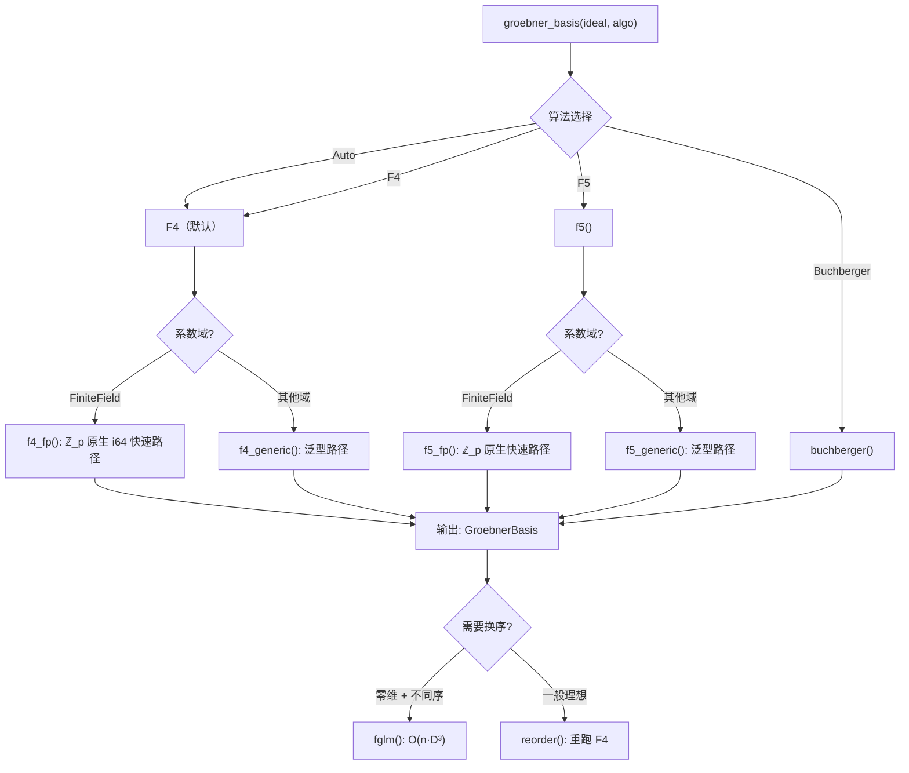

# Gröbner 基实现

本章详述 oCAS 中 Gröbner 基计算的**实现细节**——算法选择、数据结构、关键优化
和内部流水线。数学理论见 [Gröbner 基理论](../math/groebner-theory.md)，API
签名见 [Rust API 参考](../api/rust-groebner.md)。

---

## 架构总览



统一入口 `groebner_basis` 接受一个 `Algorithm` 枚举：

| 变体 | 行为 |
|---|---|
| `Auto` | 当前路由到 F4（未来将基于 cyclic-n 基准校准 F5 切换点） |
| `Buchberger` | 经典 S-多项式迭代 |
| `F4` | 矩阵批量约化 |
| `F5` | 签名判据 |

所有算法输出**约化 Gröbner 基**（`GroebnerBasis::minimize().auto_reduce()`）。

---

## Buchberger 算法

`GroebnerBasis::buchberger` 实现经典 Buchberger 算法：

1. 初始化基为输入多项式集合
2. 构造所有临界对（S-多项式）
3. 对每对计算 S-多项式并对当前基做多步除法
4. 若余式非零，加入基并更新临界对
5. 重复直到无新多项式加入
6. 最后调用 `minimize()`（去冗余）和 `auto_reduce()`（互相约化）

```rust
pub fn buchberger<D: Domain, O: MonomialOrder>(
    ideal: &[SparseMultivariatePolynomial<D, O>],
) -> GroebnerBasis<D, O> {
    GroebnerBasis::buchberger(ideal).minimize().auto_reduce()
}
```

Buchberger 适用于小理想和教学场景。生产环境应使用 F4。

---

## F4 算法

F4（Faugère 1999）将逐对 S-多项式约化替换为**稀疏矩阵行阶梯批处理**。
这是 oCAS 的默认 Gröbner 基算法。

### 主循环

`f4` 的主循环结构：

```
初始化 basis ← 输入多项式
初始化 pairs ← 空临界对集合
对每个初始多项式: update_pairs(basis, pairs, simplifications, poly)

while pairs 非空:
    (1) 选出所有 lcm 总次数最小的临界对（一批）
    (2) 符号预处理：构造约化矩阵
    (3) 行阶梯化：Gaussian 消元
    (4) 提取幸存行 → 新基元素
    (5) 对每个新基元素: update_pairs(...)
```

### 临界对与 Gebauer-Moeller 筛选

`CriticalPair` 存储两个基元素的索引和预计算的 lcm：

```rust
struct CriticalPair {
    idx1: usize,       // 第一个基元素索引
    idx2: usize,       // 第二个基元素索引
    lcm: SmallVec<[usize; 4]>,  // LM(idx1) 和 LM(idx2) 的 lcm
    degree: usize,     // lcm 的总次数
}
```

`update_pairs` 实现 Gebauer-Moeller 临界对管理，遵循 Becker-Weispfenning
《A Computational Approach to Commutative Algebra》中的描述。其核心是三个判据：

**第一判据（Chain Criterion）**：对已有对 $(f_i, f_j)$，若存在 $f_k$
使得 $\text{lcm}(f_i, f_k)$ 整除 $\text{lcm}(f_i, f_j)$ 且
$\text{lcm}(f_j, f_k)$ 整除 $\text{lcm}(f_i, f_j)$，则 $(f_i, f_j)$ 冗余。

**第二判据（Update Criterion）**：新多项式加入时，遍历已有对，若新多项式的
LM 与对中某元素的 lcm 严格整除对的 lcm，则该对可移除。

**冗余对清理**：移除那些首项已被基中其他元素约化的对。

### 符号预处理（Symbolic Preprocessing）

对于选中的临界对，F4 构造一个**稀疏矩阵**，其中：
- 每行对应一个多项式（S-多项式或基元素的倍式）
- 每列对应矩阵中出现的唯一单项式
- 单项式按当前序降序排列（列 0 = 最大单项式）

预处理的工作列表（worklist）算法：

1. 将 S-多项式对的两个分量分别加入矩阵
2. 对矩阵中每个单项式 $\mathbf{x}^\alpha$，若存在基元素 $f_i$ 使得
   $\text{LT}(f_i) \mid \mathbf{x}^\alpha$，则将 $f_i \cdot (\mathbf{x}^\alpha / \text{LT}(f_i))$
   加入矩阵
3. 重复直到工作列表为空

### DivisorIndex：快速除子查询

朴素实现需要 $O(\text{单项式数} \times \text{基大小})$ 的线性扫描来查找
约化器。oCAS 引入 `DivisorIndex` 替代之：

```rust
struct DivisorIndex {
    buckets: HashMap<u64, Vec<usize>>,
}
```

**原理**：每个单项式的 **support**（出现正指数的变量集合）用 64 位掩码表示。
基元素按其首项单项式的 support 掩码分桶。查询时，$\mathbf{x}^\alpha$ 的约化器
的 support 必须是 $\text{support}(\alpha)$ 的子掩码——枚举子掩码（位运算）并
在对应桶中做精确整除检查。

选择约化器时，优先选**项数最少**的基元素（ties 按基索引），这与 Buchberger
的线性扫描行为一致。

### SimpCache：倍式缓存

```rust
type SimpCache<P> = Vec<(SmallVec<[usize; 4]>, P)>;
```

`get_simplified` 在缓存中查找给定指数差 `diff` 对应的已计算倍式
`basis_poly * x^diff`。命中时直接返回，避免重复乘法。缓存跨轮次保持，
因此同一 S-多次项只构造一次。

### 行阶梯化

矩阵构造完成后，执行稀疏 Gaussian 消元：

**ℤ_p 快速路径**（`echelonize_fp`）：

```rust
fn echelonize_fp(
    matrix: &mut Vec<Vec<(i64, usize)>>,
    ncols: usize,
    prime: i64,
    pivots: &mut Vec<Option<usize>>,
)
```

- 行按首列升序排序
- 逐列扫描：找到当前列的第一个非零行作为主元
- 主元行 monic 化（乘以首系数的模逆）
- 用主元行消去其余行的当前列
- `sub_scaled_fp` 执行稀疏行减法：双指针合并两个按列升序排列的行，
  跳过首列（主元是 monic，首列自动消去），结果系数归一化到 $[0, p)$，
  零系数丢弃

**泛型路径**（`echelonize_generic`）：

结构与 ℤ_p 路径相同，但使用域的通用 `sub`/`mul`/`div` 运算。
`sub_scaled_generic` 同样是双指针合并，零系数丢弃。

### ℤ_p 原生快速路径（FpPoly）

当系数域是 `FiniteField` 时，F4 自动切换到 `f4_fp`，其中所有多项式操作
使用 `FpPoly`——一个纯 `i64` 模算术的多项式表示：

```rust
struct FpPoly {
    terms: Vec<(SmallVec<[usize; 4]>, i64)>,  // 按序降序，系数 ∈ [0, p)
    n_vars: usize,
}
```

**约束**：$p < 2^{31}$，确保两个残差的乘积仍在 `i64` 范围内。

`register_row_fp` 实现跨轮次的行缓存：用 `(basis_idx, diff)` 作键，
避免重复构造同一 S-多项式或约化器倍式。

`monic_fp` 通过扩展 Euclid 算法（`mod_inv`）计算模逆，使首项系数归一化。

**性能影响**：ℤ_p 路径完全避免 `BigInt` 分配，行阶梯步骤使用惰性模算术，
使得有限域计时接近有理数计时。

### 基后处理

F4 循环结束后：

1. **`minimize()`**：移除首项被其他基元素首项整除的冗余元素
2. **`auto_reduce()`**：对每个基元素，用其余基元素约化其尾项（非首项部分）

---

## F5 算法

F5（Faugère 2002）是**基于签名**的 Gröbner 基算法。其核心思想：为每个
多项式附加一个"签名"，利用 syzygy 判据在矩阵构造**之前**拒绝零约化器，
对困难理想（如 cyclic-n）可实现数量级加速。

自 0.19.0 版本起，F5 已是生产级实现。

### 签名与 pot 序

```rust
struct Signature {
    module_pos: usize,                     // 输入生成元的索引（0-based）
    monomial: SmallVec<[usize; 4]>,        // 乘子单项式
}
```

签名记录多项式的"历史"：`module_pos` 是它源自第几个输入生成元，
`monomial` 是施加在该生成元的模基向量 $\mathbf{e}_{\text{module\_pos}}$
上的单项式倍数。

签名按 **pot**（position-over-term）序比较：先比较 `module_pos`（更小的
更优先），再按单项式序 $O$ 比较 `monomial`。

### LabeledPoly：带签名的多项式

```rust
struct LabeledPoly<D: Domain, O: MonomialOrder> {
    poly: SparseMultivariatePolynomial<D, O>,
    sig: Signature,
}
```

F5 基中每个多项式都携带签名。`LabeledPoly` 实现了 `BasisPoly` trait，
因此可以复用 F4 的临界对管理（`update_pairs`）和简化缓存。

### SyzygySet：零约化跟踪

```rust
struct SyzygySet {
    lms: HashMap<usize, Vec<SmallVec<[usize; 4]>>>,
}
```

当矩阵行约化为零时，其签名是一个 syzygy。F5 的 syzygy 判据：
**若未来某行的签名是已知 syzygy 签名的单项式倍数，则该行也将约化为零，
可立即跳过**。

内部按模块位置（`module_pos`）分组存储已知 syzygy 的首项单项式。
查询 `(k, t)` 时，检查位置 `k` 下是否有 LM 整除 `t`。

### F5 主循环

`f5` 的结构与 F4 类似但有关键差异：

```
对每个输入生成元 g_i (i = 0, 1, ...):
    给 g_i 附加签名 (i, 1)（单位单项式）
    将 (i, 1) 加入基
    update_pairs(...)

while pairs 非空:
    选中一组临界对
    对每个对:
        构造 S-多项式并计算其签名 sig
        if syzygies.is_syzygy(sig):  ← 关键优化：跳过
            continue
    build_and_reduce(selected, basis, syzygies):
        (1) 构造带签名的矩阵行
        (2) 行阶梯化
        (3) 约化为零的行 → 将其签名加入 syzygies
        (4) 幸存行 → 新基元素（保留签名）
    对每个新基元素: update_pairs(...)
```

### F5 的 ℤ_p 快速路径

与 F4 类似，F5 有 `f5_fp` 变体使用 `LabeledFpPoly`（`FpPoly` + 签名）：

```rust
struct LabeledFpPoly {
    poly: FpPoly,
    sig: Signature,
}
```

所有多项式操作在 `i64` 模算术上执行，`BigInt` 转换仅发生在输入读取和
结果输出边界。

---

## FGLM 换序算法

FGLM（Faugère–Gianni–Lazard–Mora 1993）将**零维**理想的 Gröbner 基从
一种单项式序转换为另一种，代价为 $O(n \cdot D^3)$ 次域运算（$D$ 为阶梯
维数），远低于对一般理想重跑 F4 的代价。

### 核心思路

零维理想的**阶梯**（不被任何首项单项式整除的单项式集合）是有限的。
FGLM 按**目标序**递增遍历阶梯中的单项式，计算它们对当前基的正规形，
并检测线性相关：

```
compute_staircase(lms, n_vars):
    BFS 从单位单项式出发
    单项式 m ∈ 阶梯 ⟺ 无 LM 整除 m
    若 BFS 不终止 → 正维，返回 None

fglm(gb, TargetOrder):
    staircase ← compute_staircase(gb.lms)
    seen ← []  // 已遍历单项式的正规形（阶梯坐标）
    new_basis ← []

    按 TargetOrder 递增遍历阶梯中的 m:
        nf ← normal_form_monomial(m, gb, staircase)
        coeffs ← find_relation(seen, nf)
        if coeffs 存在:  // nf = Σ c_i · seen_i → 线性相关
            new_poly ← m - Σ c_i · m_i  // 目标序下的新基元素
            new_basis.push(new_poly)
            mark_multiples(visited, m)  // 跳过 m 的倍数
        else:
            seen.push(nf)

    return GroebnerBasis::new(new_basis)
```

### 正规形计算

`normal_form_monomial` 将单项式 $m$ 对源基 GB 约化，结果表示为阶梯
坐标的线性组合——即长度为 $\dim(R/I)$ 的向量，每个分量对应阶梯中的
一个基单项式。

### 线性相关检测

`find_relation` 用 Gaussian 消元在域上检测：是否存在系数 $c_i$ 使得
$\text{nf} = \sum c_i \cdot \text{seen}_i$。若存在，这些系数确定了
新基多项式。

### 返回 None 的情况

当理想为正维（阶梯无限）时，`fglm` 返回 `None`。此时应改用
`reorder`（在新序下重跑 F4）。

---

## Hilbert 级数计算

`hilbert` 模块从 Gröbner 基计算 Hilbert 级数和相关不变量。

### Hilbert 分子（容斥原理）

对单项式理想 $\langle m_1, \dots, m_s \rangle$，Hilbert 分子通过
容斥原理计算：

$$N(t) = \sum_{k=0}^{s} (-1)^k \sum_{|S|=k} t^{\deg \text{lcm}(S)}$$

`hilbert_numerator` 遍历生成元的所有子集，计算 lcm 的次数，按容斥符号
累加。实际适用于约 20 个生成元以内。

### 正则性界

`regularity_bound` 返回 Hilbert 分子中非零系数的最高次数。这是 F4 的
**提前终止提示**（Bayer–Stillman）：F4 可以停止选择次数超过正则性界的
临界对——因为所有剩余 S-多项式将约化为零。当前该界是**建议性的**，
不改变计算结果。

### 完整 Hilbert 级数

`hilbert_series` 使用 **Macaulay 定理**：$R/I$ 的 Hilbert 级数等于
$R/\text{LT}(I)$ 的 Hilbert 级数（其中 $\text{LT}(I)$ 是首项理想）。

```rust
struct HilbertSeries {
    numerator: Vec<i64>,       // N(t) 的系数（从常数项起）
    denominator_power: usize,  // 分母 (1-t)^n 的幂（= 变量数）
}
```

提供四个方法：
- `hilbert_function(d)`：$\dim_k (R/I)_d$ 在次数 $d$ 的值
- `dimension()`：$R/I$ 的 Krull 维数
- `degree()`：射影簇的次数
- `hilbert_polynomial()`：Lagrange 插值计算完整多项式系数

阶梯维数 `staircase_dimension` 由容斥分子在 $t = 1$ 处的取值给出（容斥
枚举随生成元数指数增长，实际约 20 个以内可用）；当理想为正维（分子
系数和为 0）时返回 `None`。

---

## 理想运算

`ocas_poly::ideal` 模块基于 Gröbner 基实现完整的理想算术。所有运算
使用 `Lex` 序保持一致性。

### 成员判定

`ideal_contains(gens, f, algo)`：
1. 计算生成元的 Gröbner 基 GB
2. 将 $f$ 对 GB 约化
3. 余式为零 $\iff f \in I$

### 和与积

**理想和** $I + J = \langle f_1, \dots, f_m, g_1, \dots, g_n \rangle$：
合并两组生成元后计算 GB。

**理想积** $I \cdot J = \langle f_i \cdot g_j \rangle$：
取所有对的乘积后计算 GB。

### 商（Rabinowitsch 技巧）

$I : J = \{f : f \cdot g \in I, \forall g \in J\}$

对单个生成元 $g$，`quotient_single_generator` 执行：

1. 引入新变量 $w$，在扩展环 $k[x_1, \dots, x_n, w]$ 中
2. 计算 $\text{GB}(I' \cup \{1 - wg'\})$
3. 消去 $w$（取 Lex GB 中不包含 $w$ 的元素）
4. 结果为 $I : g \subset k[x_1, \dots, x_n]$

对多个生成元 $J = \langle g_1, \dots, g_k \rangle$，分别计算
$I : g_j$ 后取交集。

### 饱和

$I : J^\infty = \bigcup_k (I : J^k)$

`ideal_saturate` 迭代计算 $I : J$，$(I : J) : J$，…，直到稳定
（连续两次结果相同）。

### 交集（辅助变量法）

$I \cap J = \langle t \cdot f_i, (1-t) \cdot g_j \rangle \cap k[x_1, \dots, x_n]$

`intersect_generators`：
1. 引入辅助变量 $t$（索引 0）
2. 构造 $t \cdot f_i$ 和 $(1-t) \cdot g_j$
3. 计算 Lex GB
4. 消去 $t$（取不含 $t$ 的元素）

### 消元

`eliminate(gens, elim_vars, algo)`：

利用 Lex 序的自然消元性质：在 Lex 序下，约化 GB 自动包含消元理想的
生成元。取 GB 中不涉及前 `elim_vars` 个变量的多项式。

---

## 零维求解

`solve_polynomial_system` 对方程组分类并求实数解。

### 维数检测

`is_zero_dimensional` 检查：对每个变量 $x_i$，GB 中是否存在纯幂
$x_i^N$ 作为某个首项单项式。等价地，阶梯（标准单项式）是有限的。

### 三角分解求解

对零维系统，`solve_triangular` 执行：

1. 取 Lex GB（自然形成三角形式）
2. 从最后一个变量（Lex 中最小）开始**反向代入**：
   - 提取仅含单变量 $x_n$ 的多项式 → 一元方程 → 求实根
   - 将 $x_n$ 的每个根代入含 $x_{n-1}, x_n$ 的多项式
   - 递归求解 $x_{n-1}$，…
3. 实根用 Sturm 根隔离法计算（`f64` 精度）

`compute_vector_space_dim` 返回 $k[x_1, \dots, x_n]/I$ 的向量空间维数
（各变量一元多项式次数的乘积）。

### 解的分类

```rust
enum PolynomialSystemSolution {
    ZeroDimensional(ZeroDimSolutions),  // 有限个实数解
    PositiveDimensional(GroebnerBasis), // 无限解集；返回 Lex GB
    Empty,                               // 无解（理想 = ⟨1⟩）
}
```

---

## 准素分解与根式

### 零维根式

`radical_zero_dim`：取 Lex GB 中每个一元多项式的**无平方分解**，
用无平方因子替换原多项式后重新计算 GB。

### 正维根式

`radical_via_jacobian`（简化 Kemper 算法，特征 0）：

1. 对所有生成元和变量计算偏导数 $\partial f_i / \partial x_j$
2. 取所有非零偏导数的 GCD 为 $h$
3. $\sqrt{I} = I : h^\infty$（用饱和实现）

若 Jacobian 平凡（所有导数为零或 $h = 1$），回退到返回原 GB。

### 零维准素分解

`primary_decomp_zero_dim`：

1. 取 Lex GB 中一元多项式的**不可约因式分解**
2. 每个不可约因子 $p_i^{e_i}$ 对应一个准素分量
3. 用饱和分离各分量：$Q_i = I : \prod_{j \neq i} p_j^\infty$
4. 关联素理想 $\mathfrak{p}_i = \langle p_i \rangle$

返回 `Vec<PrimaryComponent>`，每个包含：
- `primary`：准素理想的 GB
- `prime`：关联素理想的 GB

### 素性与准素性检测

- `is_prime_ideal`：零维时检查一元多项式是否不可约；正维保守返回 `false`
- `is_primary_ideal`：检查是否恰有一个关联素理想

---

## 单项式序系统

oCAS 支持丰富的单项式序配置（0.19.1+）：

| 序 | 说明 |
|---|---|
| `Lex` | 字典序：$x_1 > x_2 > \cdots$，适合消元 |
| `Grlex` | 分次字典序：先总次数，再字典序 |
| `Grevlex` | 分次反字典序：先总次数，反向字典序 |
| `WeightOrder` | 加权序：按 $\sum w_i e_i$ 降序 |
| `BlockOrder` | 分块消元：变量分组，各组独立子序 |
| `MatrixOrder` | 通用权重矩阵序（0.23.0+） |

`MatrixOrder::elimination_order(elim_vars, n_vars)` 生成消元序，
先消去前 `elim_vars` 个变量，剩余按 Grevlex 比较。

### 换序策略

| 场景 | 推荐策略 |
|---|---|
| 零维 + 需要 Lex | 先 Grevlex 计算，再 `fglm` 换序到 Lex |
| 一般理想 + 需要不同序 | `reorder`（在新序下重跑 F4） |
| 消元 | 直接用 Lex 或 `MatrixOrder::elimination_order` |

---

## 基准数据

Criterion 计时（cyclic 方程组，本机）：

| 方程组 | Buchberger | F4 | 加速比 |
|---|---|---|---|
| cyclic-3 ℚ | 308 µs | 147 µs | 2.1× |
| cyclic-4 ℚ | 3.99 ms | 2.13 ms | 1.9× |
| cyclic-3 ℤ₁₃ | 582 µs | 276 µs | 2.1× |
| cyclic-4 ℤ₁₃ | 6.19 ms | 2.80 ms | 2.2× |

ℤ_p 原生 `i64` 快速路径使有限域计时接近有理数计时。

---

## 参见

- **数学理论**：[Gröbner 基理论](../math/groebner-theory.md) — Buchberger/F4/F5
  算法的数学基础、Hilbert 函数理论
- **FGLM 与消元**：[FGLM 与消元理论](../math/fglm-elimination.md) — 换序算法
  的数学原理、理想运算的 Gröbner 基实现
- **API 参考**：[Rust Gröbner 基与理想](../api/rust-groebner.md) — 函数签名、
  参数、返回值、完整示例
- **多项式**：[多项式](../api/rust-polynomials.md) — `SparseMultivariatePolynomial`
  的表示与单项式序 trait
- **系数域**：[系数域](../api/rust-domains.md) — `Domain` trait 与各域实现
