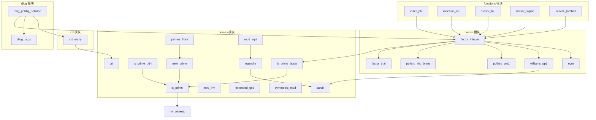

# Rust API 参考：数论

本章记录 oCAS 数论模块 `ocas_domain::number_theory` 的完整 API。该模块提供素性检测、整数分解、中国剩余定理、离散对数、二次剩余符号和积性数论函数，是多项式因式分解（Berlekamp、Cantor–Zassenhaus、Hensel 提升）、有理重构和模 GCD 算法的基础设施。

**模块路径**：`ocas_domain::number_theory`

**子模块**：

| 子模块 | 功能 |
|---|---|
| `primes` | 素性检测、素数生成、模逆、扩展 Euclid、二次剩余 |
| `factor` | 整数完全分解（试除、Pollard rho/p−1/p+1、ECM） |
| `crt` | 多模中国剩余定理 |
| `dlog` | 离散对数（BSGS、Pohlig–Hellman） |
| `functions` | 积性数论函数（φ、μ、τ、σ_k、λ） |

**导入方式**：

```rust
use ocas_domain::number_theory::{
    is_prime, next_prime, primes_from, mod_inv, extended_gcd, symmetric_mod,
    crt, legendre, jacobi, mod_sqrt,
    factor::factor_integer,
    functions::{euler_phi, moebius_mu, divisor_tau, divisor_sigma, liouville_lambda},
};
// 或从子模块精确导入
use ocas_domain::number_theory::primes::is_prime_bpsw;
use ocas_domain::number_theory::primes::is_prime_u64;
use ocas_domain::number_theory::crt::crt_many;
use ocas_domain::number_theory::dlog::{dlog_bsgs, dlog_pohlig_hellman};
```

---

## 素性检测

### is_prime

**签名**：`pub fn is_prime(n: &Integer) -> bool`

**功能**：判断 `n` 是否为素数。

**参数**：

| 参数 | 类型 | 说明 |
|---|---|---|
| `n` | `&Integer` | 待测整数 |

**返回值**：`bool`——`true` 表示 `n` 是（强）拟素数或确定素数。

**实现细节**：

- 对 $n < 3.317 \times 10^{24}$，使用固定 12 个 Miller–Rabin 证人 $\{2, 3, 5, 7, 11, 13, 17, 19, 23, 29, 31, 37\}$ 的**确定性**判定。
- 对更大的 `n`，退化为强拟素数测试（复合数通过概率极低）。
- 显式处理 $n \leq 3$ 和偶数情况。

**示例**：

```rust
use ocas_domain::Integer;
use ocas_domain::number_theory::is_prime;

assert!(is_prime(&Integer::from(97)));
assert!(!is_prime(&Integer::from(561)));   // Carmichael 数，不是素数
assert!(is_prime(&Integer::from(2_147_483_647_i64))); // Mersenne 素数 M31
```

**参见**：[`is_prime_bpsw`](#is_prime_bpsw)、[`is_prime_u64`](#is_prime_u64)、[`next_prime`](#next_prime)

---

### is_prime_bpsw

**签名**：`pub fn is_prime_bpsw(n: &Integer) -> bool`

**功能**：BPSW 拟素数判定——base-2 强 Miller–Rabin + 强 Lucas 拟素数测试（Selfridge 参数选择）。

**参数**：

| 参数 | 类型 | 说明 |
|---|---|---|
| `n` | `&Integer` | 待测整数 |

**返回值**：`bool`——`true` 表示 `n` 通过 BPSW 测试。

**实现细节**：

1. 先做 base-2 强 Miller–Rabin（与 `is_prime` 共享 `mr_witness` 内核）。
2. 再做强 Lucas 测试：Selfridge 参数选择——从序列 $5, -7, 9, -11, \ldots$ 中取首个满足 $\text{jacobi}(D, n) = -1$ 的 $D$，令 $P = 1$，$Q = (1 - D)/4$。
3. 写 $n + 1 = d \cdot 2^r$（$d$ 奇），二进制 ladder 计算 Lucas 序列 $(U_k, V_k)$。$n$ 通过当 $U_d \equiv 0$ 或 $V_{d \cdot 2^i} \equiv 0 \pmod{n}$ 对某个 $0 \leq i < r$。

**已知性质**：目前没有任何复合数通过 BPSW 测试（截至 2026 年）。对 $n < 3.317 \times 10^{24}$ 结果是确定性的。

**示例**：

```rust
use ocas_domain::Integer;
use ocas_domain::number_theory::primes::is_prime_bpsw;

assert!(is_prime_bpsw(&Integer::from(97)));
assert!(!is_prime_bpsw(&Integer::from(561)));    // Carmichael 数
assert!(!is_prime_bpsw(&Integer::from(2047)));   // base-2 强伪素数，但非素数
```

**参见**：[`is_prime`](#is_prime)、[`factor_integer`](#factor_integer)（内部使用 BPSW 作为最终素性判定）

---

### is_prime_u64

**签名**：`pub fn is_prime_u64(n: u64) -> bool`

**功能**：对 `u64` 范围内的整数做确定性素性检测。

**参数**：

| 参数 | 类型 | 说明 |
|---|---|---|
| `n` | `u64` | 待测整数 |

**返回值**：`bool`。

**实现细节**：内部将 `n` 转换为 `Integer` 后调用 `is_prime`。12 个 Miller–Rabin 证人覆盖整个 `u64` 范围（$< 3.317 \times 10^{24}$），因此结果是**确定性**的。

**示例**：

```rust
use ocas_domain::number_theory::primes::is_prime_u64;

assert!(is_prime_u64(97));
assert!(!is_prime_u64(561));
assert!(is_prime_u64(u64::MAX - 58)); // 2^64 − 59，最大的 u64 素数
```

**参见**：[`is_prime`](#is_prime)

---

## 素数生成

### next_prime

**签名**：`pub fn next_prime(n: &Integer) -> Integer`

**功能**：返回严格大于 `n` 的最小素数。

**参数**：

| 参数 | 类型 | 说明 |
|---|---|---|
| `n` | `&Integer` | 起始整数 |

**返回值**：`Integer`——大于 `n` 的最小素数。

**实现细节**：从 $n + 1$ 开始（若 $n < 2$ 则从 2 开始），依次测试奇数候选。

**示例**：

```rust
use ocas_domain::Integer;
use ocas_domain::number_theory::next_prime;

assert_eq!(next_prime(&Integer::from(10)), Integer::from(11));
assert_eq!(next_prime(&Integer::from(13)), Integer::from(17));
assert_eq!(next_prime(&Integer::from(0)), Integer::from(2));
```

**参见**：[`primes_from`](#primes_from)、[`is_prime`](#is_prime)

---

### primes_from

**签名**：`pub fn primes_from(n: &Integer) -> PrimesFrom`

**功能**：创建一个从 `n` 之后开始的连续素数迭代器。

**参数**：

| 参数 | 类型 | 说明 |
|---|---|---|
| `n` | `&Integer` | 起始整数 |

**返回值**：`PrimesFrom`——实现 `Iterator<Item = Integer>` 的迭代器，依次产出严格大于 `n` 的素数。

**使用场景**：在 Hensel 提升中扫描素数（寻找不整除首项系数且保持 $f \bmod p$ 无平方的素数）。

**示例**：

```rust
use ocas_domain::Integer;
use ocas_domain::number_theory::primes_from;

let mut it = primes_from(&Integer::from(100));
assert_eq!(it.next().unwrap().to_string(), "101");
assert_eq!(it.next().unwrap().to_string(), "103");
```

**参见**：[`next_prime`](#next_prime)

---

## 模运算

### mod_inv

**签名**：`pub fn mod_inv(a: &Integer, m: &Integer) -> Option<Integer>`

**功能**：计算 `a` 模 `m` 的乘法逆元，即满足 $a \cdot x \equiv 1 \pmod{m}$ 的 `x`。

**参数**：

| 参数 | 类型 | 说明 |
|---|---|---|
| `a` | `&Integer` | 被求逆元素 |
| `m` | `&Integer` | 模数 |

**返回值**：`Option<Integer>`——`Some(x)` 且 $0 \leq x < m$，或 `None`。

**错误条件**：当 $\gcd(a, m) \neq 1$ 或 $m \leq 1$ 时返回 `None`。

**示例**：

```rust
use ocas_domain::Integer;
use ocas_domain::number_theory::mod_inv;

assert_eq!(mod_inv(&Integer::from(3), &Integer::from(11)), Some(Integer::from(4)));
// 3 × 4 = 12 ≡ 1 (mod 11)
assert_eq!(mod_inv(&Integer::from(2), &Integer::from(4)), None);
// gcd(2, 4) = 2 ≠ 1，逆元不存在
```

**参见**：[`extended_gcd`](#extended_gcd)

---

### extended_gcd

**签名**：`pub fn extended_gcd(a: &Integer, b: &Integer) -> (Integer, Integer, Integer)`

**功能**：扩展 Euclid 算法——计算 $g = \gcd(a, b)$ 以及 Bézout 系数 $x, y$ 使得 $g = a \cdot x + b \cdot y$。

**参数**：

| 参数 | 类型 | 说明 |
|---|---|---|
| `a` | `&Integer` | 第一个整数 |
| `b` | `&Integer` | 第二个整数 |

**返回值**：`(g, x, y)`——`g` 非负，满足 $g = a \cdot x + b \cdot y$。

**示例**：

```rust
use ocas_domain::Integer;
use ocas_domain::number_theory::extended_gcd;

let (g, x, y) = extended_gcd(&Integer::from(240), &Integer::from(46));
assert_eq!(g, Integer::from(2));
// 验证 Bézout 等式：240·x + 46·y = 2
assert_eq!(&x * &Integer::from(240) + &y * &Integer::from(46), g);
```

**参见**：[`mod_inv`](#mod_inv)

---

### symmetric_mod

**签名**：`pub fn symmetric_mod(a: &Integer, m: &Integer) -> Integer`

**功能**：将 `a` 约化到对称区间 $(-m/2, m/2]$。

**参数**：

| 参数 | 类型 | 说明 |
|---|---|---|
| `a` | `&Integer` | 被约化整数 |
| `m` | `&Integer` | 模数（正数） |

**返回值**：`Integer`——在 $(-m/2, m/2]$ 内的代表元。

**使用场景**：Hensel 提升中从模表示恢复整数系数时使用。

**示例**：

```rust
use ocas_domain::Integer;
use ocas_domain::number_theory::symmetric_mod;

// mod 7，区间 (-3.5, 3.5]
assert_eq!(symmetric_mod(&Integer::from(3), &Integer::from(7)), Integer::from(3));
assert_eq!(symmetric_mod(&Integer::from(5), &Integer::from(7)), Integer::from(-2));
assert_eq!(symmetric_mod(&Integer::from(6), &Integer::from(7)), Integer::from(-1));
```

**参见**：[`crt`](#crt)

---

## 中国剩余定理

### crt

**签名**：`pub fn crt(r1: &Integer, m1: &Integer, r2: &Integer, m2: &Integer) -> Option<(Integer, Integer)>`

**功能**：合并两个同余方程 $x \equiv r_1 \pmod{m_1}$，$x \equiv r_2 \pmod{m_2}$。

**参数**：

| 参数 | 类型 | 说明 |
|---|---|---|
| `r1` | `&Integer` | 第一个余数 |
| `m1` | `&Integer` | 第一个模数 |
| `r2` | `&Integer` | 第二个余数 |
| `m2` | `&Integer` | 第二个模数 |

**返回值**：`Option<(Integer, Integer)>`——`Some((r, m))` 其中 $m = \operatorname{lcm}(m_1, m_2)$，$0 \leq r < m$，$r \equiv r_1 \pmod{m_1}$，$r \equiv r_2 \pmod{m_2}$。

**错误条件**：当系统不相容（$r_1 - r_2$ 不被 $\gcd(m_1, m_2)$ 整除）时返回 `None`。模数**无需互素**。

**示例**：

```rust
use ocas_domain::Integer;
use ocas_domain::number_theory::crt;

// x ≡ 2 (mod 3), x ≡ 3 (mod 5)  =>  x ≡ 8 (mod 15)
let (r, m) = crt(&Integer::from(2), &Integer::from(3),
                 &Integer::from(3), &Integer::from(5)).unwrap();
assert_eq!(r, Integer::from(8));
assert_eq!(m, Integer::from(15));
```

**参见**：[`crt_many`](#crt_many)

---

### crt_many

**签名**：`pub fn crt_many(congruences: &[(Integer, Integer)]) -> Option<(Integer, Integer)>`

**功能**：合并多个同余方程 $x \equiv r_i \pmod{m_i}$。

**参数**：

| 参数 | 类型 | 说明 |
|---|---|---|
| `congruences` | `&[(Integer, Integer)]` | 同余方程列表，每个元素为 `(r_i, m_i)` |

**返回值**：`Option<(Integer, Integer)>`——`Some((R, M))` 其中 $M = \operatorname{lcm}(m_1, \ldots, m_k)$，$0 \leq R < M$。

**错误条件**：

- 空列表返回 `None`。
- 任意一对不相容时返回 `None`。

**实现细节**：逐对折叠调用 [`crt`](#crt)，模数无需两两互素。

**示例**：

```rust
use ocas_domain::Integer;
use ocas_domain::number_theory::crt::crt_many;

// 孙子算经：x ≡ 2 (mod 3), x ≡ 3 (mod 5), x ≡ 2 (mod 7)
let cs = [
    (Integer::from(2), Integer::from(3)),
    (Integer::from(3), Integer::from(5)),
    (Integer::from(2), Integer::from(7)),
];
let (r, m) = crt_many(&cs).unwrap();
assert_eq!(r, Integer::from(23));
assert_eq!(m, Integer::from(105)); // 3 × 5 × 7 = 105
```

**参见**：[`crt`](#crt)、[`dlog_pohlig_hellman`](#dlog_pohlig_hellman)（内部使用 CRT 合并部分结果）

---

## 二次剩余

### legendre

**签名**：`pub fn legendre(a: &Integer, p: &Integer) -> i8`

**功能**：计算 Legendre 符号 $\left(\frac{a}{p}\right)$。

**参数**：

| 参数 | 类型 | 说明 |
|---|---|---|
| `a` | `&Integer` | 被判别整数 |
| `p` | `&Integer` | 奇素数（调用者保证素性） |

**返回值**：

| 值 | 含义 |
|---|---|
| `1` | $a$ 是模 $p$ 的二次剩余（QR） |
| `-1` | $a$ 是模 $p$ 的二次非剩余（QNR） |
| `0` | $p \mid a$ |

**注意**：`p` 的素性由调用者保证；函数内部等价于 `jacobi(a, p)`。

**示例**：

```rust
use ocas_domain::Integer;
use ocas_domain::number_theory::legendre;

assert_eq!(legendre(&Integer::from(2), &Integer::from(7)), 1);  // 2 是 mod 7 的 QR
assert_eq!(legendre(&Integer::from(3), &Integer::from(7)), -1); // 3 是 mod 7 的 QNR
```

**参见**：[`jacobi`](#jacobi)、[`mod_sqrt`](#mod_sqrt)

---

### jacobi

**签名**：`pub fn jacobi(a: &Integer, n: &Integer) -> i8`

**功能**：计算 Jacobi 符号 $\left(\frac{a}{n}\right)$——Legendre 符号的推广，对任意正奇数 `n` 定义。

**参数**：

| 参数 | 类型 | 说明 |
|---|---|---|
| `a` | `&Integer` | 被判别整数 |
| `n` | `&Integer` | 正奇数 |

**返回值**：`i8`——`0`、`1` 或 `-1`。

**实现细节**：使用二次互反律计算，包括 2-adic 剥离和 mod-8/mod-4 符号规则。

**注意**：若 `n` 为偶数或非正，结果未定义（函数返回 `0`）。

**示例**：

```rust
use ocas_domain::Integer;
use ocas_domain::number_theory::jacobi;

assert_eq!(jacobi(&Integer::from(2), &Integer::from(15)), 1);
assert_eq!(jacobi(&Integer::from(7), &Integer::from(15)), -1);
```

**参见**：[`legendre`](#legendre)

---

### mod_sqrt

**签名**：`pub fn mod_sqrt(a: &Integer, p: &Integer) -> Option<Integer>`

**功能**：计算 $a$ 模奇素数 $p$ 的平方根，即满足 $x^2 \equiv a \pmod{p}$ 的 $x$。

**参数**：

| 参数 | 类型 | 说明 |
|---|---|---|
| `a` | `&Integer` | 被开方数 |
| `p` | `&Integer` | 奇素数 |

**返回值**：`Option<Integer>`——`Some(x)` 且 $0 \leq x < p$（另一个根为 $p - x$）。

**错误条件**：当 $p \leq 2$ 或 $a$ 是二次非剩余（`legendre(a, p) = -1`）时返回 `None`。`p` 的素性由调用者保证——函数内部不检查素性，对奇合数 `p` 行为未定义。

**实现细节**：

- 当 $p \equiv 3 \pmod{4}$ 时使用快速路径 $x = a^{(p+1)/4} \bmod p$。
- 其他情况使用完整 Tonelli–Shanks 算法：找非剩余 $z$，维护不变量 $c, t, r, m$。

**示例**：

```rust
use ocas_domain::Integer;
use ocas_domain::number_theory::mod_sqrt;

// 2 是 mod 7 的 QR：根为 3 和 4（3² = 9 ≡ 2, 4² = 16 ≡ 2 mod 7）
let r = mod_sqrt(&Integer::from(2), &Integer::from(7)).unwrap();
assert!(r == Integer::from(3) || r == Integer::from(4));
```

**参见**：[`legendre`](#legendre)

---

## 整数分解

### factor_integer

**签名**：`pub fn factor_integer(n: &Integer) -> Vec<(Integer, u32)>`

**功能**：将 $|n|$ 完全分解为素因子，返回按升序排列的 `(素数, 指数)` 对。

**参数**：

| 参数 | 类型 | 说明 |
|---|---|---|
| `n` | `&Integer` | 待分解整数 |

**返回值**：`Vec<(Integer, u32)>`——素因子列表，按素数升序排列。$n \in \{0, \pm 1\}$ 返回空列表。

**分解策略**：

1. **试除**（`factor_trial`）：移除 $\leq 1000$ 的小因子。
2. 对剩余的复合余因子，使用**递增策略**逐级尝试：
   - Pollard rho–Brent 变体（批量 gcd + 回溯）
   - Pollard $p-1$ stage 1（光滑性界倍增 $\times 4$）
   - Williams $p+1$ stage 1（Lucas $V$ 序列，随机 $P$ 使 $\text{jacobi}(P^2-4, n) = -1$）
   - ECM Lenstra（Suyama 参数化，Montgomery 曲线射影坐标，曲线预算 $\approx B_1/550$）
3. 每个叶子通过 BPSW 素性判定。

**示例**：

```rust
use ocas_domain::Integer;
use ocas_domain::number_theory::factor::factor_integer;

let f = factor_integer(&Integer::from(2 * 2 * 3 * 5 * 101 * 1000003));
assert_eq!(f, vec![
    (Integer::from(2), 2),
    (Integer::from(3), 1),
    (Integer::from(5), 1),
    (Integer::from(101), 1),
    (Integer::from(1000003), 1),
]);

// 空列表
assert!(factor_integer(&Integer::from(0)).is_empty());
assert!(factor_integer(&Integer::from(1)).is_empty());
```

**参见**：[`is_prime_bpsw`](#is_prime_bpsw)、[`euler_phi`](#euler_phi)、[`moebius_mu`](#moebius_mu)

---

### factor_integer_with_rng

**签名**：`pub fn factor_integer_with_rng(n: &Integer, rng: &mut Xoshiro256PlusPlus) -> Vec<(Integer, u32)>`

**功能**：与 [`factor_integer`](#factor_integer) 相同，但接受显式 RNG 以实现可重复的分解结果。

**参数**：

| 参数 | 类型 | 说明 |
|---|---|---|
| `n` | `&Integer` | 待分解整数 |
| `rng` | `&mut Xoshiro256PlusPlus` | 随机数生成器（`rand_xoshiro` crate） |

**返回值**：`Vec<(Integer, u32)>`。

**使用场景**：测试中需要确定性结果时使用。

**参见**：[`factor_integer`](#factor_integer)

---

### factor_trial

**签名**：`pub fn factor_trial(n: &Integer, limit: u64) -> (Vec<(Integer, u32)>, Integer)`

**功能**：试除法移除 $\leq \text{limit}$ 的素因子。

**参数**：

| 参数 | 类型 | 说明 |
|---|---|---|
| `n` | `&Integer` | 待分解整数 |
| `limit` | `u64` | 试除上界 |

**返回值**：`(factors, cofactor)`——`factors` 为已找到的因子列表，`cofactor` 无 $\leq \text{limit}$ 的素因子（但未必是素数）。

**示例**：

```rust
use ocas_domain::Integer;
use ocas_domain::number_theory::factor::factor_trial;

let (factors, rest) = factor_trial(&Integer::from(2 * 2 * 3 * 7 * 1000003), 100);
assert_eq!(factors, vec![
    (Integer::from(2), 2),
    (Integer::from(3), 1),
    (Integer::from(7), 1),
]);
assert_eq!(rest, Integer::from(1000003));
```

**参见**：[`factor_integer`](#factor_integer)

---

### pollard_rho_brent

**签名**：`pub fn pollard_rho_brent(n: &Integer, rng: &mut Xoshiro256PlusPlus) -> Option<Integer>`

**功能**：Brent 变体的 Pollard rho 算法——搜索奇复合数 `n` 的非平凡因子。

**参数**：

| 参数 | 类型 | 说明 |
|---|---|---|
| `n` | `&Integer` | 奇复合数 |
| `rng` | `&mut Xoshiro256PlusPlus` | 随机数生成器 |

**返回值**：`Option<Integer>`——`Some(d)` 为 `n` 的非平凡因子，`None` 表示多次尝试均未成功（极少出现）。

**实现细节**：批量 gcd + 回溯策略提高成功率，有界重试次数。

**示例**：

```rust
use ocas_domain::Integer;
use ocas_domain::number_theory::factor::pollard_rho_brent;
use rand::SeedableRng;
use rand_xoshiro::Xoshiro256PlusPlus;

let n = Integer::from(1000003) * Integer::from(1000033);
let mut rng = Xoshiro256PlusPlus::seed_from_u64(42);
let d = pollard_rho_brent(&n, &mut rng).unwrap();
assert!(d == Integer::from(1000003) || d == Integer::from(1000033));
```

**参见**：[`factor_integer`](#factor_integer)

---

### pollard_pm1

**签名**：`pub fn pollard_pm1(n: &Integer, b1: u64, rng: &mut Xoshiro256PlusPlus) -> Option<Integer>`

**功能**：Pollard $p-1$ 方法（stage 1）——当 $p-1$ 是 $B_1$-光滑时找到 `n` 的因子 `p`。

**参数**：

| 参数 | 类型 | 说明 |
|---|---|---|
| `n` | `&Integer` | 奇复合数 |
| `b1` | `u64` | 光滑性上界 |
| `rng` | `&mut Xoshiro256PlusPlus` | 随机数生成器 |

**返回值**：`Option<Integer>`。

**实现细节**：计算 $a^M \bmod n$，其中 $M = \prod q^e \leq B_1$（$q$ 取遍素数，$q^e \leq B_1$），定期测试 $\gcd(a^M - 1, n)$。

**示例**：

```rust
use ocas_domain::Integer;
use ocas_domain::number_theory::factor::pollard_pm1;
use rand::SeedableRng;
use rand_xoshiro::Xoshiro256PlusPlus;

// 65537 是素数，65536 = 2^16 是 2^17-光滑的
let n = Integer::from(65537) * Integer::from(1000003);
let mut rng = Xoshiro256PlusPlus::seed_from_u64(7);
let d = pollard_pm1(&n, 1 << 17, &mut rng).unwrap();
assert_eq!(n.mod_floor(&d), Integer::from(0));
```

**参见**：[`williams_pp1`](#williams_pp1)、[`ecm`](#ecm)

---

### williams_pp1

**签名**：`pub fn williams_pp1(n: &Integer, b1: u64, rng: &mut Xoshiro256PlusPlus) -> Option<Integer>`

**功能**：Williams $p+1$ 方法（stage 1）——当 $p+1$ 是 $B_1$-光滑时找到 `n` 的因子 `p`。

**参数**：

| 参数 | 类型 | 说明 |
|---|---|---|
| `n` | `&Integer` | 奇复合数 |
| `b1` | `u64` | 光滑性上界 |
| `rng` | `&mut Xoshiro256PlusPlus` | 随机数生成器 |

**返回值**：`Option<Integer>`。

**实现细节**：使用 Lucas $V$ 序列（$Q = 1$），随机选择 $P$ 使 $\text{jacobi}(P^2 - 4, n) = -1$。

**示例**：

```rust
use ocas_domain::Integer;
use ocas_domain::number_theory::factor::williams_pp1;
use rand::SeedableRng;
use rand_xoshiro::Xoshiro256PlusPlus;

// 31 是素数，31 + 1 = 2^5 是 64-光滑的
let n = Integer::from(31) * Integer::from(1000003);
let mut rng = Xoshiro256PlusPlus::seed_from_u64(13);
let d = williams_pp1(&n, 64, &mut rng).unwrap();
assert_eq!(n.mod_floor(&d), Integer::from(0));
```

**参见**：[`pollard_pm1`](#pollard_pm1)、[`ecm`](#ecm)

---

### ecm

**签名**：`pub fn ecm(n: &Integer, b1: u64, max_curves: u32, rng: &mut Xoshiro256PlusPlus) -> Option<Integer>`

**功能**：Lenstra 椭圆曲线方法（ECM，stage 1）——当某条曲线在 $\mathbb{F}_p$ 上的群阶是 $B_1$-光滑时找到 `n` 的因子 `p`。

**参数**：

| 参数 | 类型 | 说明 |
|---|---|---|
| `n` | `&Integer` | 奇复合数 |
| `b1` | `u64` | 光滑性上界 |
| `max_curves` | `u32` | 最大尝试曲线数 |
| `rng` | `&mut Xoshiro256PlusPlus` | 随机数生成器 |

**返回值**：`Option<Integer>`。

**实现细节**：

- Suyama 参数化：从 $\sigma \notin \{0, 1, 5\}$ 构建 Montgomery 曲线，$a24 = (A+2)/4$，$A = \frac{(v-u)^3(3u+v)}{4u^3v} - 2$，其中 $u = \sigma^2 - 5$，$v = 4\sigma$。
- 射影坐标 $(X:Z)$ 下的 Montgomery ladder 标量乘。
- 曲线预算 $\approx B_1 / 550$。

**示例**：

```rust
use ocas_domain::Integer;
use ocas_domain::number_theory::factor::ecm;
use rand::SeedableRng;
use rand_xoshiro::Xoshiro256PlusPlus;

let n = Integer::from(1000003) * Integer::from(1000033);
let mut rng = Xoshiro256PlusPlus::seed_from_u64(99);
let d = ecm(&n, 2_000, 50, &mut rng).unwrap();
assert!(d == Integer::from(1000003) || d == Integer::from(1000033));
```

**参见**：[`factor_integer`](#factor_integer)、[`pollard_pm1`](#pollard_pm1)

---

## 离散对数

### dlog_bsgs

**签名**：`pub fn dlog_bsgs(base: &Integer, target: &Integer, modulus: &Integer) -> Option<Integer>`

**功能**：用 baby-step giant-step（BSGS）算法求解 $base^x \equiv \text{target} \pmod{\text{modulus}}$，搜索 $x < \text{modulus}$。

**参数**：

| 参数 | 类型 | 说明 |
|---|---|---|
| `base` | `&Integer` | 底数 |
| `target` | `&Integer` | 目标值 |
| `modulus` | `&Integer` | 模数 |

**返回值**：`Option<Integer>`——`Some(x)` 且 $0 \leq x < \text{modulus}$，`None` 表示无解。

**错误条件**：

- $\gcd(\text{base}, \text{modulus}) \neq 1$（底数不是单位）。
- 不存在满足条件的 $x$。

**复杂度**：时间和空间均为 $O(\sqrt{\text{modulus}})$。仅适用于较小的 `modulus`。

**实现细节**：HashMap 存储 baby steps，$O(\sqrt{m})$ 查找 giant steps。

**示例**：

```rust
use ocas_domain::Integer;
use ocas_domain::number_theory::dlog::dlog_bsgs;

// 2 是 mod 11 的原根；2^7 = 128 ≡ 7 (mod 11)
let x = dlog_bsgs(&Integer::from(2), &Integer::from(7), &Integer::from(11)).unwrap();
assert_eq!(Integer::from(2).modpow(&x, &Integer::from(11)), Integer::from(7));
```

**参见**：[`dlog_pohlig_hellman`](#dlog_pohlig_hellman)

---

### dlog_pohlig_hellman

**签名**：`pub fn dlog_pohlig_hellman(base: &Integer, target: &Integer, p: &Integer) -> Option<Integer>`

**功能**：用 Pohlig–Hellman 算法求解 $base^x \equiv \text{target} \pmod{p}$（$p$ 为素数）。

**参数**：

| 参数 | 类型 | 说明 |
|---|---|---|
| `base` | `&Integer` | 底数 |
| `target` | `&Integer` | 目标值 |
| `p` | `&Integer` | 素数模数 |

**返回值**：`Option<Integer>`——`Some(x)`，`None` 表示无解或输入不满足条件。

**错误条件**：

- `p` 是合数。
- `base` 不是模 `p` 的单位。
- `target` 不在 `base` 生成的子群中。

**实现细节**：

1. 用 `factor_integer` 分解 `base` 的阶。
2. 对每个素幂 $q^e$，逐位 BSGS 恢复离散对数（数字恢复）。
3. 用 `crt_many` 合并部分结果。
4. 最终验证 $\text{base}^x \equiv \text{target} \pmod{p}$。

**复杂度**：由最大素因子 $q$ 支配，为 $O(\sqrt{q})$。当阶为光滑数时效率极高。

**示例**：

```rust
use ocas_domain::Integer;
use ocas_domain::number_theory::dlog::dlog_pohlig_hellman;

// p = 101, p − 1 = 2²·5²（光滑）。2 是 mod 101 的原根。
let p = Integer::from(101);
let base = Integer::from(2);
let target = base.modpow(&Integer::from(83), &p);
let x = dlog_pohlig_hellman(&base, &target, &p).unwrap();
assert_eq!(x, Integer::from(83));
```

**参见**：[`dlog_bsgs`](#dlog_bsgs)、[`factor_integer`](#factor_integer)、[`crt_many`](#crt_many)

---

## 积性数论函数

所有积性函数基于 [`factor_integer`](#factor_integer) 分解后组合计算。

### euler_phi

**签名**：`pub fn euler_phi(n: &Integer) -> Integer`

**功能**：Euler totient 函数 $\varphi(n)$——$[1, |n|]$ 中与 $n$ 互素的整数个数。

**参数**：

| 参数 | 类型 | 说明 |
|---|---|---|
| `n` | `&Integer` | 输入整数 |

**返回值**：`Integer`——$\varphi(|n|)$。

**计算公式**：$|n| \cdot \prod_{p \mid n} \left(1 - \frac{1}{p}\right)$，遍历 $n$ 的不同素因子。

**约定**：$\varphi(0) = 0$，$\varphi(\pm 1) = 1$。

**示例**：

```rust
use ocas_domain::Integer;
use ocas_domain::number_theory::functions::euler_phi;

assert_eq!(euler_phi(&Integer::from(9)), Integer::from(6));
// φ(9) = 9 × (1 − 1/3) = 6，与 9 互素的有 {1,2,4,5,7,8}
assert_eq!(euler_phi(&Integer::from(36)), Integer::from(12));
assert_eq!(euler_phi(&Integer::from(97)), Integer::from(96)); // 素数 p: φ(p) = p−1
```

**参见**：[`factor_integer`](#factor_integer)

---

### moebius_mu

**签名**：`pub fn moebius_mu(n: &Integer) -> i8`

**功能**：Möbius 函数 $\mu(n)$。

**参数**：

| 参数 | 类型 | 说明 |
|---|---|---|
| `n` | `&Integer` | 输入整数 |

**返回值**：`i8`。

**定义**：

$$
\mu(n) = \begin{cases} 1 & n = \pm 1 \\ (-1)^k & n \text{ 有 } k \text{ 个不同的素因子（无平方因子）} \\ 0 & n \text{ 被某个素数的平方整除} \end{cases}
$$

**约定**：$\mu(0) = 0$。

**示例**：

```rust
use ocas_domain::Integer;
use ocas_domain::number_theory::functions::moebius_mu;

assert_eq!(moebius_mu(&Integer::from(1)), 1);
assert_eq!(moebius_mu(&Integer::from(6)), 1);   // 6 = 2·3，2 个素因子 → (−1)² = 1
assert_eq!(moebius_mu(&Integer::from(30)), -1); // 30 = 2·3·5，3 个素因子 → (−1)³ = −1
assert_eq!(moebius_mu(&Integer::from(12)), 0);  // 4 = 2² 整除 12
```

**参见**：[`factor_integer`](#factor_integer)

---

### divisor_tau

**签名**：`pub fn divisor_tau(n: &Integer) -> Integer`

**功能**：除数函数 $\tau(n)$（也记作 $d(n)$）——$|n|$ 的正因子个数。

**参数**：

| 参数 | 类型 | 说明 |
|---|---|---|
| `n` | `&Integer` | 输入整数 |

**返回值**：`Integer`——$\tau(|n|)$。

**计算公式**：若 $n = \prod p_i^{e_i}$，则 $\tau(n) = \prod (e_i + 1)$。

**约定**：$\tau(0) = 0$。

**示例**：

```rust
use ocas_domain::Integer;
use ocas_domain::number_theory::functions::divisor_tau;

assert_eq!(divisor_tau(&Integer::from(12)), Integer::from(6));
// 12 = 2²·3¹ → (2+1)(1+1) = 6，因子为 {1,2,3,4,6,12}
assert_eq!(divisor_tau(&Integer::from(97)), Integer::from(2)); // 素数只有 1 和自身
```

**参见**：[`divisor_sigma`](#divisor_sigma)、[`factor_integer`](#factor_integer)

---

### divisor_sigma

**签名**：`pub fn divisor_sigma(n: &Integer, k: u32) -> Integer`

**功能**：除数函数 $\sigma_k(n)$——$|n|$ 的正因子的 $k$ 次幂之和。

**参数**：

| 参数 | 类型 | 说明 |
|---|---|---|
| `n` | `&Integer` | 输入整数 |
| `k` | `u32` | 幂次（非负整数） |

**返回值**：`Integer`——$\sigma_k(|n|)$。

**计算公式**：$\sigma_k(n) = \prod \frac{p_i^{k(e_i+1)} - 1}{p_i^k - 1}$。

**特殊值**：

- $\sigma_0(n) = \tau(n)$（除数个数）
- $\sigma_1(n) = \sigma(n)$（除数之和——完美数判定：$n$ 为完全数当且仅当 $\sigma_1(n) = 2n$）

**约定**：$\sigma_k(0) = 0$。

**示例**：

```rust
use ocas_domain::Integer;
use ocas_domain::number_theory::functions::divisor_sigma;

assert_eq!(divisor_sigma(&Integer::from(12), 1), Integer::from(28));
// σ₁(12) = 1+2+3+4+6+12 = 28
assert_eq!(divisor_sigma(&Integer::from(12), 2), Integer::from(210));
// σ₂(12) = 1+4+9+16+36+144 = 210
assert_eq!(divisor_sigma(&Integer::from(12), 0), Integer::from(6));
// σ₀(12) = τ(12) = 6
```

**参见**：[`divisor_tau`](#divisor_tau)、[`factor_integer`](#factor_integer)

---

### liouville_lambda

**签名**：`pub fn liouville_lambda(n: &Integer) -> i8`

**功能**：Liouville 函数 $\lambda(n) = (-1)^{\Omega(n)}$，其中 $\Omega(n)$ 为含重数的素因子总个数。

**参数**：

| 参数 | 类型 | 说明 |
|---|---|---|
| `n` | `&Integer` | 输入整数 |

**返回值**：`i8`——`1` 或 `-1`。

**约定**：$\lambda(0) = 0$，$\lambda(\pm 1) = 1$。

**示例**：

```rust
use ocas_domain::Integer;
use ocas_domain::number_theory::functions::liouville_lambda;

assert_eq!(liouville_lambda(&Integer::from(12)), -1);
// 12 = 2²·3，Ω = 3 → (−1)³ = −1
assert_eq!(liouville_lambda(&Integer::from(6)), 1);
// 6 = 2·3，Ω = 2 → (−1)² = 1
```

**参见**：[`factor_integer`](#factor_integer)、[`moebius_mu`](#moebius_mu)

---

## 模块依赖关系


