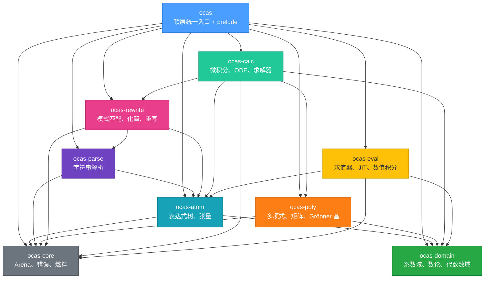

# Rust API 参考

oCAS 的 Rust API 采用分层 crate 架构，顶层 `ocas` crate 通过 `prelude` 模块统一导出所有常用类型和函数。用户只需一行导入即可开始使用：

```rust
use ocas::prelude::*;
```

## 模块层级



| Crate | 职责 |
|---|---|
| `ocas-core` | Arena bump 分配器、统一错误类型 `OcasError`、燃料计数 `Fuel` |
| `ocas-domain` | 系数域 trait（`Domain`、`EuclideanDomain`）及实现（整数、有理数、有限域、实数球、复数、双精度浮点、代数数域）、数论函数库、对偶数自动微分 |
| `ocas-atom` | 表达式树（`Atom`、`AtomNode`、`AtomArena`）、hash-consing、张量系统 |
| `ocas-parse` | 字符串 → `Atom` 解析器 |
| `ocas-poly` | 多项式（稠密一元、稀疏多元、有理分式域）、矩阵、Gröbner 基算法（Buchberger/F4/F5）、理想运算、FGLM 换序 |
| `ocas-rewrite` | 模式匹配（AC 匹配）、化简（不动点迭代）、自底向上变换、E-graph（可选） |
| `ocas-calc` | 符号微分、积分（Risch 管线）、Taylor 展开、ODE 求解、丢番图/线性/多项式系统求解器 |
| `ocas-eval` | 栈 VM 解释器、JIT 编译（Cranelift）、SIMD 批量求值、Vegas 蒙特卡洛数值积分 |

## `prelude` 导入内容清单

`use ocas::prelude::*` 导入以下所有项。同时也可通过 `ocas::TypeName` 直接访问最常用的类型。

### 表达式树

| 名称 | 类型 | 说明 |
|---|---|---|
| `Atom` | struct | Copy 句柄，指向 arena 中的表达式节点 |
| `AtomArena` | struct | hash-consing 构造器，从 `Arena` 创建表达式 |
| `AtomNode` | enum | 节点变体：`Num`/`Var`/`Fun`/`Add`/`Mul`/`Pow` |
| `Symbol` | struct | interned 字符串标识符，Copy |
| `normalize` | fn | 规范化表达式（排序、合并同类项） |
| `parse` | fn | 字符串解析为 `Atom` |
| `ParseError` | enum | 解析错误 |

### 系数域

| 名称 | 类型 | 说明 |
|---|---|---|
| `Domain` | trait | 系数域基本算术（`zero`/`one`/`add`/`mul`/`sub`/`neg` 等） |
| `EuclideanDomain` | trait | 欧几里得域（+ `div_rem`/`gcd`/`lcm`） |
| `Integer` | struct | 任意精度整数 |
| `IntegerDomain` | struct | 整数域实现 |
| `Rational` | struct | 任意精度有理数 |
| `RationalDomain` | struct | 有理数域实现 |
| `FiniteField` | struct | 𝔽ₚ 有限域 |
| `FiniteFieldElement` | struct | 有限域元素 |
| `RealBall` | struct | 实数球算术（需 `mpfr` feature） |
| `RealBallDomain` | struct | 实数球域实现 |
| `Complex` | struct | 复数 |
| `ComplexDomain` | struct | 复数域实现 |
| `DoubleF64` | struct | 双精度浮点（~31 位有效数字） |
| `DoubleF64Domain` | struct | 双精度浮点域实现 |
| `AlgebraicExtension` | struct | 代数数域 ℚ(α) 或 GF(p^d) |
| `AlgebraicElement` | struct | 代数数域元素 |
| `AlgebraicNumberField` | struct | 代数数域构造器 |
| `Assumption` | enum | 假设变体（`Positive`/`Negative`/`Integer`/`Real`/`Complex` 等 13 种） |
| `Assumptions` | struct | 假设集合 |
| `SymbolAssumptions` | struct | 符号级假设管理 |

### 多项式

| 名称 | 类型 | 说明 |
|---|---|---|
| `DenseUnivariatePolynomial` | struct | 稠密一元多项式 |
| `SparseMultivariatePolynomial` | struct | 稀疏多元多项式 |
| `RationalPolynomial` | struct | 多项式分式域元素 p/q |
| `RootInterval` | struct | 恰好包含一个实根的区间（`low`/`high` 边界） |
| `MonomialOrder` | trait | 单项式序 trait |
| `Lex` | struct | 字典序 |
| `Grlex` | struct | 分次字典序 |
| `Grevlex` | struct | 分次反字典序 |
| `WeightOrder` | struct | 加权序 |
| `BlockOrder` | struct | 分块消元序 |
| `SubOrder` | struct | 子序 |
| `monomial_divides` | fn | 单项式整除测试 |
| `monomial_lcm` | fn | 单项式最小公倍 |
| `monomial_are_coprime` | fn | 单项式互素测试 |

### 矩阵

| 名称 | 类型 | 说明 |
|---|---|---|
| `Matrix` | struct | 域上矩阵（Bareiss 行列式、高斯消元求解） |
| `MatrixError` | enum | 矩阵运算错误 |

### Gröbner 基

| 名称 | 类型 | 说明 |
|---|---|---|
| `GroebnerBasis` | struct | Gröbner 基结果（含多项式列表与元数据） |
| `buchberger` | fn | Buchberger 算法入口 |
| `f4` | fn | F4 算法入口（矩阵行阶梯批处理） |

### 微积分

| 名称 | 类型 | 说明 |
|---|---|---|
| `diff` | fn | 符号微分 |
| `integrate` | fn | 符号积分（分层管线） |
| `integrate_heuristic` | fn | 启发式积分（不含 Risch） |
| `integrate_with_fuel` | fn | 带燃料限制的积分 |
| `taylor` | fn | Taylor 展开 |
| `substitute` | fn | 表达式替换 |
| `apart` | fn | 部分分式分解 |

### 求解器

| 名称 | 类型 | 说明 |
|---|---|---|
| `solve_linear_rational` | fn | ℚ 上线性方程组 Ax=b |
| `solve_linear_integer` | fn | ℤ 上线性方程组 Ax=b |
| `solve_diophantine` | fn | 丢番图方程 ax+by=c |
| `DiophantineSolution` | struct | 丢番图解（特解 + 步长） |
| `SolveError` | enum | 求解错误 |
| `solve_polynomial_system` | fn | 多项式系统求解（零维/正维/空解集） |
| `classify_ode` | fn | ODE 类型分类 |
| `dsolve` | fn | 符号 ODE 求解 |
| `dsolve_ivp` | fn | ODE 初值问题（Laplace） |
| `dsolve_system` | fn | 2×2 ODE 系统求解 |
| `ODE` | struct | ODE 描述 |
| `ODESolution` | enum | ODE 解（显式/隐式/参数/级数/系统/未解） |
| `ODEType` | enum | ODE 类型枚举 |

### 重写与化简

| 名称 | 类型 | 说明 |
|---|---|---|
| `Pattern` | enum | 匹配模式（`Literal`/`Wildcard`/`Add`/`Mul`/`Pow`/`Fun`） |
| `Rule` | struct | 重写规则 |
| `Bindings` | struct | 模式绑定结果 |
| `MatchError` | enum | 匹配错误（含 `BudgetExhausted`） |
| `WildcardLevel` | enum | 通配符级别（`Single`/`Sequence`/`NullSequence`） |
| `match_pattern` | fn | AC 模式匹配 |
| `simplify` | fn | 不动点化简 |
| `simplify_with_fuel` | fn | 带燃料限制的化简 |
| `transform` | fn | 自底向上变换 |

### 求值与 JIT

| 名称 | 类型 | 说明 |
|---|---|---|
| `ExpressionEvaluator` | struct | 栈 VM 解释器 |
| `FunctionMap` | struct | 自定义函数注册表 |
| `EvaluationDomain` | trait | 求值域约束 |
| `EvaluationError` | enum | 求值错误 |
| `EvalTree` | struct | 求值树 |
| `Instr` | enum | 指令枚举 |
| `Instruction` | struct | 指令详情 |
| `Slot` | enum | 操作数槽（`Param`/`Const`/`Temp`） |
| `PowfExtension` | trait | 浮点幂扩展 |
| `VectorEvaluator` | struct | SIMD 批量求值（需 `simd` feature） |
| `JitEngine` | struct | JIT 编译引擎（需 `jit` feature） |
| `JitCompiledFunction` | struct | JIT 编译结果 |

### 数值积分

| 名称 | 类型 | 说明 |
|---|---|---|
| `Vegas` | struct | Vegas 蒙特卡洛积分器 |
| `VegasOptions` | struct | Vegas 选项（bin 数、样本数、迭代数等） |
| `IntegrateResult` | struct | 积分结果（值 + 误差） |
| `Integrator` | struct | 积分器接口 |
| `StatisticsAccumulator` | struct | 逆方差加权累加器 |
| `integrate_1d` | fn | 一维数值积分便捷函数 |

### 自动微分

| 名称 | 类型 | 说明 |
|---|---|---|
| `DualShape` | struct | 导数布局描述 |
| `HyperDual` | struct | 超对偶数 |
| `DualCoeff` | trait | 对偶数系数约束 |
| `new_first_order` | fn | 一阶对偶便捷构造 |

### 张量

| 名称 | 类型 | 说明 |
|---|---|---|
| `Tensor` | struct | 命名指标张量 |
| `IndexSlot` | struct | 指标槽（标签 + 位置） |
| `IndexPosition` | enum | `Upper`（逆变）/ `Lower`（协变） |
| `Symmetry` | enum | `None`/`Symmetric`/`Antisymmetric` |
| `Contracted` | enum | 缩并结果（`Scalar`/`Product`） |
| `TensorProduct` | struct | 张量积 |
| `contract` | fn | 指标缩并 |
| `symmetrise_sign` | fn | 反对称化符号 |

### 运行时

| 名称 | 类型 | 说明 |
|---|---|---|
| `Arena` | struct | bump 分配器 |
| `OcasError` | enum | 统一错误类型 |
| `Result` | type | `Result<T, OcasError>` |
| `Fuel` | struct | 燃料计数（防无限循环） |

## Feature Flags 速查表

在 `Cargo.toml` 中通过 `features` 启用可选后端和加速功能：

```toml
[dependencies]
ocas = { version = "0.24", features = ["gmp", "jit"] }
```

| Feature | 默认 | 说明 | 依赖的子 crate feature |
|---|---|---|---|
| `gmp` | 否 | 使用 GMP 任意精度算术（显著加速大整数运算） | `ocas-domain/gmp`, `ocas-poly/gmp`, `ocas-core/gmp` |
| `mpfr` | 否 | 启用 MPFR 实数球算术（`RealBall` 类型） | `ocas-domain/mpfr` |
| `flint` | 否 | 使用 FLINT 数论库加速多项式运算 | `ocas-poly/flint` |
| `python` | 否 | 启用 Python 绑定（PyO3） | `dep:ocas-py` |
| `gpl` | 否 | 启用 GPL 许可的功能模块 | `dep:ocas-gpl` |
| `egg` | 否 | 启用 E-graph 化简（`egg_simplify` 函数） | `ocas-rewrite/egg` |
| `jit` | 否 | 启用 Cranelift JIT 编译（`compile_jit` 方法） | `ocas-eval/jit` |
| `simd` | 否 | 启用 SIMD 批量求值（`VectorEvaluator`） | `ocas-eval/simd` |
| `mimalloc` | 否 | 使用 mimalloc 全局分配器（加速大量小分配场景） | `dep:mimalloc` |
| `system-libs` | 否 | 链接系统预装的 GMP/MPFR/MPC（MinGW 必需） | `ocas-domain/system-libs` |
| `ntt` | 否 | NTT 数论变换加速 𝔽ₚ 上多项式乘法 | `ocas-poly/ntt` |
| `sprs` | 否 | 稀疏矩阵后端（用于 F4 准备阶段） | `ocas-poly/sprs` |
| `fast-poly` | 否 | fast_polynomial Estrin 求值加速 | `ocas-eval/fast-poly` |

> **提示**：`default = []`，所有后端默认关闭以保持最大可移植性（包括 Windows MSVC）。推荐开发配置：`features = ["gmp", "jit"]`。

## 子页面索引

| 主题 | 文件 | 内容概述 |
|---|---|---|
| 表达式系统 | [rust-expressions](./rust-expressions.md) | `Arena`、`Atom`、`AtomArena`、`Symbol`、模式匹配、解析 |
| 系数域 | [rust-domains](./rust-domains.md) | `Domain` trait、整数/有理数/有限域/实数球/复数/双精度/代数数域、假设系统 |
| 多项式 | [rust-polynomials](./rust-polynomials.md) | 稠密一元、稀疏多元、有理分式域、单项式序 |
| 矩阵 | [rust-matrix](./rust-matrix.md) | `Matrix`（Bareiss 行列式、高斯消元） |
| 微积分 | [rust-calculus](./rust-calculus.md) | `diff`、`integrate`、`taylor`、积分管线分层 |
| 求解器 | [rust-solvers](./rust-solvers.md) | 线性方程组、丢番图、多项式系统、ODE 求解 |
| 重写与化简 | [rust-rewrite](./rust-rewrite.md) | `Pattern`、`Rule`、`simplify`、`transform`、E-graph |
| 求值与 JIT | [rust-evaluation](./rust-evaluation.md) | `ExpressionEvaluator`、JIT、SIMD、`FunctionMap` |
| 自动微分 | [rust-autodiff](./rust-autodiff.md) | `DualShape`、`HyperDual`、`DualCoeff` |
| 张量 | [rust-tensors](./rust-tensors.md) | `Tensor`、缩并、对称性、规范化、Young 投影 |
| 数论 | [rust-ntheory](./rust-ntheory.md) | 素性、分解、离散对数、CRT、数论函数、二次剩余 |
| Gröbner 基与理想 | [rust-groebner](./rust-groebner.md) | Buchberger/F4/F5、FGLM、理想运算、准素分解 |
| 因式分解 | [rust-factoring](./rust-factoring.md) | 一元/多元 ℤ[x]/𝔽ₚ[x] 因式分解、代数数域、有理函数 |
| 数值积分 | [rust-numeric-integration.md](./rust-numeric-integration.md) | Vegas 蒙特卡洛、`integrate_1d` |

## 快速开始

```rust
use ocas::prelude::*;
use ocas_core::arena::Arena;

fn main() {
    // 1. 创建 arena 和表达式上下文
    let arena = Arena::new();
    let ctx = AtomArena::new(&arena);

    // 2. 构造表达式 sin(x)
    let x = ctx.var("x");
    let expr = ctx.fun("sin", &[x]);

    // 3. 符号微分（diff 接受 Symbol 作为求导变量）
    let deriv = diff(&ctx, expr, Symbol::new("x"));
    assert_eq!(deriv.to_string(), "cos(x)");

    // 4. 化简（空规则集保持表达式不变）
    let simplified = simplify(&ctx, expr, &[], 100);
    assert_eq!(simplified.to_string(), "sin(x)");

    println!("d/dx sin(x) = {}", deriv);
}
```

## 参见

- [架构概览](../architecture.md) — 整体设计与数据流
- [数学基础总览](../math/overview.md) — 背景数学知识与学习路径
- [Python API 参考](./python.md) — Python 绑定
- [C/C++ API 参考](./c.md) — C/C++ 绑定
