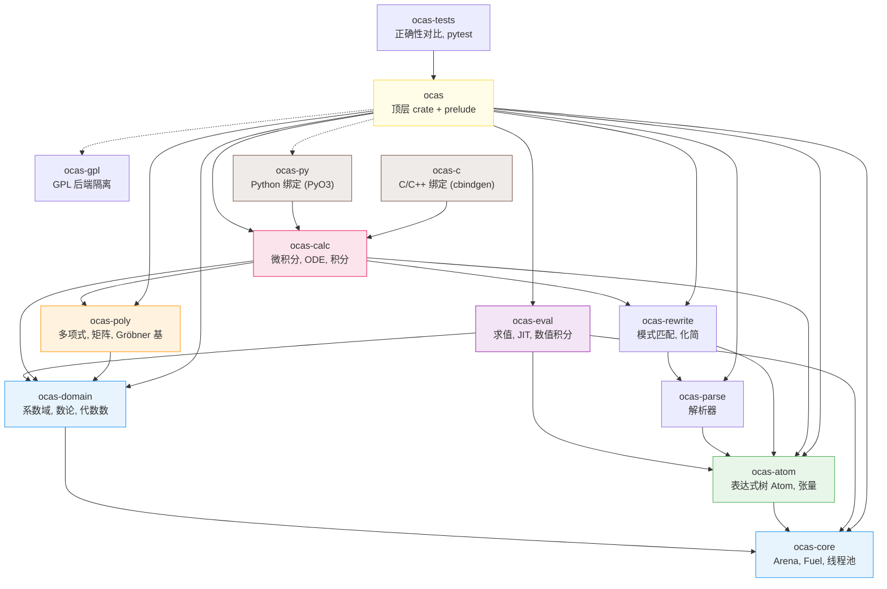

# 简介

**oCAS**（Open Computer Algebra System）是一个用 Rust 编写的高性能计算机代数系统（CAS），采用 **LGPL-3.0-or-later** 许可证开源。项目目标是在核心符号计算性能上达到或超越 Symbolica 与 SageMath，同时通过 Python（PyO3）和 C/C++（cbindgen）绑定提供多语言接口。

oCAS 采用分层 crate 架构，从底层 arena 分配器到顶层语言绑定共 13 个 workspace 成员，依赖方向严格向下。所有系数域（任意精度整数/有理数、有限域、实数球、复数、双精度浮点）通过统一的 `Domain` trait 抽象，多项式代数、Gröbner 基、符号微积分、ODE 求解等模块共享同一表达式基础设施。

---

## 版本特性对照表

下表列出 oCAS 各版本的关键新增特性（0.1 → 0.24）：

| 版本 | 日期 | 关键新增 |
|---|---|---|
| **0.1.0** | 2026-06-29 | 工作空间搭建、Arena 分配器、统一错误类型、C ABI 最小示例、跨平台 CI |
| **0.2.0** | 2026-06-30 | 表达式树 `Atom`（hash consing）、基于 `logos`/`chumsky` 的解析器、规范化器 |
| **0.3.0** | 2026-06-30 | 系数域（`Integer`/`Rational`/`FiniteField`/`RealBall`/`Complex`）、稠密/稀疏多项式、可选 GMP/FLINT 后端 |
| **0.4.0** | 2026-07-01 | 重写引擎（通配符模式、AC 匹配、`Rule`/`simplify`）、可选 egg e-graph 等式饱和 |
| **0.5.0** | 2026-07-01 | 符号微分 `diff`、Taylor 展开 `taylor`、启发式积分 `integrate` |
| **0.6.0** | 2026-07-08 | 稳定 prelude API、rustdoc 示例、proptest 属性测试、Criterion 基准、SymPy 对比工具 |
| **0.7.0** | 2026-07-01 | 根隔离（Sturm 定理）、线性方程组求解器（ℚ/ℤ）、丢番图方程、Buchberger Gröbner 基 |
| **0.8.0** | 2026-07-02 | 求值引擎（栈式 VM、CSE 优化、SIMD 向量化、Cranelift JIT 后端） |
| **0.9.0** | 2026-07-02 | Python 绑定（PyO3 `Expression`/`ExpressionEvaluator`）、C 微积分 API、C++ RAII 包装、33 项 pytest |
| **0.10.0** | 2026-07-02 | Python `Polynomial`/`Matrix` 类、Bareiss 行列式、`FiniteField` 实现 `EuclideanDomain`、mdBook 文档站 |
| **0.11.0** | 2026-07-03 | 正确性对比框架（16 模块 82 测试）、ℤ/𝔽_p 完整因式分解（Cantor–Zassenhaus + Hensel）、数论原语、多元 GCD |
| **0.12.0** | 2026-07-04 | `RationalPolynomial` 有理函数类型、Brown PRS 结式、Karatsuba 快速乘法、部分分式分解 `apart`/`together` |
| **0.13.0** | 2026-07-06 | F4 Gröbner 基算法（Gebauer–Moeller 筛选、SimpCache、ℤ_p i64 快速路径） |
| **0.14.0** | 2026-07-18 | Risch 符号积分（Hermite 约化、RDE、三角/特殊函数）、FGLM 换序、Hilbert 界 |
| **0.15.0** | 2026-07-20 | 多输出 JIT、f32 混合精度、流式求值（恒定内存）、Arena reset + workspace 池、原生 i64 F4 管线 |
| **0.16.0** | 2026-07-21 | 任意多元因式分解（Wang EEZ）、$n$ 元 GCD（稠密递归求值–插值） |
| **0.17.0** | 2026-07-22 | 代数数域因式分解（Trager 范数算法）、$\mathrm{GF}(p^d)$ 构造 |
| **0.18.0** | 2026-07-23 | 资源控制 `Fuel`、超对偶数自动微分 `HyperDual`、Vegas 蒙特卡洛积分、张量基础（指标槽/缩并/对称化） |
| **0.19.0** | 2026-07-23 | F5 签名约简算法（cyclic-6 ℤ₁₃ 加速 ~1400×至 2.63s）、统一 Gröbner 分发入口、Rust 1.97 工具链 |
| **0.20.0** | 2026-07-27 | ODE 求解器（5 种一阶 + 2 种二阶 + 幂级数）、ODE 分类引擎 `classify_ode` |
| **0.20.1** | 2026-07-27 | 积分因子、常数变易法（VOP）、待定系数法扩展（共振/三角/叠加）、降阶法 |
| **0.21.0** | 2026-07-30 | BPSW 素性判定、整数分解（Pollard rho/p−1/p+1/ECM）、离散对数、模多项式 GCD（Brown）、12 个数论 Python 绑定 |
| **0.22.0** | 2026-08-02 | McKay 图同构规范标号引擎、张量表达式规范化、Young 投影子、回溯 AC 匹配、多模式替换 |
| **0.23.0** | 2026-08-02 | 理想运算（成员/和/积/商/饱和/交集）、消元序、零维求解、准素分解、Hilbert 级数、有理根定理 |
| **0.24.0** | 2026-08-03 | 启发式积分（LIATE 分部积分/三角换元/Weierstrass）、DoubleF64 双精度浮点（~31 位有效数字） |

---

## 模块架构

oCAS 由 13 个 crate 组成，依赖关系如下（箭头 A → B 表示 A 依赖 B；
`ocas-py`/`ocas-c` 还依赖 `ocas-eval`、`ocas-rewrite` 等核心 crate，
图中仅示代表边；虚线表示可选依赖）：

**crate 一览**：

| crate | 职责 |
|---|---|
| `ocas-core` | Arena 分配器、`Fuel` 资源控制、`ThreadPool`、GMP 类型别名 |
| `ocas-domain` | 系数域 trait（`Domain`/`EuclideanDomain`）、`Integer`/`Rational`/`FiniteField`/`RealBall`/`Complex`/`DoubleF64`/`AlgebraicExtension`、数论函数、假设系统 |
| `ocas-poly` | 稠密一元/稀疏多元多项式、`RationalPolynomial`、矩阵、GCD、因式分解、Gröbner 基（Buchberger/F4/F5）、FGLM、理想运算 |
| `ocas-atom` | `Atom`/`Arena`/`Symbol` 表达式树、hash consing、张量（图规范化/Young 投影） |
| `ocas-parse` | 基于 `logos`/`chumsky` 的表达式解析器 |
| `ocas-rewrite` | 通配符模式匹配（AC 回溯）、`Rule`/`simplify`/`transform`、可选 egg e-graph |
| `ocas-calc` | 符号微分 `diff`、分层积分管线（有理→Risch→三角→特殊函数→启发式）、Taylor 展开、ODE 求解器（一阶/二阶/级数解/Laplace/系统）、部分分式 |
| `ocas-eval` | 栈式 VM 解释器、SIMD 向量化求值、Cranelift JIT、流式求值、Vegas 蒙特卡洛数值积分 |
| `ocas` | 顶层 re-export crate + `prelude::*` |
| `ocas-py` | PyO3 Python 绑定（25 类 + 32 函数） |
| `ocas-c` | C/C++ FFI 绑定（91 个 `#[no_mangle]` 导出）+ `ocas.hpp` RAII 包装 |
| `ocas-gpl` | GPL 许可后端隔离（GMP/MPFR/FLINT） |
| `ocas-tests` | 正确性对比框架（SymPy/SageMath/Symbolica）、pytest 套件、C API 集成测试 |

---

## 关键特性

- **13 个 crate** —— 从 arena 运行时到语言绑定的分层 Rust 架构，依赖严格向下。
- **7 种系数域** —— 任意精度整数/有理数、有限域 $\mathbb{F}_p$、实数球、复数、双精度浮点（DoubleF64 ~31 位）、代数数域 $\mathbb{Q}(\alpha)$ / $\mathrm{GF}(p^d)$。
- **多项式代数** —— 稠密一元/稀疏多元多项式、Karatsuba 乘法、GCD（模 GCD Brown 算法）、多元 GCD、因式分解（Cantor–Zassenhaus + Hensel + Wang EEZ）、代数数域分解（Trager）。
- **Gröbner 基** —— Buchberger / F4 / F5 三种算法、FGLM 换序、理想运算（成员/和/积/商/饱和/交集/消元/根式/准素分解）、Hilbert 级数。
- **符号微积分** —— 微分、Taylor 展开、分层积分管线（有理 → Risch → 三角 → 特殊函数 → 启发式 → 未求值形式）。
- **ODE 求解** —— 一阶（可分离/线性/Bernoulli/恰当/齐次/积分因子）、二阶（常系数/Cauchy–Euler/降阶/待定系数/参数变易）、幂级数与 Frobenius 级数解、Laplace IVP、2×2 系统。
- **求值引擎** —— 栈式 VM 解释器、SIMD 批量求值（f64x4）、Cranelift JIT（f64/f32）、流式求值（恒定内存）。
- **自动微分** —— 超对偶数 `HyperDual<T>` 前向模式，一阶及高阶偏导数。
- **张量代数** —— 指标槽、显式缩并、McKay 图同构规范化（1-WL 细化 + 路径不变量剪枝）、Young 投影子。
- **数值积分** —— 自适应蒙特卡洛（Vegas），支持高维定积分。
- **数论** —— BPSW 素性判定、整数分解（试除/Pollard rho/p−1/p+1/ECM）、离散对数（BSGS + Pohlig–Hellman）、Euler φ / Möbius / 除数函数。
- **重写与化简** —— AC 回溯模式匹配、通配符（`x__`/`x___`）、不动点化简、fuel 受限化简、可选 egg e-graph 等式饱和。
- **三语言绑定** —— Rust prelude API、Python（PyO3，25 类 + 32 函数）、C/C++（cbindgen，91 个导出 + RAII 包装）。
- **正确性框架** —— 与 SymPy、SageMath、Symbolica 跨多个数学模块的交叉验证（1174 个 `#[test]`/`#[tokio::test]` 标注，截至 0.24.0）。
- **可选数值后端** —— GMP/MPFR/FLINT 隐藏在 feature flag 后，GPL 后端隔离在 `ocas-gpl`。

---

## 快速导航

| 主题 | 说明 | 入口 |
|---|---|---|
| **Rust API 参考** | 全部公共类型与函数的逐项文档 | [API 参考总览](./api/rust.md) |
| **Python API 参考** | PyO3 绑定的签名、参数、异常、示例 | [Python API](./api/python.md) |
| **C/C++ API 参考** | FFI 原型、错误码、内存管理、示例 | [C/C++ API](./api/c.md) |
| **数学基础** | 从多项式代数到 Risch 算法的渐进式讲解 | [数学基础总览](./math/overview.md) |
| **算法详解** | Gröbner 基、因式分解、数论、积分、ODE 的实现细节 | [算法](./algorithms/groebner.md) |
| **求解器** | 线性/丢番图/多项式系统/ODE 求解器 | [求解器](./solvers.md) |
| **重写与化简** | 模式匹配、规则化简、e-graph | [重写](./rewrite.md) |
| **求值与 JIT** | VM 解释器、SIMD、Cranelift JIT | [求值](./evaluation.md) |
| **数值积分** | Vegas 自适应蒙特卡洛 | [数值积分](./numeric-integration.md) |
| **自动微分** | 超对偶数前向模式 AD | [自动微分](./autodiff.md) |
| **张量** | 指标、缩并、规范化、Young 投影 | [张量](./tensors.md) |
| **基准与性能** | Criterion 基准、SymPy/SageMath 对比 | [性能](./performance.md) |
| **正确性** | 跨系统交叉验证测试 | [正确性](./correctness.md) |
| **构建指南** | 后端选择、Windows 构建、贡献 | [构建](./backends.md) |

---

## 项目状态

oCAS 当前版本为 **0.24.0**。核心符号引擎、多项式代数、Gröbner 基与代数几何、ODE 求解、JIT 求值、三语言绑定与正确性对比框架已达到功能完备。通往稳定 1.0 的路线见
[路线图](https://github.com/charleshzh/ocas/blob/main/docs/planning/ROADMAP_CN.md)。
