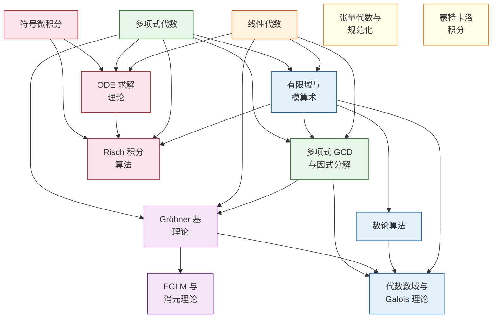

# 数学基础总览

本章系统介绍 oCAS 所涉及的数学理论，从基础概念到高阶算法，为理解源码实现提供完整的数学背景。每篇文章遵循"前提知识 → 基础概念 → 核心理论 → oCAS 实现 → 进阶话题 → 参考文献"的渐进式结构。

---

## 知识图谱

下图展示各数学主题之间的依赖关系。箭头表示"建议先学习"。

---

## 推荐学习路径

根据你的兴趣方向，选择以下路径之一进行系统学习。

### 路径 A：多项式代数与符号计算

适合希望理解符号计算核心算法（多项式运算、消元、求解方程组）的读者。

$$\text{多项式代数} \;\to\; \text{GCD/因式分解} \;\to\; \text{Gröbner 基} \;\to\; \text{FGLM/消元}$$

| 步骤 | 主题 | 核心收获 | 文件 |
|:---:|------|---------|------|
| 1 | [多项式代数](./polynomial-algebra.md) | 多项式环、单项式序、除法算法 | `polynomial-algebra.md` |
| 2 | [线性代数](./linear-algebra.md) | 矩阵运算、Bareiss 算法、高斯消元 | `linear-algebra.md` |
| 3 | [有限域与模算术](./finite-fields.md) | $\mathbb{F}_p$ 构造、模逆、NTT | `finite-fields.md` |
| 4 | [多项式 GCD 与因式分解](./poly-gcd-factoring.md) | Euclid 算法、Hensel 提升、Berlekamp 算法 | `poly-gcd-factoring.md` |
| 5 | [Gröbner 基理论](./groebner-theory.md) | Buchberger 算法、F4/F5、Hilbert 函数 | `groebner-theory.md` |
| 6 | [FGLM 与消元理论](./fglm-elimination.md) | 换序算法、理想运算、准素分解 | `fglm-elimination.md` |

### 路径 B：数论与代数数域

适合希望理解整数分解、素性判定、离散对数、代数数域构造的读者。

$$\text{有限域} \;\to\; \text{数论算法} \;\to\; \text{代数数域}$$

| 步骤 | 主题 | 核心收获 | 文件 |
|:---:|------|---------|------|
| 1 | [有限域与模算术](./finite-fields.md) | $\mathbb{F}_p$、$\mathbb{F}_{p^d}$ 构造、乘法群循环性 | `finite-fields.md` |
| 2 | [数论算法](./number-theory-algorithms.md) | BPSW 素性、ECM 分解、BSGS 离散对数、Tonelli–Shanks | `number-theory-algorithms.md` |
| 3 | [代数数域与 Galois 理论](./algebraic-number-fields.md) | $\mathbb{Q}(\alpha)$ 表示、Trager 范数算法、$\mathrm{GF}(p^d)$ | `algebraic-number-fields.md` |

### 路径 C：符号微积分与微分方程

适合希望理解符号求导、积分、ODE 求解、Risch 算法的读者。

$$\text{符号微积分} \;\to\; \text{ODE 求解} \;\to\; \text{Risch 积分}$$

| 步骤 | 主题 | 核心收获 | 文件 |
|:---:|------|---------|------|
| 1 | [符号微积分](./symbolic-calculus.md) | 求导规则、Taylor 展开、表达式树变换 | `symbolic-calculus.md` |
| 2 | [ODE 求解理论](./ode-theory.md) | 可分离/线性/Bernoulli/常系数/级数解/Laplace 变换 | `ode-theory.md` |
| 3 | [Risch 积分算法](./risch-algorithm.md) | 微分域塔、Hermite 约化、对数导数恒等式、RDE | `risch-algorithm.md` |

---

## 主题速查表

下表列出每个数学主题对应的 oCAS 源码模块和本文档中的章节文件。

| 主题 | 难度 | oCAS 模块 | 数学章节 |
|------|:----:|-----------|----------|
| [多项式代数](./polynomial-algebra.md) | 基础 | `ocas-poly`（`dense.rs`, `sparse.rs`） | `polynomial-algebra.md` |
| [有限域与模算术](./finite-fields.md) | 基础 | `ocas-domain`（`finite_field.rs`） | `finite-fields.md` |
| [线性代数](./linear-algebra.md) | 基础 | `ocas-poly`（`matrix.rs`） | `linear-algebra.md` |
| [多项式 GCD 与因式分解](./poly-gcd-factoring.md) | 进阶 | `ocas-poly`（`gcd/`, `factor/`） | `poly-gcd-factoring.md` |
| [Gröbner 基理论](./groebner-theory.md) | 进阶 | `ocas-poly`（`groebner/mod.rs`, `f4.rs`, `f5.rs`, `hilbert.rs`） | `groebner-theory.md` |
| [数论算法](./number-theory-algorithms.md) | 进阶 | `ocas-domain`（`number_theory/`） | `number-theory-algorithms.md` |
| [符号微积分](./symbolic-calculus.md) | 进阶 | `ocas-calc`（`lib.rs`） | `symbolic-calculus.md` |
| [ODE 求解理论](./ode-theory.md) | 进阶 | `ocas-calc`（`ode/`） | `ode-theory.md` |
| [Risch 积分算法](./risch-algorithm.md) | 高阶 | `ocas-calc`（`integral/`） | `risch-algorithm.md` |
| [FGLM 与消元理论](./fglm-elimination.md) | 高阶 | `ocas-poly`（`groebner/fglm.rs`, `ideal.rs`） | `fglm-elimination.md` |
| [代数数域与 Galois 理论](./algebraic-number-fields.md) | 高阶 | `ocas-domain`（`algebraic.rs`） | `algebraic-number-fields.md` |
| [张量代数与规范化](./tensor-canonicalization.md) | 高阶 | `ocas-atom`（`tensor/canon.rs`, `young.rs`, `spec.rs`） | `tensor-canonicalization.md` |
| [蒙特卡洛积分](./monte-carlo-integration.md) | 高阶 | `ocas-eval`（`numeric/vegas.rs`） | `monte-carlo-integration.md` |

---

## 数学分支与 oCAS 的对应关系

oCAS 的设计遵循计算代数（Computer Algebra）的传统，各模块与数学分支的对应如下：

- **交换代数**（多项式环、理想论）→ `ocas-poly`：多项式表示、GCD、因式分解、Gröbner 基、理想运算
- **数论**（素性、分解、离散对数）→ `ocas-domain/number_theory`：整数分解、素性判定、二次剩余
- **线性代数**（矩阵、行列式）→ `ocas-poly/matrix`：Bareiss 行列式、高斯消元、线性方程组
- **微积分与微分代数**（符号求导、积分、ODE）→ `ocas-calc`：微分、Taylor 展开、ODE 分类求解、Risch 算法
- **张量代数**（指标缩并、对称化）→ `ocas-atom/tensor`：图编码、McKay 算法、Young 投影
- **数值分析**（自适应积分）→ `ocas-eval/numeric`：Vegas 蒙特卡洛、自适应网格
