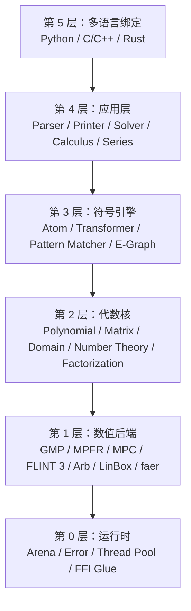

# oCAS 架构

本文档描述 **oCAS** 的架构，这是一个基于 LGPL-3.0+ 许可证的 Rust 计算机代数
系统。英文版见 [ARCHITECTURE_EN.md](ARCHITECTURE_EN.md)。

---

## 设计原则

1. **性能优先**：零拷贝解析、arena 分配、hash consing、SIMD、并行化以及成熟的
   LGPL 数值后端。
2. **许可证清晰**：默认构建仅使用 LGPL 兼容后端；GPL 专属后端隔离在
   `ocas-gpl` 中。
3. **分层设计**：每一层只依赖更底层；语言绑定位于顶层。
4. **多语言一致性**：Rust 是权威实现；Python 与 C/C++ 是薄封装。
5. **后端可插拔**：多项式、矩阵与数值后端可通过 trait 替换。

---

## 分层架构



---

## Crate 职责

| Crate | 层级 | 职责 |
|---|---|---|
| `ocas-core` | 0 + 1 | arena 分配器、统一错误、线程池、FFI 胶水、后端封装 |
| `ocas-domain` | 2 | 代数域：整数、有理数、有限域、代数数、实数球、复数 |
| `ocas-poly` | 2 | 稠密与稀疏多项式表示、最大公因式、因式分解、Gröbner 基、级数 |
| `ocas-atom` | 3 | 表达式树（Atom）、规范化、转换器、模式匹配、e-graph 集成 |
| `ocas-rewrite` | 3 | 模式匹配、重写、基于规则的化简 |
| `ocas-calc` | 4 | 微分、积分、方程求解、级数展开 |
| `ocas-eval` | 4 | 解释器、AST 编译器、Cranelift/LLVM JIT |
| `ocas-parse` | 4 | 词法分析器、语法分析器、Mathematica/Python 语法支持 |
| `ocas` | 5 | 顶层 Rust API 与 prelude |
| `ocas-py` | 5 | 基于 PyO3 的 Python 绑定 |
| `ocas-c` | 5 | 基于 cbindgen 与 C-ABI 封装的 C/C++ 绑定 |
| `ocas-gpl` | - | 隔离在单独 crate 中的可选 GPL 专属后端 |
| `ocas-tests` | - | 集成测试、回归测试、基准测试 |

---

## 数据流

### 解析 → 规范化 → 化简

```text
输入字符串
    │
    ▼
词法分析（tokens）
    │
    ▼
语法分析（chumsky / 递归下降）
    │
    ▼
原始 Atom（arena 分配）
    │
    ▼
规范化器
    │
    ▼
规范 Atom  -->  E-Graph（可选，egg）
    │
    ▼
化简后的 Atom
```

### 求值

```text
Atom + 变量绑定
    │
    ▼
后端选择器（按域驱动）
    │
    ├──▶ 解释器（通用、较慢）
    ├──▶ AST 编译器（指令序列 + 常量折叠）
    └──▶ JIT 编译器（Cranelift / LLVM）
                │
                ▼
        域值
```

### 求导

```text
Atom + 变量
    │
    ▼
递归规则引擎
    │
    ▼
基本导数表
    │
    ▼
中间 Atom
    │
    ▼
化简器
    │
    ▼
导数 Atom
```

### 因式分解

```text
Atom（多项式）
    │
    ▼
转换为内部多项式表示
    │
    ▼
后端选择器
    │
    ├──▶ FLINT 3（单/多变元）
    ├──▶ NTL（有限域因式分解）
    └──▶ 纯 Rust 回退（Wang / EEZ）
                │
                ▼
        因式列表 + 余式
```

### 求解

```text
方程或方程组
    │
    ▼
分类器
    │
    ├──▶ 线性：faer / LinBox
    ├──▶ 多项式：Gröbner 基 + 根隔离
    └──▶ 超越方程：数值 / 启发式求解器
                │
                ▼
        解集
```

---

## 内存管理

### Arena 分配

- 每个表达式树存在于一个 `Arena` 中。
- 子节点通过 `Arena::allocate_with` 进行 bump 分配，在闭包内构造值；arena
  被 drop 时整棵树一次性释放。
- 这避免了每个节点使用 `Box`/`Rc` 的开销，并提升缓存局部性。

### 0.1.0 限制

当前 `Arena` 故意不运行已分配值的析构函数。因此，仅可安全存放 `Copy` 类型
或无需显式清理资源的类型。当表达式树需要存放拥有的字符串或其他 `Drop` 类型时，
将添加类型擦除的 drop 机制。

### 外部对象生命周期

| 对象 | 策略 |
|---|---|
| GMP `mpz_t` / `mpq_t` | 带 `Drop` 的 Rust 包装 |
| FLINT 对象 | 带 `Drop` 的 Rust 包装 |
| 共享不可变表达式 | `Arc<Atom>` 或借用引用 |
| Python/C 对象 | 不透明指针 + 引用计数；Rust 持有最终 drop |

### 多线程

- `Arena` 默认线程本地。
- 只读表达式树可通过 `Arc` 或不可变引用跨线程共享。
- 并行计算使用 `rayon`。

---

## 错误处理

- `ocas-core` 中统一错误类型 `OcasError`。
- 分类：
  - `ParseError { span, message }`
  - `DomainError { expected, found }`
  - `NumericOverflow`
  - `UnsupportedOperation`
  - `BackendError`
- Rust API 返回 `Result<T, OcasError>`。
- FFI 层提供 `ocas_error_t` 输出指针与 C 字符串消息。
- Python 绑定映射到自定义 Python 异常类。

---

## 多语言绑定策略

### Rust API

- 原生 API 最完整且零开销。
- 通过 `ocas` crate 的 prelude 暴露。

### Python API

- 基于 PyO3 构建。
- 将 Rust 类型包装为 Python 类（`Expression`、`Polynomial`、`Domain`、
  `Matrix`）。
- Python 对象持有 Rust arena 引用；释放 Python 对象时 arena 被 drop。

### C/C++ API

- cbindgen 从 Rust `#[no_mangle]` 函数生成 C 头文件。
- 手写 C-ABI 封装提供稳定的不透明指针：
  ```c
  ocas_expr_t* ocas_parse(const char* s, ocas_error_t* err);
  void ocas_expr_free(ocas_expr_t* e);
  const char* ocas_expr_to_string(ocas_expr_t* e);
  ```
- C++ 用户可将其包装为 RAII 类。

---

## 许可证边界

### LGPL 兼容默认栈

以下后端可直接链接到 LGPL-3.0+ 核心而不会强制 GPL：

| 后端 | 许可证 | 备注 |
|---|---|---|
| GMP | LGPL-3.0+ / GPL-2.0+ | |
| MPFR | LGPL-3.0+ | |
| MPC | LGPL-3.0+ | |
| FLINT 3 / Arb | LGPL-2.1+ | |
| LinBox | LGPL-2.1+ | |
| Givaro | LGPL-2.1+ / CeCILL-B | |
| Piranha | LGPL 可选 | |
| faer | MIT / Apache-2.0 | |
| ndarray | MIT / Apache-2.0 | |
| SymEngine | MIT | |
| Cranelift / LLVM | Apache-2.0 with LLVM exceptions | |
| egg | MIT | |
| PyO3 | MIT / Apache-2.0 | |

### GPL 专属可选后端

以下后端隔离在 `ocas-gpl` 中，默认禁用：

- NTL (GPL-2.0+)
- Singular (GPL-2.0+ / GPL-3)
- PARI/GP (GPL-2.0+)
- GiNaC (GPL-2.0+)
- SageMath interfaces (GPL-3.0)
- Normaliz (GPL-3.0+)
- polymake (GPL-2.0+)

启用 `ocas-gpl` 将产生受 GPL 条款约束的合并作品。

---

## 功能开关

默认构建保持后端可选，确保在没有 GMP/MPFR/FLINT 的系统上（如 Windows MSVC）
也能直接编译。

```toml
[features]
default = []
gmp = ["ocas-core/gmp"]
mpfr = ["ocas-domain/mpfr"]
flint = ["ocas-poly/flint"]
llvm = ["ocas-eval/llvm"]
gpl = ["ocas-gpl"]
python = ["ocas-py"]
```

要启用完整 LGPL 后端，显式传入：

```bash
cargo build -p ocas --features gmp,mpfr,flint
```

---

## 测试策略

| 层级 | 工具 | 目的 |
|---|---|---|
| 单元测试 | `cargo test` | 每个 crate 的正确性 |
| 属性测试 | `proptest` | 代数恒等式 |
| 模糊测试 | `cargo fuzz` | 解析器与 FFI 鲁棒性 |
| 回归测试 | `ocas-tests` | 与 SymPy/SageMath 输出对比 |
| 基准测试 | `criterion.rs` | 多项式 GCD、因式分解、Gröbner 基 |
| 许可证审计 | `cargo-deny` | 防止意外 GPL 污染 |

---

## 性能策略

- **零拷贝解析**：token 尽可能引用输入字符串。
- **Hash consing**：结构相同的子表达式共享内存。
- **后端特化**：为每个域和规模选择最快的后端。
- **SIMD**：在稠密多项式求值与数值核中使用 `std::simd` / `packed_simd`。
- **并行化**：map 操作、矩阵核、Gröbner 基筛选使用 `rayon`。
- **JIT**：重复表达式求值使用 Cranelift；重度优化 AOT 核使用 LLVM。

---

## 待决问题

- 直接使用 `egg` 还是为其定制 CAS 专用代价函数进行 fork。
- 如何在三种语言 API 中干净地暴露代数数与区间算术。
- 原生支持 Mathematica 语法还是仅作为兼容层。

---

## 参见

- [README_CN.md](../README_CN.md)
- [ROADMAP_CN.md](ROADMAP_CN.md)
- [EVOLUTION_PLAN_CN.md](EVOLUTION_PLAN_CN.md)
- [CONTRIBUTING.md](../book/zh/src/contributing.md)
