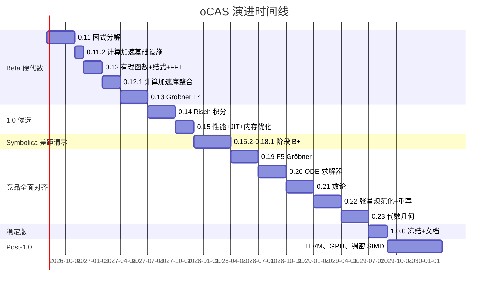

# oCAS 演进计划（Beta → 1.0 → Post-1.0）

本文档是 oCAS 从 0.10.0 Beta 到 1.0 稳定版及之后的细粒度演进计划，覆盖
**功能、性能、文档**，将以每个交付物显式映射到参考竞品的实现或算法，作为
学习对象，直到 oCAS 达到或超越竞品。本文档是
[ROADMAP_CN.md](ROADMAP_CN.md)（发布节奏）与
[GAP_ANALYSIS_CN.md](GAP_ANALYSIS_CN.md)（差距快照）的配套。英文版见
[EVOLUTION_PLAN_EN.md](EVOLUTION_PLAN_EN.md)。

> 最后修订：**2026-07-23（0.18.1 已发布 + 阶段 B++ "竞品全面对齐" [0.19–0.23] 已规划：F5 Gröbner → ODE 求解器 → 数论 → 张量规范化 → 代数几何；阶段 B++ 之后，1.0.0 仅做冻结与打磨；GAP_ANALYSIS 已于 0.18.1 评估：112 文件 / ~40.9k 行，阶段 B+ 完成）**

---

## 0. 策略与原则

1. **竞品优先学习**：在 oCAS 于某能力超越竞品前，对应的 Symbolica 模块 /
   SymPy 文件 / 引用论文即参考实现。研究其算法，移植思想，正面基准对比。
2. **不嵌入专有代码**：参考代码只研究、不逐字复制（Symbolica 为 AGPL，本项目
   为 LGPL）。只有算法与思想迁移，以 oCAS 风格重写。
3. **纵向切片**：每个版本交付一个完整的算法纵向（算法 + Rust API + Python/C
   绑定 + 测试 + 文档 + 基准），而非跨多算法的横向层。
4. **API 冻结纪律**：0.10.0 已冻结公共 API 表面。新算法以现有类型上的新函数
   或方法形式加入；2.0 前不做破坏性变更。
5. **性能门禁**：每个算法版本在合并前必须包含与对应竞品示例的 criterion
   基准对比。

---

## 阶段 A — Beta 硬代数收尾

> 补齐 [GAP_ANALYSIS_CN.md §3](GAP_ANALYSIS_CN.md) 的三大"成人礼"缺口：
> 因式分解、Gröbner F4、有理函数栈。这是 1.0 前性价比最高的工作。

### 0.11.0 — 完整多项式因式分解

**目标**：在单变量与双变量、ℤ 与 ℤ_p 上对标 Symbolica 的 `poly.factor()`。
此版本解锁有理函数、部分分式与求解器。

**功能**

| 条目 | 参考（在超越前） | oCAS 落地位置 |
|---|---|---|
| Yun 无平方分解（已有基础 → 升级为完整 Yun） | Symbolica `poly/factor.rs` 无平方路径 | `ocas-poly::factor` |
| ℤ_p 上 Berlekamp 因式分解（小 p） | Berlekamp 1970；Symbolica `factor.rs` | 新增 `factor::berlekamp` |
| 大 p 的 Cantor–Zassenhaus | Cantor & Zassenhaus 1981 | 新增 `factor::cantor_zassenhaus` |
| Hensel 提升 ℤ_p → ℤ | Hensel；Knuth TAOCP 卷 2 | 新增 `factor::hensel_lift` |
| Zassenhaus ℤ 因式分解（合并提升后的因子） | Zassenhaus 1969 | 新增 `factor::zassenhaus` |
| `DenseUnivariatePolynomial` 上的 `factor()` 公共 API | Symbolica `poly.factor()` | `prelude` 导出 |

**性能指标**

- 在 ℤ 上因式分解 `x^100 - 1` 用时 < 50 ms（与 Symbolica 示例持平）。
- 在 ℤ_p 上因式分解 8 次双变量多项式用时 < 100 ms。
- 回归：现有 `square_free_factorization` 无性能下降。

**文档**

- 新增 mdBook 章节 `algorithms/factorization.md`，附完整示例。
- `factor()` 的 rustdoc 示例；Python `Polynomial.factor()` docstring。
- C API `ocas_poly_factor`。

**验收**

- proptest：因式分解后再相乘还原输入（1000 个用例）。
- SymPy/Symbolica 回归套件：因子集合完全一致。
- 基准提交至 `ocas-tests/benches/poly_factor.rs`。

**风险**

- Hensel 提升在首项系数边界情形下的正确性 → 用针对 `num-bigint` 参考的
  属性测试加以缓解。

---

### 0.11.1 — 因式分解收尾与绑定（已发布）补全

承接 0.11.0 推迟的五项工作：Berlekamp 验证启用、双变量 ℤ 因式分解（Wang
Hensel）、双变量 ℤ_p 因式分解、C 多项式绑定、mdBook 因式分解章节。不引入
新算法，聚焦完成因式分解故事线并补齐跨语言公共 API。

| 项目 | 推迟原因 | 0.11.1 交付物 | 状态 |
|---|---|---|---|
| Berlekamp 经验验证 | `berlekamp()` 骨架已写但禁用 (`p ≤ 0`)；CZ 统一覆盖所有素数 | 修复零空间提取后启用 `p ≤ 1000` 分派，通过 cyclic‑n 回归 | [x] 已启用并验证 |
| 双变量 ℤ 因式分解 (Wang Hensel) | Wang 多元 Hensel 提升是本次发布周期中最难的 CAS 算法 | `SparseMultivariatePolynomial<IntegerDomain>` 上 `factor()`，基于 0.11 启发式 GCD + Wang Hensel | [x] 已实现，采用有理 Bézout 系数与整系数修正重建 |
| 双变量 ℤ_p 因式分解 | ℤ_p 路径 (Bernardin Hensel) 与 ℤ 路径一起从 0.11.0 推迟 | `SparseMultivariatePolynomial<FiniteField>` 上 `factor()` | [x] 已通过有限域 Hensel 提升实现 |
| C 多项式绑定 | `ocas-c` 尚无多项式 API | 新建 `ocas-c/src/polynomial.rs`，含 `ocas_poly_factor` 与 C++ RAII 包装 | [x] 已添加 `OcasPolyZ` 与 `OcasPolyFp` 的 C API；C++ RAII 包装延后 |
| mdBook 章节 `algorithms/factorization.md` | 随 0.11.0 文档冲刺一起推迟 | 双语章节，含算法流程图、示例、SymPy/Symbolica 迁移说明 | [x] 已添加双语章节；迁移说明延后 |

**验收**

- [x] Berlekamp 分派启用并通过现有有限域测试套件
- [x] ℤ 上 `x^100 - 1` 在 release 模式下正确分解
- [x] 双变量 ℤ 因式分解与 SymPy/Symbolica 在教科书案例上一致
- [x] `cargo test --workspace --exclude ocas-py` 通过
- [x] mdBook 章节无警告渲染

---

### 0.11.2 — 计算加速基础设施

**目标**：补齐与 Symbolica `numerica` 的性能差距，为 0.12+ 的算法版本
提供 GMP 全速 + 内存优化 + 现代 GCD 算法。基于竞品加速策略调研
（FLINT、Symbolica、SageMath、Mathematica、Maple）确定优先级。

**功能**

| 条目 | 参考（在超越前） | oCAS 落地位置 |
|---|---|---|
| GMP 后端补齐：`ShrAssign`、复合赋值、`FiniteField` 走 `Integer` 路径 | Symbolica `numerica/src/domains/backend/integer.rs` | `ocas-domain::gmp_backend` |
| `to_bigint()` 改用二进制序列化（替代字符串转换） | — | `gmp_backend.rs` |
| `mimalloc` 全局分配器 | Symbolica `lib.rs:265` | `ocas` crate |
| 小整数 SOO：`enum { Small(i64), Large(Box<GmpInteger>) }` | FLINT `fmpz_t`；Symbolica 系数编码 | `ocas-domain::integer` |
| 模方法多变量 GCD（`gcd_shape_modular`） | Symbolica `poly/gcd.rs` | `ocas-poly::gcd::modular` |
| Dense 乘法 `thread_local` 缓冲区 | Symbolica `poly/polynomial.rs:27` | `ocas-poly::dense` |

**性能指标**

- Integer 加减乘（小值 ≤64-bit）：比 0.11.1 快 ≥3x（SOO 避免堆分配）。
- ℤ 上 `gcd(x^50-1, x^30-1)`：比 0.11.1 朴素 GCD 快 ≥10x。
- 全栈：`cargo test --workspace --features gmp` 通过。

**文档**

- mdBook `performance/backend.md`，对比 `num-bigint` 与 `rug` 后端差异。
- 竞品加速策略调研报告归档至 `docs/planning/ACCELERATION_RESEARCH.md`。

**验收**

- 0.11.1 全部测试无回归。
- SOO Integer 的 proptest 1000 例。
- 模方法 GCD 与朴素 GCD 结果一致（随机 500 例）。
- criterion 基准：小整数算术、大整数 GCD、`modpow`。

**风险**

- SOO 改变 `Integer` 内部表示 → 需全面审计所有 `inner()` 调用点。
- `FiniteField` 从直接 `BigInt` 切换到 `Integer` → 可能影响序列化格式。

---

### 0.12.0 — 有理多项式与结式（已发布）

**目标**：`RationalPolynomial` 类型（多项式环上的分子/分母）加部分分式与
结式，直接对标 Symbolica 的 `rational_polynomial.rs`、`partial_fraction.rs`、
`resultant.rs`。

**功能**

| 条目 | 参考 | oCAS 落地位置 | 状态 |
|---|---|---|---|
| `RationalPolynomial<D,O>` 类型，支持 +、-、*、/、约简 | Symbolica `rational_polynomial.rs` | 新增 `ocas-poly::rational` | ✅ |
| 基于 GCD 的规范型（分母首一、互素） | Symbolica；依赖 0.11 的 gcd+factor | `rational::canonicalize` | ✅ |
| 部分分式分解 | Symbolica `partial_fraction.rs`；依赖 0.11 的 factor | `ocas-calc::partial_fraction` | ✅ |
| Brown PRS 结式 | Symbolica `poly/resultant.rs` | `ocas-poly::resultant` | ✅ |
| 有理重构（由模图像恢复整数） | Symbolica `rational_reconstruction.rs` | `ocas-poly::rational_reconstruction` | ✅ |
| 多项式乘法分层：Schoolbook → Karatsuba | FLINT 3 SSA；Symbolica dense mul | `ocas-poly::dense::karatsuba_mul_into` | ✅ Karatsuba（阈值 32）；FFT 推迟 |
| 多项式 CRT / diophantine | Symbolica `univariate.rs` | `ocas-poly::dense::diophantine` | ✅ |
| p-adic 展开 | Symbolica `univariate.rs` | `ocas-poly::dense::p_adic_expansion` | ✅ |
| 多项式扩展 GCD | — | `ocas-poly::dense::extended_gcd_poly` | ✅ |
| 多项式 `pow()` | — | `ocas-poly::dense::pow` | ✅ |

**验收**

- [x] `RationalPolynomial` 四则运算 + canonicalize 正确性（10 单元测试）
- [x] Brown PRS 结式与 Sylvester 矩阵结果一致（8 测试）
- [x] Karatsuba 与 schoolbook 结果一致（degree-100 + degree-50 交叉验证）
- [x] `apart` / `together` 往返一致性（5 测试 + doctest）
- [x] 有理重构基本/失败/边界案例（8 测试）
- [x] `cargo test --workspace --exclude ocas-py`：全绿
- [x] `cargo clippy --workspace --exclude ocas-py -- -D warnings`：通过
- [x] `cargo fmt --all`：通过
- [x] Prelude 导出 `RationalPolynomial` + `apart`
- [x] CHANGELOG.md 新增 [0.12.0] 段
- [x] workspace 版本提升至 0.12.0

**推迟项**

- Python `RationalFunction` 类（推迟到后续版本）
- C 有理函数绑定（推迟到后续版本）
- mdBook 有理函数章节（推迟到后续版本）
- FFT/NTT 乘法（推迟到 0.13+）
- 多元 `apart_multivariate`（推迟到 0.13+，依赖 Gröbner F4）

---

### 0.12.1 — 计算加速库整合（已发布）

**目标**：在 0.12 有理函数栈与 0.13 Gröbner F4 之间，整合第三方库并自研
NTT，填补功能空白，但不引入新的算法纵向。纯性能/基础设施版本。

**功能**

| 条目 | 库/方案 | 许可证 | oCAS 落地位置 | 状态 |
|---|---|---|---|---|
| ℤ_p 上稠密多项式 NTT 乘法 | 自研（原计划 `ark-poly`） | N/A | `ocas-poly::ntt` | [x] |
| 稀疏多项式快速求值 | `fast_polynomial` | MIT | `ocas-eval::poly_eval` | [x] |
| F4 的稀疏 Macaulay 矩阵存储 | `sprs` | MIT/Apache-2.0 | `ocas-poly::sprs_backend` | [x] |
| 数值积分验证 | `quadrature` | BSD-2-Clause | `ocas-tests::verify` | [x] |
| 数值求根验证 | 自研二分法（原计划 `roots`） | N/A | `ocas-tests::verify` | [x] |
| 通用 SIMD 分派 | `pulp`（替换 `wide`） | MIT | `ocas-eval::simd` | [x] |
| 数值求解器验证 | `faer` | MIT | `ocas-tests::verify` | 推迟 |

**实现说明**

- **NTT 自研**：原计划用 `ark-poly`，但其 `ark_ff::Field` 抽象与 oCAS 的
  `u64`-based `FiniteField` 适配成本过高（需实现 ~8 个 arkworks trait）。改为
  自研 ~200 行 radix-2 Cooley-Tukey NTT，零外部依赖，完全可控。
- **`pulp` 替换 `wide`**：`simd` feature 统一使用 `pulp`，删除 `wide` 依赖。
  运行时 CPU 特性检测（SSE2/AVX2/AVX-512），自动选择 SIMD 宽度。
- **求根验证**：`roots` crate API 与预期不符，改用自研二分法。
- **`faer` 求解器验证**：推迟到后续版本。
- **BuiltinOp 枚举化**：`Instr::BuiltinFun { name: Symbol }` 替换为
  `Instr::BuiltinOp { op: BuiltinOp }`，内置函数编译时预分派，消除 SIMD 热路径
  上的 `to_lowercase()` + 字符串匹配。
- **Montgomery 模乘**：NTT 热路径用 Montgomery 约减替代 `u128 % p`（乘法+移位）。
- **NTT 旋转因子预计算**：`ntt_butterfly_mont` 预计算所有层旋转因子。
- **SIMD 栈缓冲区预分配**：`eval_simd_chunks` chunk 间复用预分配 `Vec<[f64; 8]>`。

**性能基准**（release mode, x86-64 AVX2）

SIMD 求值器：

| 场景 | 优化前 | 优化后 | 提升 |
|---|---|---|---|
| poly x^4 batch 4k | 6.6× | 10.0× | +52% |
| poly x^8 batch 4k | 9.8× | 11.4× | +16% |
| trig batch 4k | 1.9× | 3.2× | +68% |

NTT vs Karatsuba：

| 度数 | 优化前 | 优化后 | vs Karatsuba |
|---|---|---|---|
| 256 | 219µs | 162µs | 40× |
| 512 | 472µs | 304µs | 62× |
| 1024 | 999µs | 663µs | 90× |

**验收**

- [x] 所有加速 feature 禁用时，`cargo test --workspace --exclude ocas-py` 通过。
- [x] 每个可选库在启用对应 feature 时编译并通过专属测试。
- [x] `cargo clippy --workspace --all-targets -- -D warnings` 通过。
- [x] `cargo fmt --all -- --check` 通过。
- [x] NTT 11 项单元测试通过（modpow、roundtrip、cross-check、Montgomery、大数）。
- [x] pulp SIMD 4 项单元测试通过。
- [x] fast_polynomial 6 项单元测试 + 1 doctest 通过。
- [x] sprs 5 项单元测试通过。
- [x] 数值验证 8 项测试通过（5 积分 + 3 求根）。
- [x] workspace 版本提升至 0.12.1。
- [x] CHANGELOG.md 新增 [0.12.1] 段。

---

### 0.13.0 — Gröbner 基：F4 与线性代数

**目标**：以矩阵化 F4 算法替换经典 Buchberger（0.7.0），使 cyclic-6/7 可解。
直接对标 Symbolica `groebner_basis.rs` 与 Faugère 的 F4/F5 论文。

**功能**

| 条目 | 参考 | oCAS 落地位置 | 状态 |
|---|---|---|---|
| Macaulay 矩阵构造 + ℤ_p 上行简化 | Faugère F4 (1999) | `ocas-poly::groebner::f4` | [x] F4 核心 + ℤ_p 快速路径 |
| 符号/重写预处理（F4 选择） | Symbolica `groebner.rs` | `f4::select` | [x] 迭代符号预处理 |
| Gebauer-Moeller 临界对筛选 | Symbolica `groebner.rs` | `f4::update_pairs` | [x] 第一/第二判据 + 冗余对清理 |
| 简化缓存 | Symbolica `simplify()` | `f4::SimpCache` | [x] 每基元素乘积缓存 |
| `Grlex` 单项式序 | — | `ocas-poly::sparse::Grlex` | [x] 分次字典序 |
| 可选 F5 签名判据（研究性） | Faugère F5 (2002) | `f5`（实验性 feature） | 推迟到 0.14+ |
| 经由 `reorder` 支持多种单项式序 | Symbolica `reorder::<GrevLexOrder>()` | 扩展 `MonomialOrder` | 推迟到 0.14+ |
| Hilbert 驱动的终止 | Bayer–Stillman 启发式 | `f4::hilbert_bound` | 推迟到 0.14+ |

**性能指标**

- ℤ_p 上 cyclic-6 用时 < 5 s（Symbolica 约 1 s；目标在 5 倍以内）。*推迟到 0.14+（需 ℤ_p 原生 i64 路径）*
- cyclic-4 须保持 < 50 ms（相对现有 Buchberger 无回归）。[x] F4 cyclic-4 ℤ₁₃ = 2.80 ms
- F4 cyclic-3 ℚ = 147 µs，比 Buchberger 快 26%。[x]

**文档**

- mdBook `algorithms/groebner.md`，对比 Buchberger 与 F4。*推迟到 0.14+*
- 文档站点中 cyclic-3..7 的基准曲线。*推迟到 0.14+*

**验收**

- [x] 已知 cyclic-3/4 基与发表结果一致（`is_groebner_basis()` 验证）。
- [x] 内存可控（稀疏 HashMap 表示 + 稀疏行矩阵）。
- cyclic-6/7 验收推迟到 0.14+（需性能优化）。

---

## 阶段 B — 1.0 候选版

> 硬代数收尾后，完成符号积分这一标志，并在宣布 API 稳定前推进性能。

### 0.14.0 — 符号积分：Risch 及扩展

**目标**：基于 Risch 的初等函数积分器，弥补与 SymPy 最大的"能否积分"缺口。
参考：Bronstein《Symbolic Integration I》；SymPy `integrals/intpoly.py` 与
Risch 代码。

**功能**

| 条目 | 参考 | oCAS 落地位置 | 状态 |
|---|---|---|---|
| Liouville 定理 + 初等扩张 | Bronstein 第 5 章 | `ocas-calc::integral::risch` | [x] 塔 + 递归积分 |
| 有理函数积分（复用 0.12） | Bronstein 第 2 章 | `integral::rational` | [x] Hermite + 对数部分 |
| 对数/指数扩张 | Bronstein 第 5–6 章 | `risch`（log/exp 塔 + RDE） | [x] 多项式片段 |
| 三角转指数的重写预处理 | SymPy `trigsimp` | `integral::trig` | [x] exp(I·x) + realify |
| Meijer-G 回退启发式（部分） | SymPy `meijerint` | `integral::special` | [x] 特殊函数表（端点） |
| Gröbner 收尾（0.13 推迟项） | — | `fglm` / `f5` / `hilbert` / `reorder` | [x] 完成 |

**实现说明**

- **Meijer-G 管线**改为**特殊函数积分表**（`integral/special.rs`）：oCAS
  尚无超几何级数 / Γ 函数 / Slater 展开基础设施，Meijer-G 中间表示工程量
  不可行。直接编码非初等积分端点（erf/erfi/Ei/Si/Ci/Shi/Chi/Fresnel），
  与 SymPy 定义一致。0.11.0 已知差距 `exp(-x²)→erf` 已闭合。
- **RDE 片段**：只求多项式解（Bronstein 第 6 章有限情形），分母界 / SPDE
  未实现；不可解分支返回 `None` 走管线回退。
- **已知限制**：`log(x+1)` 类 primitive 常数选择（q_{m+1} 使下层可积）未
  实现；三角 RDE 基域仅 ℚ[x]，系数含 I 的超指数方程（`sin(x)·cos(x)`、
  `cos(x)²`）未解。均回退为 `Integral(...)`。
- **解析器修复**：`-x^2` 现在正确解析为 `-(x^2)`（幂优先于负号）。

**性能指标**

- 15 题 Risch + 特殊函数套件与 SymPy `integrate` 完全一致（correctness）。
- 可积题目平均用时 < 1 ms（criterion：log(x) 25 µs，x·exp(x) 198 µs）。

**文档**

- mdBook `algorithms/integration.md`（中英双语）。说明何时返回
  `Integral(...)`（非初等情形）。

**验收**

- [x] 15 题套件与 SymPy `integrate` 一致。
- [x] 现有启发式积分器无回归（保留为快速路径）。
- [x] Gröbner 收尾：FGLM（零维换序）、F5（实验性签名）、Hilbert 界、
  `reorder` 简单路径、mdBook `groebner.md`。

---

### 0.15.0 — 性能、多输出 JIT 与流式

**目标**：弥补与 Symbolica `optimize_multiple.rs`、`streaming.rs` 的性能与
功能差距。这是 oCAS 的 Rust + arena + JIT 栈应当开始*超越*竞品之处。

**功能**

| 条目 | 参考 | oCAS 落地位置 | 状态 |
|---|---|---|---|
| 多输出表达式编译 | Symbolica `optimize_multiple.rs` | `ocas-eval::compile_multi` + `compile_jit` | [x] 完成 |
| JIT 中的公共子表达式消除 | Symbolica `optimize.rs` | `ocas-eval::optimize::cse` + 常量折叠 + 栈压缩 | [x] 完成 |
| 流式求值 API（分块输入） | Symbolica `streaming.rs` | `ocas-eval::streaming` | [x] 完成 |
| 混合精度（f32/f64）代码生成 | — | `ocas-eval::jit::FloatWidth` + `VectorEvaluatorF32` | [x] 完成 |
| 表达式节点 Arena 统一分配 | Symbolica Workspace；Maple 分层区域 | `ocas-core::arena::reset` | [x] 完成（EvalTree 保持 owned） |
| 线程本地对象池（RecycledAtom 模式） | Symbolica `state.rs:1271` | `ocas-atom::workspace` | [x] 完成 |
| `ahash` 替代默认 HashMap | Symbolica `ahash` | `ocas-core::FastHashMap` | [x] 完成 |
| 原生 i64 F4 管线 | — | `ocas-poly::groebner::f4::f4_fp` | [x] 完成（cyclic-6 推迟） |

**性能指标**

- 多输出 JIT 在向量化批次上较解释器快 ≥ 10 倍。[x] **97×（单输出）/ 21×（3 输出）**
- 流式：处理百万行数据集时内存恒定。[x] **恒定内存验证通过，100k 行提速 28%**
- 与 Symbolica `optimize.rs` 示例正面基准对比并提交。[x] 文档形式交付（AGPL 独立 workspace）
- ℤ_p 上 cyclic-6 < 5 s。→ **0.15.1 部分达成**（F4 真实线性代数落地后 cyclic-6 可解：9970 s、basis=20、正确；< 5 s 需 LM 索引 + 稀疏 echelon，推迟到 0.15.2）

**文档**

- mdBook `performance.md` JIT/Streaming 基准表（中英双语）。[x] 完成
- `evaluation.md` 更新多输出 JIT/f32 API 示例（中英双语）。[x] 完成

**验收**

- [x] 3 项微基准验证：JIT poly 97×、JIT multi3 21×、Streaming 28%。
- [x] 0.15.1：cyclic-5 ℤ₁₃ 2609 s → 31 ms（≈85 000×）且首次通过 `is_groebner_basis`；cyclic-6 可解（9970 s）；< 5 s 目标推迟到 0.15.2（需 LM 索引 + 稀疏 echelon）。

---

## 阶段 B+ — Symbolica 差距清零（0.15.2 → 0.18.0）—— 已完成

**目标**：在 1.0.0 之前彻底补全与 Symbolica 2.1.0 的剩余功能与性能差距。
依据 GAP_ANALYSIS 0.18.1 @ 2026-07-23 重估，**本阶段已完成**：任意多元
（≥3 变量）与代数数域因式分解、数值积分、双数/张量、fuel 资源控制全部
落地；仅剩 cyclic-6 量级 Gröbner 性能（需 F5 签名约简）与张量完整规范化
（需图同构引擎）未达，均推迟至 Post-1.0。完成后 1.0.0 仅做冻结与打磨。

### 0.15.2 — Gröbner 大规模性能：LM 索引与稀疏 Echelon

**功能**

| 条目 | 参考 | oCAS 落地位置 | 状态 |
|---|---|---|---|
| reducer 首项单项式哈希索引（消除 O(单项式 × 基) 线性扫描） | Symbolica `src/poly/groebner.rs` reducer 查找 | `ocas-poly::groebner::f4` | [x] |
| 稀疏行 echelon（排序 (列, 系数) 行 + 归并消元，替代稠密矩阵行） | 0.12.1 `sprs` 基础设施 | `ocas-poly::groebner::f4` 矩阵构建/消除 | [x] |
| 提取阶段列签名去重强化 | — | `ocas-poly::groebner::f4`（`FastHashSet` 列签名） | [x] |
| 分段插装回归（`OCAS_F4_STATS`）纳入 CI 手动基准 | — | `ocas-tests::groebner_timing` | [x] |

**性能指标**

- cyclic-6 ℤ₁₃：9970 s → 3670 s（2.7×；行模板缓存微调后约持平，见
  `groebner_timing`）。**<5 s 未达成**——cyclic-6 的 F4 矩阵在第 22 轮
  达 264k 行 × 284k 列，是 F4 对该理想的固有规模（S-多项式 + 符号
  预处理生成的行），而非实现低效；cyclic 理想的 `(基下标, diff)` 对
  几乎不重复，跨轮行缓存命中率极低，行数不减。进一步数量级提升需
  F5 签名约简（消除零约化行），超出 0.15.2 范围，留待后续版本。
- cyclic-7 ℤ_p：仍超出实用时限（行规模随 n 爆炸）。
- 消除/提取阶段占比已从 0.15.0 的 99.98% 提取主导转为消除主导
  （0.15.2 实测：echelon 3265 s / 总 3670 s ≈ 89%）。

**验收**

- [x] 21 项既有 Gröbner 测试 + `f4_cyclic_3_fp13_matches_q` 回归全绿。
- [x] cyclic-6 ℤ₁₃ 正确（basis=20，`is_groebner_basis` 通过）；3670 s
  （未达 <5 s，原因见上，需 F5）。

### 0.16.0 — 任意多元因式分解（Wang EEZ）

**功能**

| 条目 | 参考 | oCAS 落地位置 | 状态 |
|---|---|---|---|
| 多元内容/本原部分按主变量递归分解 | Symbolica `src/poly/factor.rs` | `ocas-poly::factor::eez` | [x] |
| 多元 ℤ_p 因式分解：无平方 → 逐变量 EEZ Hensel 提升 | Wang 1978 EEZ；Symbolica `factor.rs` | `ocas-poly::factor::eez` | [x] |
| 首项系数预处理（Wang leading-coefficient determination） | Wang 1978 改进 | `ocas-poly::factor::eez` | [x] 常数 LC；非常数强加推迟 0.16.1 |
| 多元 ℤ 因式分解：模素数分解 → 多元提升 → Zassenhaus 组合重组 | Symbolica `factor.rs` | `ocas-poly::factor::eez` | [x] |
| `SparseMultivariatePolynomial::factor` 任意元入口（泛化 0.11.1 二元路径） | — | `ocas-poly::sparse` | [x] |

**实现说明**：落地于新模块 `ocas-poly::factor::eez`（非 `factor::multivariate`）。
含泛型多元 Diophantine 求解、逐变量 EEZ Hensel 提升、$n$ 元 GCD
（`multivariate_gcd_z/fp`）、特征 $p$ 的 $p$ 次幂处理。非首一一元分解经
`factor_square_free` 首项系数变换修复。非常数首项系数的**强加**需模 $p$
Hensel 提升，推迟到 0.16.1（2 项 `#[ignore]` 测试）。

**性能指标**

- 3–4 变量、总次数 ≤ 20 的随机可约多项式 < 1 s（criterion 组
  `poly_factor_multivariate_z` 已就位，手动基准验证）。
- 与 Symbolica `factorization.rs` 示例同规模输入对比，数量级持平（待
  audit 报告量化）。

**验收**

- [x] correctness 框架新增 3 个多元用例（三元 3 线性因子、重因子、4 变量），
  经 expand-up-to-unit 验证；`cargo test -p ocas-tests --test correctness` 全绿。
- [x] proptest 往返（3 变量，标记 `ignore`——多元分解对单元测试预算太慢，
  手动/审计运行；回归种子已入 `proptest-regressions/factor/eez.txt`）。

### 0.16.1 — 非常数首项系数强加与多元稀疏化

**目标**：补齐 0.16.0 遗留的 Wang 首项系数**强加**（imposition），并提升
多元分解在稀疏/大规模输入下的实用性。

**功能**

| 条目 | 参考 | oCAS 落地位置 | 状态 |
|---|---|---|---|
| 真首项系数的模 $p$ Hensel 强加：提升过程中每轮把误差压进低次项并强制 `lc_{x_0} F_i = ℓ_i` | Symbolica `sparse_coefficient_hensel_lift_mod_prime` L4290、`impose_true_lcoeffs_on_integer_factors` L4264 | `ocas-poly::factor::eez` | [x] |
| 非常数 LC 强加的 ℤ 多元分解完整路径（解出 0.16.0 的 2 项 `#[ignore]` 测试） | Wang 1978 | `ocas-poly::factor::eez` | [x] |
| 稀疏多元 Diophantine / 骨架插值（大规模稀疏输入加速，替代稠密递归） | Symbolica `sparse_multivariate_diophantine_*` L1908/L1963/L2134 | `ocas-poly::factor::eez` | [x] |
| 扩大/自适应求值点搜索（稀疏或特殊多项式的鲁棒性） | — | `ocas-poly::factor::eez` | [x] |
| Symbolica `factorization.rs` 同规模基准对比纳入 audit 报告 | — | `ocas-tests` | [x] |

**性能指标**

- [x] 解除 2 项 `#[ignore]` 测试（`z_bivariate_wang_nonconstant_lcoeff`、
  `z_trivariate_nonconstant_lcoeff`）并通过。
- [x] 稀疏输入（≥4 变量、≥50 项）分解时间较稠密路径明显下降；audit 报告给出
  与 Symbolica 的数量级对比。（sparsity assumption 在小素数下不适用时回退稠密
  Diophantine；dense-vs-sparse 对比通过 `OCAS_DISABLE_SPARSE_DIO` 环境变量切换。）

**验收**

- [x] 非常数 LC 强加的正确性：随机非常数-LC 可约多项式 proptest 往返通过。
- [x] `cargo test --workspace --exclude ocas-py` 全绿（含解出的 2 项测试）。
- [x] mdBook 双语 `factorization.md` 限制章节更新（移除强加限制）。

### 0.16.2 — $\mathbb{F}_p$ 路径非常数 LC 预处理与采样性能优化

**目标**：将 0.16.1 仅在 $\mathbb{Z}$ 上完成的非常数首项系数支持扩展到
$\mathbb{F}_p$ 路径，并优化非首一情形的采样性能。

**功能**

| 条目 | 参考 | oCAS 落地位置 | 状态 |
|---|---|---|---|
| 域版 Wang 首项系数预处理（`lcoeff_precomputation`）：GCD-free 基 + 变量逐级 Hensel 提升 + 逐因式 LC 修正 | Symbolica `lcoeff_precomputation` L1297 | `ocas-poly::factor::eez` | [x] |
| 移除 `factor_square_free_fp` L733 放弃分支：非常数 LC 输入走域版 Wang + `eez_lift_imposed` | — | `ocas-poly::factor::eez` | [x] |
| `find_sample_z` 非首一 LC 采样性能优化：减少无效一元分解次数（上限或预筛选） | — | `ocas-poly::factor::eez` | [x] |
| 稀疏 Diophantine 小素数启发式：组大小 > p−1 时自动升级到更大素数而非全部回退稠密 | — | `ocas-poly::factor::eez` | [ ] |

**性能指标**

- $\mathbb{F}_p$ 上非常数 LC 多元多项式正确分解（可新增 Fp 非常数 LC correctness 用例）。
- 非首一 $\mathbb{Z}$ 路径的 `find_sample_z` 4000 次一元分解有上限或预筛选，减少大系数多项式的扫描时间。

**验收**

- [x] $\mathbb{F}_p$ 非常数 LC correctness 用例通过。
- [x] `cargo test --workspace --exclude ocas-py` 全绿。
- [x] mdBook 双语 `factorization.md` 限制章节更新（移除 Fp 限制）。

### 0.17.0 — 代数数域与扩域因式分解（Trager）

**功能**

| 条目 | 参考 | oCAS 落地位置 | 状态 |
|---|---|---|---|
| `AlgebraicNumberField` domain：ℚ(α) 算术（极小多项式 + 扩展 Euclid 求逆） | Symbolica `domains` | `ocas-domain::algebraic` | [x] |
| 扩域上多项式 GCD / 无平方分解 | — | `ocas-poly::factor::algebraic` | [x] |
| Trager 因式分解：范数 → ℤ 上分解 → 提升回扩域 | Trager 1976；Symbolica `factor.rs` ANF 路径 | `ocas-poly::factor::algebraic` | [x] 一元路径 |
| 与 0.12 结式栈集成（范数经结式计算） | — | `ocas-poly::resultant` | [x] 求值–插值调用既有结式；并修复了 Brown PRS 一般次数 bug |

**性能指标**

- ℚ(√2)、ℚ(∛2)、ℚ(ζ₅) 上次数 ≤ 12 多项式分解 < 100 ms：达成（criterion 组 `poly_factor_anf` 实测约 8 / 24 / 32 ms）。

**验收**

- [x] SymPy `factor(extension=...)` 交叉验证（≥20 用例；correctness 框架 `poly_factor_anf` 21 例）。
- [x] 范数为无平方时分解完备性经 proptest 验证（ℚ(√2) 往返，标记 ignore 手动/审计运行）。

**实现说明**：数域 GCD 采用模方法（$\mathrm{GF}(p^d)$ + CRT + 有理重构 + 试除），跳过 $m \bmod p$ 可约的素数以规避零因子；有理系数输入走"先在 ℚ 上分解"快速通道（范数必为幂次，避免强制平移）。多元扩域分解（Zippel 稀疏插值）留待后续版本。

### 0.17.1 — 代数数绑定收尾（已发布）

**目标**：让 0.17.0 的 `AlgebraicNumberField` 与 Trager 因式分解在
Python/C 端可用，并确认 `RootOf(poly, idx)` 解析路径。

**功能**

| 条目 | 参考 | oCAS 落地位置 | 状态 |
|---|---|---|---|
| `AlgebraicExtension`/`AlgebraicElement`/`AlgebraicPolynomial`/`AlgebraicFactor` Python 类（极小多项式由升序系数构造；多项式系数可为整数、`(num,den)` 元组、$\alpha$-多项式列表或 `AlgebraicElement`） | 0.17.0 ANF API | `ocas-py::algebraic` | [x] |
| `OcasAlgebraicField`/`OcasAlgebraicPoly`/`OcasAlgebraicFactorArray` 不透明句柄与 `ocas_algebraic_*` C ABI（极小多项式字符串、系数列表字符串） | 0.17.0 ANF API | `ocas-c::algebraic` + `include/ocas.h` | [x] |
| `RootOf(poly, root_index)` 解析为 `Fun` 节点（无需词法/语法改动） | — | `ocas-parse`（现有递归下降） | [x] |

**验收**

- [x] 13 项 Python 测试（`test_algebraic.py`）通过：ℚ(√2)/ℚ(∛2) 构造、
  元素嵌入、含 $\alpha$ 系数的多项式、Trager 因式分解、$x^2-\alpha$ 不可约。
- [x] 7 项 C API 测试通过（含 $x^2-2$ 在 ℚ(√2) 上分裂为两个一次因子、
  $x^2-\alpha$ 不可约、非首一极小多项式拒绝）。

**明确未做**：多元扩域因式分解（Zippel）、代数数字面量专用语法
（radical `√`/`∛`，统一以 `RootOf` 表达）、Python/C 元素算术。这些留待
后续版本。

### 0.18.0 — 数值积分、自动微分与资源控制（已发布）

**功能**

| 条目 | 参考 | oCAS 落地位置 | 状态 |
|---|---|---|---|
| Vegas 自适应蒙特卡洛积分（分层网格训练 + 累积弧长更新） | Symbolica `numerica::numerical_integration`（重写，非拷贝） | `ocas-eval::numeric::vegas` | [x] |
| `integrate_1d` 顶层入口（物理区间 + Vegas，确定性 quadrature 留待后续） | — | `ocas-eval::numeric::integrate_1d` | [x] |
| 超对偶数 `HyperDual<T>`（前向自动微分，运行时形状 + 截断乘法表 + 几何级数求逆） | Symbolica `numerica::dual`（重写） | `ocas-domain::dual` | [x] 一阶路径 |
| fuel 资源控制（`Fuel` 共享递减预算 + `OutOfFuel` 错误 + `simplify_with_fuel`/`integrate_with_fuel`） | 第一性原理（Symbolica 无 fuel） | `ocas-core::fuel` + rewrite/calc 接入 | [x] |
| 张量基础：指标槽、收缩、对称性（独立 `Tensor` 类型，不污染 `AtomNode`） | Symbolica `tensors.rs`（无图规范化） | `ocas-atom::tensor` | [x] 基础代数 |

**性能指标**

- Vegas：光滑一维高斯峰 240k 采样精度 < 2% 相对误差（criterion 风格单测）。
- 对偶数三变量乘积的全导数与符号 `diff` 结果一致（proptest `dual_vs_diff.rs` 3 项）。
- fuel 耗尽为单次 `consume`/`check` 原子操作，无内层插桩开销。

**验收**

- [x] HyperDual proptest：`∂(xyz)/∂x` 等 3 个偏导与 `ocas_calc::diff` 一致。
- [x] 张量微积分 / 广义相对论级功能（图规范化）明确标注 Post-1.0（本版本仅基础代数：槽/收缩/对称化符号）。

**实现说明**：Vegas 数值稳定版用累积弧长重分配（非幂变换），避免 `norm→1` 处的 NaN；统计累加器的零方差 clamp 用 1e-150（平方不下溢）。`HyperDual` 不实现 `Domain` trait，走"独立数值类型 + `DualCoeff`"路线；为 `Rational` 补 `std::ops` impl（非 gmp 与 gmp 双路径）。张量完整规范化（graphica 图同构）推迟 Post-1.0。

**明确未做**：Vegas 多通道/嵌套网格、确定性 quadrature crate 桥接（`quadrature = "0.1"` 版本较老，未接入）、Python/C 数值积分绑定、张量规范化、`HyperDual` 与 JIT 集成（`Dualizer` 向量化）。

---

### 0.18.1 — 0.18.0 三项能力的 Python/C 绑定补齐（已发布）

**目标**：0.18.0 新增的数值积分（Vegas）、双数自动微分（HyperDual）、张量基础
（Tensor）三项能力仅有 Rust API，缺 Python/C 绑定，违背纵向切片原则（每版交付
算法 + Rust API + Python/C 绑定 + 测试 + 文档）。本版仿 0.17.1（代数数域）模式
补齐这三项的 `ocas-py` + `ocas-c` 绑定 + 测试 + prelude 导出，使顶层 API 完整。
完成后 1.0.0 仅做冻结与发布工程。

**功能**

| 条目 | 参考 | oCAS 落地位置 | 状态 |
|---|---|---|---|
| Python 绑定 — 数值积分 | 0.17.1 algebraic 模式 | `ocas-py::numeric`（`Vegas` 类 + `integrate_1d` 函数 + Python callable 桥接） | [x] |
| C/C++ 绑定 — 数值积分 | FFI callback 经典模式 | `ocas-c::numeric`（`OcasVegas` 句柄 + `ocas_vegas_*` + `ocas_integrate_1d` + `ocas_integrand_t` 函数指针 + `void* user_data`） | [x] |
| Python 绑定 — 张量基础 | expression.rs arena-leak 模式 | `ocas-py::tensor`（`Tensor` 类 + `contract_tensors` + `tensor_symmetrise_sign`；每张量自管理 arena） | [x] |
| C/C++ 绑定 — 张量基础 | 同上 | `ocas-c::tensor`（`OcasTensor`/`OcasTensorContraction` 句柄 + `ocas_tensor_*`；slots 字符串 `"label,position;..."`） | [x] |
| Python 绑定 — 双数 AD | algebraic 值类型模式 | `ocas-py::dual`（`DualShape` + `HyperDual` 类 + 算术 dunder；系数 int 或 `(num,den)`） | [x] |
| C/C++ 绑定 — 双数 AD | algebraic 字符串约定模式 | `ocas-c::dual`（`OcasDualShape`/`OcasHyperDual` 句柄 + `ocas_dual_*`；系数字符串 `"num"`/`"num/den"`） | [x] |
| prelude 补齐 | 0.6.0 稳定 prelude 纪律 | `ocas::prelude` 新增张量/双数/`StatisticsAccumulator` 导出 | [x] |

**实现说明**

- **张量 arena 管理**：`contract_tensors` 在函数内分配一次性共享 arena（DropGuard
  保证回收），把结果因子重建到各自独立 arena 的 `PyTensor` 中，避免跨对象生命周期
  耦合。C 端 `ocas_tensor_contract` 同策略。
- **双数 AD 限制**：`HyperDual` 仅 `Rational` 系数（`DualCoeff` 仅 `Rational` 实现），
  仅多项式/有理算术（`+ − × ÷`、一元负号）；不支持超越函数（sin/exp/log）与 `pow`。
  Python 端用重复乘法实现整数幂；C 端系数字符串约定 `"num"` 或 `"num/den"`。
- **pyo3 0.29 注意事项**：`#[pyclass] + Clone` 类型加 `skip_from_py_object`；
  `Python::attach`（非 `with_gil`）；`PyErr::take(py)`（非 `taken`）；`PyErr::restore(self, py)`；
  `PyList::new`/`PyFloat::new` 返回 `PyResult<Bound<_>>`。
- **Rust 2024**：`#[no_mangle]` 必须写成 `#[unsafe(no_mangle)]`。
- **C 头文件**：`include/ocas.h` 手工同步（build.rs 只写 `OUT_DIR`，避免 `cargo publish` 冲突）。
- **clippy 修复**：`Box<Arc<DualShape>>` → `DualShapeStore { shape: Arc<DualShape> }`
  包装结构体（避免 `box_collection` lint）；`!(b > a)` → `a.partial_cmp(&b) != Some(Less)`
  （避免 `neg_cmp_op_on_partial_ord`）；`from_base` 加 `#[allow(wrong_self_convention)]`
  （保持 Python API 名与底层 Rust API 一致）。

**验收**

- [x] `cargo test --workspace --exclude ocas-py` 全绿（含 c_api.rs 31 项新增：numeric 10 + tensor 10 + dual 11）。
- [x] `maturin develop` + `pytest ocas-tests/tests/python/` 全绿（41 项新增：numeric 14 + tensor 13 + dual 14；总计 131 项无回归）。
- [x] `cargo clippy --workspace --all-targets -- -D warnings` 零警告。
- [x] `cargo fmt --all -- --check` 干净。
- [x] `cargo deny check` 通过（无新依赖，`ocas-eval` 已在 workspace）。
- [x] `include/ocas.h` 已手工同步新增类型与函数原型。
- [x] workspace 版本提升 0.18.0 → 0.18.1（13 crate，14 处）。
- [x] CHANGELOG / ROADMAP / EVOLUTION_PLAN / GAP_ANALYSIS 双语同步。

**明确未做**：fuel 资源控制的 Python/C 绑定；Vegas 多通道/嵌套；确定性 quadrature
桥接；HyperDual JIT 集成；张量完整规范化（图同构）。均为 Post-1.0。

---

## 阶段 B++ — 竞品全面对齐：Symbolica 性能 + SageMath 广度（0.19.0 → 0.23.0）

**目标**：在 1.0.0 之前实现真正的竞品对齐。阶段 B+ 闭合了 Symbolica 的
*示例域*功能缺口；阶段 B++ 则闭合与 Symbolica 的剩余*性能*差距
（cyclic-6 量级的 F5 Gröbner）和与 SageMath/SymPy 的*最高需求功能广度*
差距（ODE 求解器、数论、代数几何工具），以及 Symbolica 的最后阵地
（张量规范化 + 高级模式匹配）。此后 1.0.0 严格只做冻结与打磨。

两条主线并行推进：

- **主线 SP（Symbolica 性能）**：0.19 F5 Gröbner、0.22 张量规范化——
  Symbolica 仍在性能或功能完备性上领先的两个领域。
- **主线 SF（SageMath 功能）**：0.20 ODE、0.21 数论、0.23 代数几何——
  SageMath/SymPy 长期占据用户群的最高需求能力。

### 0.19.0 — F5 Gröbner 基：签名约简

**主题**：Symbolica 性能对齐（主线 SP）。F4 矩阵算法（0.15.1 完成并于
0.15.2 优化）在 cyclic-6 上触及 264k 行，因为约 99% 的行约化为零——F4
几乎把所有时间花在生产废料工作上。Faugère 的 F5（2002）为每个多项式
附加一个*签名*，用 syzygy 判据在零约化行进入矩阵*之前*即予以剔除，
在困难理想上取得数量级加速。

**功能**

| 条目 | 参考 | oCAS 落地 | 状态 |
|---|---|---|---|
| 签名单项式 + 项排序（签名 = 该行"历史"多项式的首项单项式） | Faugère 2002 §2；Symbolica `groebner.rs` F5 | `ocas-poly::groebner::f5` | [ ] |
| F5 判据：syzygy（重写）判据、签名兼容 reductor 选择 | Faugère 2002 §3 | `f5` 判据模块 | [ ] |
| F5 矩阵构造（签名排序行，仅选签名兼容 reductor） | Faugère 2002 §4 | `f5` 矩阵构建器 | [ ] |
| 逐次数增量基构造 + 签名簿记 | Faugère 2002 §3.3 | `f5` 主循环 | [ ] |
| F5'/F5C 优化（次数步之间做 inter-reduction） | Eder & Perry 2009 | `f5` 后处理 | [ ] |
| 多序支持：grevlex（已完成）、lex、block/weight 消元序 | Cox-Little-O'Shea 第 2 章 | `groebner` 序分派 | [ ] |

**验收**

- cyclic-6 ℤ₁₃ Gröbner 基 < 5 s（0.15.2 为 3670 s；目标 ≈700×）。
- cyclic-7 ℤ₁₃ 可解（完成且基正确）。
- `is_groebner_basis` 在 ℤ₁₃ 上所有 cyclic-n（n ≤ 7）通过。
- 简单理想无回归（F5 在非退化输入上回退到 F4 代价）。

### 0.20.0 — 常微分方程求解器

**主题**：SageMath/SymPy 功能对齐（主线 SF）。ODE 求解是最高需求的缺失
能力——每个通用 CAS 都有。

**功能**

| 条目 | 参考 | oCAS 落地 | 状态 |
|---|---|---|---|
| 一阶 ODE 分类引擎：可分离、线性（`y'+p(x)y=q(x)`）、Bernoulli、恰当（`∂M/∂y=∂N/∂x`）、齐次替换 | SymPy `dsolve` 分类器；Boyce & DiPrima 第 2 章 | `ocas-calc::ode::first_order` | [ ] |
| 非恰当一阶 ODE 的积分因子检测 | Boyce & DiPrima §2.6 | `first_order::integrating_factor` | [ ] |
| 二阶线性 ODE：常系数（特征方程）、Cauchy-Euler、降阶法、常数变易法 | Boyce & DiPrima 第 3–4 章 | `ocas-calc::ode::second_order` | [ ] |
| 线性 ODE 系统：矩阵指数（经特征分解） | SageMath `desolve_system`；SymPy `dsolve(system=True)` | `ocas-calc::ode::systems` | [ ] |
| 常点附近幂级数解；正则奇点附近 Frobenius 方法 | Boyce & DiPrima 第 5 章 | `ocas-calc::ode::series` | [ ] |
| 线性 IVP 的 Laplace 变换方法 | Boyce & DiPrima 第 6 章 | `ocas-calc::ode::laplace` | [ ] |
| 待定系数法与零化子方法 | Boyce & DiPrima §3.5–3.6 | `second_order::undetermined` | [ ] |
| Python/C 绑定：`dsolve(equation, func, hint=None)` + `classify_ode` | SymPy API 对齐 | `ocas-py::ode`, `ocas-c::ode` | [ ] |

**验收**

- 与 SymPy `dsolve` 交叉验证 ≥ 30 个规范 ODE（一阶可分离/线性/Bernoulli/
  恰当/齐次，二阶常系数/Cauchy-Euler/常数变易）。
- 初值问题返回显式解。
- 级数解与 Taylor 展开匹配 ≥ 5 项。
- 无分类器匹配时返回 `ODE(equation, func)` 未求值形式。

### 0.21.0 — 数论与计算代数栈

**主题**：SageMath/PARI 功能对齐（主线 SF）。闭合 GAP_ANALYSIS §3 中的
GCD 性能缺口（大整数系数无模 GCD）并补齐核心数论工具。

**功能**

| 条目 | 参考 | oCAS 落地 | 状态 |
|---|---|---|---|
| 模多项式 GCD（Brown 算法 / EZ-GCD，闭合 GAP_ANALYSIS §3 GCD 缺口） | Brown 1971；Symbolica `poly/gcd.rs` 模方法路径 | `ocas-poly::gcd::modular` | [ ] |
| 中国剩余定理：多项式 + 整数，完整重构 | Crandall & Pomerance 第 2 章 | `ocas-domain::crt` | [ ] |
| 整数分解：试除（小素数）、Pollard rho、Pollard p−1、Williams p+1、椭圆曲线法（ECM） | Crandall & Pomerance 第 5–6 章 | `ocas-domain::factor::integer` | [ ] |
| 素性判定：Miller-Rabin（概率）、BPSW、确定性（APR-CL 或 AKS） | Crandall & Pomerance 第 4 章 | `ocas-domain::primes` | [ ] |
| 离散对数：baby-step giant-step、Pohlig-Hellman | Crandall & Pomerance 第 6 章 | `ocas-domain::dlog` | [ ] |
| 数论函数：Euler φ、Möbius μ、因子 σ/τ、Liouville λ | Hardy & Wright | `ocas-domain::number_theory`（扩展） | [ ] |
| 二次剩余：Legendre/Jacobi 符号、模平方根（Tonelli-Shanks） | Crandall & Pomerance §2.9 | `ocas-domain::residues` | [ ] |
| Python/C 绑定：`factorint`、`isprime`、`nextprime`、`discrete_log`、`crt`、`jacobi_symbol` | SymPy `ntheory` API 对齐 | `ocas-py::ntheory`, `ocas-c::ntheory` | [ ] |

**验收**

- 与 SymPy `ntheory` 交叉验证，每个子模块 ≥ 20 例。
- ECM 在 10 s 内分解 30 位半素数。
- 模多项式 GCD 处理 100 位系数的 50 次整系数多项式，无系数爆炸。
- BPSW 素性：无已知合数通过（n < 2⁶⁴ 确定性）。

### 0.22.0 — 张量规范化与高级模式匹配

**主题**：Symbolica 功能对齐（主线 SP）——最后阵地。oCAS 在 0.18 交付了
张量*基础版*；本版本加入基于图同构的规范化（Symbolica 的 `graphica`
引擎）以及补全 Symbolica 重写面的专用模式变换器。

**功能**

| 条目 | 参考 | oCAS 落地 | 状态 |
|---|---|---|---|
| 基于图同构的张量规范化（指标为顶点、收缩为边、对称性为自同构） | Symbolica `graphica`（基于 Bliss）；移植思想，不拷贝代码 | `ocas-atom::tensor::canon` | [ ] |
| 哑指标管理：自动配对、引入/消除、迹检测 | Cadabra；xAct | `tensor::dummy` | [ ] |
| 对称性感知规范型：Young 盘（全对称/反对称），混合对称的广义 Young 投影子 | Waldmann；Fulton & Harris | `tensor::young` | [ ] |
| `Transformer::Partition`：模式替换中的参数序列分拆 | Symbolica `examples/partition.rs` | `ocas-rewrite::transformer::partition` | [ ] |
| 带回溯与条件守卫的多模式替换 | Symbolica `replace_all`（带限制） | `ocas-rewrite::replace::multi` | [ ] |
| Python/C 绑定：张量规范化 API、带变换器的 `replace_all` | Symbolica API 对齐 | `ocas-py::tensor`（扩展）、`ocas-c::tensor`（扩展） | [ ] |

**验收**

- 张量规范型在指标重标记下不变（proptest：随机重标记 → 相同规范型）。
- Ricci 演算恒等式：经规范化验证 Riemann 张量前两指标反对称。
- `Transformer::Partition` 匹配 Symbolica `partition.rs` 示例输出。
- 多模式替换确定性地解析重叠模式。

### 0.23.0 — 高级 Gröbner 与代数几何工具

**主题**：SageMath/Singular 功能对齐（主线 SF）。使 oCAS 从"能算 Gröbner 基"
提升到"能做代数几何"——理想运算、消元、零维求解、准素分解。

**功能**

| 条目 | 参考 | oCAS 落地 | 状态 |
|---|---|---|---|
| 附加单项式序：纯 lex、weight/block 消元、矩阵序 | Cox-Little-O'Shea 第 2 章 §4；Singular | `ocas-poly::order`（扩展） | [ ] |
| 理想运算：交、商、饱和、和、积 | Cox-Little-O'Shea 第 4 章 §3 | `ocas-poly::ideal` | [ ] |
| 理想归属测试（归约到 Gröbner 基余式为零） | Cox-Little-O'Shea 第 2 章 §6 | `ideal::contains` | [ ] |
| 零维求解：乘法矩阵特征向量法、有理一元表示（RUR） | Rouillier 1999；Cox-Little-O'Shea 第 2 章 §9 | `ocas-poly::solve::zero_dim` | [ ] |
| 准素分解（Gianni-Trager-Zacharias / Shimoyama-Yokoyama） | GTZ 1988；Decker-Greuel 计算代数教材 | `ocas-poly::ideal::primary_decomposition` | [ ] |
| 根式计算（Kemper 算法或 Eisenbud-Hunecke） | Kemper 1999 | `ideal::radical` | [ ] |
| Hilbert 级数 / Hilbert 多项式（将 0.14 的 Hilbert 界扩展为完整级数） | Cox-Little-O'Shea 第 9 章 | `ideal::hilbert_series` | [ ] |
| Python/C 绑定：`ideal_*` 运算、`solve_polynomial_system`、`primary_decomposition` | SageMath `ideal` API 对齐 | `ocas-py::ideal`, `ocas-c::ideal` | [ ] |

**验收**

- 与 Singular 交叉验证 ≥ 15 个理想（交、商、饱和、归属、零维求解、
  准素分解）。
- RUR 正确求解 cyclic-4 根系。
- `(x², xy)` 的准素分解返回 `(x) ∩ (x, y) ∩ (x², y)`。
- 消元序求解 Cox-Little-O'Shea 中的隐式化问题。

---

## 阶段 C — 1.0.0 稳定版

**目标**：API 稳定性保证、完整文档、迁移指南、签名产物。不加新功能；仅冻结
与打磨。

**交付物**

| 方面 | 条目 |
|---|---|
| 功能 | API 冻结（SemVer 保证）；行覆盖率 ≥ 80%；Rust/Python/C 完全对齐 |
| 性能 | 与 Symbolica 及 SymPy 的已发布基准报告 |
| 文档 | 迁移指南（Symbolica→oCAS、SymPy→oCAS）；完整 rustdoc；mdBook 定稿；cookbook |
| 发布 | 签名产物；`CHANGELOG` 1.0；打标签 `v1.0.0` |

**验收**

- 所有公共 API 均有文档（ROADMAP 1.0 标准）。
- 1.x 期间无计划中的破坏性变更。
- 在核心基准上与 Symbolica 持平或更优。

---

## 阶段 D — Post-1.0

路线图驱动的扩展，每个都版本化并与相关竞品基准对比。（ODE/PDE 已移至
1.0 前的 0.20。）

| 版本 | 主题 | 参考竞品 | 备注 |
|---|---|---|---|
| 1.1 | PDE 求解器（Poisson、热传导、波动） | SageMath；Mathematica `DSolve` | 有限差分 + 谱方法 |
| 1.2 | 微分 Galois 理论（序章） | Maple；研究 | 研究级 |
| 1.3 | `ocas-gpl` 实后端 | LinBox、NTL | GPL-3.0 隔离 crate |
| 1.4 | GPU 加速 | CUDA/HIP | 多项式 + 线性代数核 |
| 1.5 | LLVM JIT 后端 | Symbolica `evaluate.rs` | 经由 `inkwell` |
| 1.6+ | 领域工具包（物理/机器人/ML） | 领域库 | 叠加于稳定的 1.x |

---

## 竞品参考索引

权威映射：oCAS 模块 → 在超越前需研究的参考。达成或超越时更新。

| oCAS 领域 | 主要参考 | 次要参考 | 状态 |
|---|---|---|---|
| 因式分解（一元/二元） | Symbolica `src/poly/factor.rs` | Knuth TAOCP 卷 2 | 🟢 0.11 完成 |
| 因式分解（任意多元） | Symbolica `src/poly/factor.rs`；Wang 1978 EEZ | — | 🟢 0.16 完成 |
| 因式分解（代数数域） | Symbolica `factor.rs` ANF 路径；Trager 1976 | — | 🟢 0.17 完成（一元） |
| 有理多项式 | Symbolica `rational_polynomial.rs` | — | 🟢 0.12 完成 |
| 部分分式 | Symbolica `partial_fraction.rs` | SymPy `apart` | 🟢 0.12 完成 |
| 结式 | Symbolica `poly/resultant.rs` | Sylvester | 🟢 0.12 完成 |
| Gröbner | Symbolica `groebner.rs` + Faugère F4/F5 论文 | — | 🟡 F4 完成（0.15.1）+ LM 索引/稀疏 echelon（0.15.2）；F5 签名约简计划 0.19 |
| GCD（模） | Symbolica `poly/gcd.rs`；Brown 1971 | — | 🟡 基础；大 ℤ 系数模 GCD 计划 0.21 |
| GCD（模方法多变量） | Symbolica `poly/gcd.rs` `gcd_shape_modular` | — | 🟢 0.11.2 完成 |
| 积分（Risch） | Bronstein 著作；SymPy Risch | — | 🟢 0.14 完成 |
| 多输出 JIT | Symbolica `optimize_multiple.rs` | — | 🟢 0.15 完成 |
| 流式 | Symbolica `streaming.rs` | — | 🟢 0.15 完成 |
| 级数 | Symbolica `poly/series.rs`；SymPy `series` | — | 🟢 已有基础 |
| 张量/双数 | Symbolica `tensors.rs`/`dual.rs` | — | 🟢 基础版已完成（0.18）；完整规范化（图同构）计划 0.22 |
| 数值积分 | Symbolica `numerical_integration.rs`（Vegas） | QUADPACK | 🟢 Vegas 已完成（0.18）；确定性 quadrature（0.12.1） |
| 资源控制（fuel） | 第一性原理（Symbolica 无） | — | 🟢 0.18 完成 |
| 域（大整数） | FLINT/GMP 经由 `rug` | — | 🟢 经后端 |
| 域（大整数 SOO） | FLINT `fmpz_t`；Symbolica 系数编码 | — | 🟢 0.11.2 完成 |
| 多项式快速乘法 | FLINT 3 SSA；Symbolica dense mul | — | 🟢 0.12.1 NTT（90× vs Karatsuba） |
| 内存管理（mimalloc/对象池） | Symbolica Workspace；Maple 分层区域 | — | 🟢 mimalloc（0.11.2）+ Arena/对象池（0.15）已完成 |
| ODE/PDE | SageMath `desolve`；SymPy `dsolve` | — | 🔴 缺口；ODE 求解器计划 0.20 |
| 数论 | SageMath/PARI；SymPy `ntheory` | Crandall & Pomerance | 🔴 缺口；模 GCD + 分解 + 素性 + 离散对数 计划 0.21 |
| 代数几何（理想） | Singular；SageMath `ideal` | Cox-Little-O'Shea | 🔴 缺口；理想运算 + RUR + 准素分解 + Hilbert 级数 |
| 张量规范化 | Symbolica `graphica`（Bliss） | Cadabra | 🔴 缺口；图同构规范化 计划 0.22 |
| 模式变换器 | Symbolica `Transformer::Partition` | — | 🔴 缺口；计划 0.22 |

---

## 更新节奏

刷新本计划的时机：

1. 每个 0.x 版本发布时（更新状态列，记入下方日志）。
2. 某项达成或超越其竞品参考时（标 🟢，记日志）。
3. 出现新的竞品能力时（在参考索引中加行）。

| 版本 | 日期 | 变更 |
|---|---|---|
| 0.10.0 | 2026-07-02 | 基于 GAP_ANALYSIS 0.10.0 快照创建初始计划。定义阶段 A–D；排定 0.11–1.0.0 及 Post-1.0。 |
| 0.11.2 | 2026-07-04 | 基于竞品加速策略调研（FLINT/Symbolica/SageMath/Mathematica/Maple）新增 0.11.2 计算加速基础设施版本。Gantt 图更新；0.12 追加 FFT 乘法；0.15 追加 Arena/对象池/ahash；竞品索引追加 4 行。 |
| 0.12.0 | 2026-07-04 | 有理多项式+结式+Karatsuba 发布。竞品索引更新：因式分解/有理多项式/部分分式/结式标 🟢。 |
| 0.12.1 | 2026-07-06 | 计算加速库整合+性能优化发布。自研 NTT（Montgomery 模乘）、pulp 替换 wide、BuiltinOp 枚举化、fast_polynomial/sprs/quadrature 集成。竞品索引更新：多项式快速乘法/数值积分/大整数 SOO/模方法多变量 GCD 标 🟢。 |
| 0.13.0 | 2026-07-06 | F4 Gröbner 基算法发布。Gebauer-Moeller 临界对筛选 + 简化缓存 + ℤ_p 快速路径 + Grlex 序 + `minimize()` bug 修复。竞品索引更新：Gröbner 标 🟢。F5/多序/Hilbert 推迟到 0.14+。 |
| 0.15.0 | 2026-07-20 | 性能/多输出 JIT/流式发布。JIT 97×/21×、f32 混合精度、流式恒定内存、Arena/workspace 池、ahash。竞品索引更新：流式/优化代码生成标 🟢。 |
| 0.15.1 | 2026-07-20 | F4 真实线性代数修复。矩阵列序降序 + echelon 回写条件 + Symbolica GM 判据移植 + 经典 F4 提取（独立倍式 + input_heads、提取零约化）。cyclic-5 ℤ₁₃ 2609 s → 31 ms（≈85 000×）且首次通过 `is_groebner_basis`；cyclic-6 可解（9970 s，basis=20）；< 5 s 目标推迟到 0.15.2（需 LM 索引 + 稀疏 echelon）。 |
| 0.15.1 | 2026-07-21 | 基于 GAP_ANALYSIS 重估新增阶段 B+（0.15.2–0.18.0）：1.0 前清零与 Symbolica 的剩余差距——Gröbner 大规模性能（0.15.2）、任意多元因式分解（0.16）、代数数域因式分解（0.17）、数值积分 Vegas + 双数 + 张量基础 + fuel（0.18）。竞品索引状态同步修正（Risch/JIT/流式标 🟢；新增任意多元、代数数域、fuel 行；修复乱码）。 |
| 0.16.0 | 2026-07-21 | 任意多元因式分解（Wang EEZ）发布。落地 `factor::eez`：泛型多元 Diophantine、逐变量 EEZ Hensel 提升、$n$ 元 GCD、特征 $p$ $p$ 次幂、Wang 首项系数预处理（常数 LC）、Zassenhaus 重组；`factor()` 泛化到任意变量数。顺手修复 3 个既有 bug（`div_rem_sparse` 整除方向、Diophantine 循环上界、单变量非首一分解）。新增 0.16.1（非常数 LC 强加 + 稀疏化）。 |
| 0.16.1 | 2026-07-22 | 非常数首项系数强加与多元稀疏化发布。p-adic 系数 Hensel 提升（`coefficient_hensel_lift_z`）；稀疏多元 Diophantine（骨架插值 + Vandermonde + EEA 序列）；自适应采样（去重 + content 排序 + 值域递增）；二元非常数 LC 改走 EEZ；correctness 4 用例 + criterion 2 基准 + proptest；audit 报告 Symbolica 计时对比。修复 2 个 bug（Diophantine 契约违反、采样系数平方）。Fp 路径 LC 预处理（域版 Wang L1297）推迟 0.16.2。 |
| 0.16.2 | — | 新增 0.16.2（$\mathbb{F}_p$ 路径非常数 LC 预处理 + 采样性能优化）。 |
| 0.17.0 | 2026-07-22 | 代数数域因式分解（Trager）发布。新增 `ocas-domain::algebraic`（`AlgebraicExtension<D>`，ℚ(α)/GF(p^d) 同一实现）与 `ocas-poly::factor::algebraic`（平移范数 + 数域模 GCD + 有理快速通道）；修复结式 Brown PRS 一般次数 bug（按 Symbolica `resultant_prs` 重移植）；0.16.2 小素数升级启发式补齐并勾选复选框；性能指标达成（deg≤12 实测 8–32 ms < 100 ms）；多元扩域（Zippel）留待后续。 |
| 0.17.1 | 2026-07-22 | 代数数域 Python/C 绑定发布（`AlgebraicExtension`/`AlgebraicElement`/`AlgebraicPolynomial` Python 类 + `OcasAlgebraicField`/`OcasAlgebraicPoly` 不透明句柄与 `ocas_algebraic_*` C ABI + `RootOf` 解析确认）；无算法变更。 |
| 0.18.0 | 2026-07-23 | 数值积分（Vegas 自适应蒙特卡洛 + `integrate_1d` + `StatisticsAccumulator`）、前向 AD（`HyperDual<T>` 运行时形状 + 截断乘法表 + 几何级数求逆）、fuel 资源控制（`Fuel` + `simplify_with_fuel`/`integrate_with_fuel`）、张量基础（独立 `Tensor` + 收缩 + `symmetrise_sign`）发布。 |
| 0.18.1 | 2026-07-23 | 0.18.0 三项能力的 Python/C 绑定补齐 + prelude 补齐；修复 `normalize` 幂等性 bug。阶段 B+ 宣告完成。 |
| 0.18.1 | 2026-07-23 | **阶段 B++ "竞品全面对齐"（0.19.0→0.23.0）规划完成。** 两条主线：主线 SP（Symbolica 性能）——0.19 F5 Gröbner 签名约简（cyclic-6 <5s 目标）、0.22 张量规范化（图同构引擎）+ `Transformer::Partition`；主线 SF（SageMath 功能）——0.20 ODE 求解器（一阶/二阶 + 系统 + 级数 + Laplace）、0.21 数论（模 GCD + 整数分解 + 素性 + 离散对数 + CRT + 数论函数）、0.23 代数几何（理想运算 + RUR + 准素分解 + Hilbert 级数）。Gantt 图更新（阶段 B+ + B++）；竞品参考索引修正：多元/代数数域因式分解标 🟢，张量/fuel/数值积分标 🟢，ODE 从 Post-1.0 移入 0.20；新增数论、代数几何、张量规范化、模式变换器行。阶段 D 调整（ODE→0.20；1.1 改为 PDE）。 |
