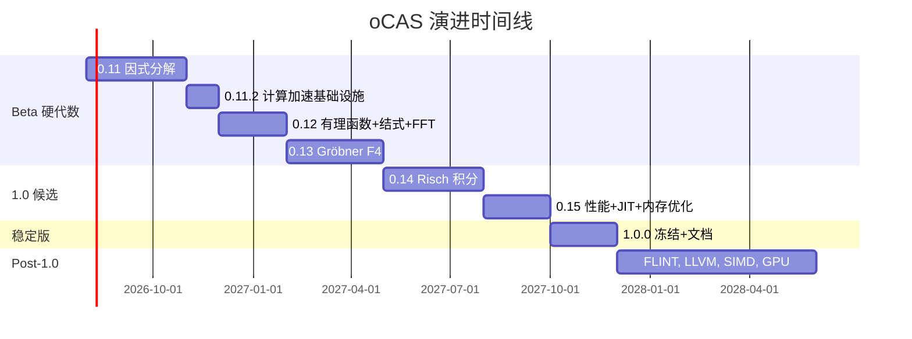

# oCAS 演进计划（Beta → 1.0 → Post-1.0）

本文档是 oCAS 从 0.10.0 Beta 到 1.0 稳定版及之后的细粒度演进计划，覆盖
**功能、性能、文档**，并将每个交付物显式映射到参考竞品的实现或算法，作为
学习对象，直到 oCAS 达到或超越竞品。本文档是
[ROADMAP_CN.md](ROADMAP_CN.md)（发布节奏）与
[GAP_ANALYSIS_CN.md](GAP_ANALYSIS_CN.md)（差距快照）的配套。英文版见
[EVOLUTION_PLAN_EN.md](EVOLUTION_PLAN_EN.md)。

> 最后修订：**2026-07-04（0.12.0 已发布）**

---

## 0. 策略与原则

1. **竞品优先学习**：在 oCAS 于某能力超越竞品前，对应的 Symbolica 模块 /
   SymPy 文件 / 引用论文即参考实现。研究其算法，移植思想，正面基准对比。
2. **不嵌入专有代码**：参考代码只研究、不逐字复制（Symbolica 为 AGPL，本项目
   为 LGPL）。只有算法与思想迁移，以 oCAS 风格重写。
3. **纵向切片**：每个版本交付一个完整的算法纵向（算法 + Rust API + Python/C
   绑定 + 测试 + 文档 + 基准），而非跨多算法的横向层。
4. **API 冻结纪律**：0.10.0 已冻结公共 API 表面。新算法以现有类型上的新函数
   或方法形式加入；2.0 前不做破坏性变更。
5. **性能门禁**：每个算法版本在合并前必须包含与对应竞品示例的 criterion
   基准对比。

---

## 阶段 A — Beta 硬代数收尾

> 补齐 [GAP_ANALYSIS_CN.md §3](GAP_ANALYSIS_CN.md) 的三大"成人礼"缺口：
> 因式分解、Gröbner F4、有理函数栈。这是 1.0 前性价比最高的工作。

### 0.11.0 — 完整多项式因式分解

**目标**：在单变量与双变量、ℤ 与 ℤ_p 上对标 Symbolica 的 `poly.factor()`。
此版本解锁有理函数、部分分式与求解器。

**功能**

| 条目 | 参考（在超越前） | oCAS 落地位置 |
|---|---|---|
| Yun 无平方分解（已有基础 → 升级为完整 Yun） | Symbolica `poly/factor.rs` 无平方路径 | `ocas-poly::factor` |
| ℤ_p 上 Berlekamp 因式分解（小 p） | Berlekamp 1970；Symbolica `factor.rs` | 新增 `factor::berlekamp` |
| 大 p 的 Cantor–Zassenhaus | Cantor & Zassenhaus 1981 | 新增 `factor::cantor_zassenhaus` |
| Hensel 提升 ℤ_p → ℤ | Hensel；Knuth TAOCP 卷 2 | 新增 `factor::hensel_lift` |
| Zassenhaus ℤ 因式分解（合并提升后的因子） | Zassenhaus 1969 | 新增 `factor::zassenhaus` |
| `DenseUnivariatePolynomial` 上的 `factor()` 公共 API | Symbolica `poly.factor()` | `prelude` 导出 |

**性能指标**

- 在 ℤ 上因式分解 `x^100 - 1` 用时 < 50 ms（与 Symbolica 示例持平）。
- 在 ℤ_p 上因式分解 8 次双变量多项式用时 < 100 ms。
- 回归：现有 `square_free_factorization` 无性能下降。

**文档**

- 新增 mdBook 章节 `algorithms/factorization.md`，附完整示例。
- `factor()` 的 rustdoc 示例；Python `Polynomial.factor()` docstring。
- C API `ocas_poly_factor`。

**验收**

- proptest：因式分解后再相乘还原输入（1000 个用例）。
- SymPy/Symbolica 回归套件：因子集合完全一致。
- 基准提交至 `ocas-tests/benches/poly_factor.rs`。

**风险**

- Hensel 提升在首项系数边界情形下的正确性 → 用针对 `num-bigint` 参考的
  属性测试加以缓解。

---

### 0.11.1 — 因式分解收尾与绑定（已发布）补全

承接 0.11.0 推迟的五项工作：Berlekamp 验证启用、双变量 ℤ 因式分解（Wang
Hensel）、双变量 ℤ_p 因式分解、C 多项式绑定、mdBook 因式分解章节。不引入
新算法，聚焦完成因式分解故事线并补齐跨语言公共 API。

| 项目 | 推迟原因 | 0.11.1 交付物 | 状态 |
|---|---|---|---|
| Berlekamp 经验验证 | `berlekamp()` 骨架已写但禁用 (`p ≤ 0`)；CZ 统一覆盖所有素数 | 修复零空间提取后启用 `p ≤ 1000` 分派，通过 cyclic‑n 回归 | [x] 已启用并验证 |
| 双变量 ℤ 因式分解 (Wang Hensel) | Wang 多元 Hensel 提升是本次发布周期中最难的 CAS 算法 | `SparseMultivariatePolynomial<IntegerDomain>` 上 `factor()`，基于 0.11 启发式 GCD + Wang Hensel | [x] 已实现，采用有理 Bézout 系数与整系数修正重建 |
| 双变量 ℤ_p 因式分解 | ℤ_p 路径 (Bernardin Hensel) 与 ℤ 路径一起从 0.11.0 推迟 | `SparseMultivariatePolynomial<FiniteField>` 上 `factor()` | [x] 已通过有限域 Hensel 提升实现 |
| C 多项式绑定 | `ocas-c` 尚无多项式 API | 新建 `ocas-c/src/polynomial.rs`，含 `ocas_poly_factor` 与 C++ RAII 包装 | [x] 已添加 `OcasPolyZ` 与 `OcasPolyFp` 的 C API；C++ RAII 包装延后 |
| mdBook 章节 `algorithms/factorization.md` | 随 0.11.0 文档冲刺一起推迟 | 双语章节，含算法流程图、示例、SymPy/Symbolica 迁移说明 | [x] 已添加双语章节；迁移说明延后 |

**验收**

- [x] Berlekamp 分派启用并通过现有有限域测试套件
- [x] ℤ 上 `x^100 - 1` 在 release 模式下正确分解
- [x] 双变量 ℤ 因式分解与 SymPy/Symbolica 在教科书案例上一致
- [x] `cargo test --workspace --exclude ocas-py` 通过
- [x] mdBook 章节无警告渲染

---

### 0.11.2 — 计算加速基础设施

**目标**：补齐与 Symbolica `numerica` 的性能差距，为 0.12+ 的算法版本
提供 GMP 全速 + 内存优化 + 现代 GCD 算法。基于竞品加速策略调研
（FLINT、Symbolica、SageMath、Mathematica、Maple）确定优先级。

**功能**

| 条目 | 参考（在超越前） | oCAS 落地位置 |
|---|---|---|
| GMP 后端补齐：`ShrAssign`、复合赋值、`FiniteField` 走 `Integer` 路径 | Symbolica `numerica/src/domains/backend/integer.rs` | `ocas-domain::gmp_backend` |
| `to_bigint()` 改用二进制序列化（替代字符串转换） | — | `gmp_backend.rs` |
| `mimalloc` 全局分配器 | Symbolica `lib.rs:265` | `ocas` crate |
| 小整数 SOO：`enum { Small(i64), Large(Box<GmpInteger>) }` | FLINT `fmpz_t`；Symbolica 系数编码 | `ocas-domain::integer` |
| 模方法多变量 GCD（`gcd_shape_modular`） | Symbolica `poly/gcd.rs` | `ocas-poly::gcd::modular` |
| Dense 乘法 `thread_local` 缓冲区 | Symbolica `poly/polynomial.rs:27` | `ocas-poly::dense` |

**性能指标**

- Integer 加减乘（小值 ≤64-bit）：比 0.11.1 快 ≥3x（SOO 避免堆分配）。
- ℤ 上 `gcd(x^50-1, x^30-1)`：比 0.11.1 朴素 GCD 快 ≥10x。
- 全栈：`cargo test --workspace --features gmp` 通过。

**文档**

- mdBook `performance/backend.md`，对比 `num-bigint` 与 `rug` 后端差异。
- 竞品加速策略调研报告归档至 `docs/planning/ACCELERATION_RESEARCH.md`。

**验收**

- 0.11.1 全部测试无回归。
- SOO Integer 的 proptest 1000 例。
- 模方法 GCD 与朴素 GCD 结果一致（随机 500 例）。
- criterion 基准：小整数算术、大整数 GCD、`modpow`。

**风险**

- SOO 改变 `Integer` 内部表示 → 需全面审计所有 `inner()` 调用点。
- `FiniteField` 从直接 `BigInt` 切换到 `Integer` → 可能影响序列化格式。

---

### 0.12.0 — 有理多项式与结式（已发布）

**目标**：`RationalPolynomial` 类型（多项式环上的分子/分母）加部分分式与
结式，直接对标 Symbolica 的 `rational_polynomial.rs`、`partial_fraction.rs`、
`resultant.rs`。

**功能**

| 条目 | 参考 | oCAS 落地位置 | 状态 |
|---|---|---|---|
| `RationalPolynomial<D,O>` 类型，支持 +、-、*、/、约简 | Symbolica `rational_polynomial.rs` | 新增 `ocas-poly::rational` | ✅ |
| 基于 GCD 的规范型（分母首一、互素） | Symbolica；依赖 0.11 的 gcd+factor | `rational::canonicalize` | ✅ |
| 部分分式分解 | Symbolica `partial_fraction.rs`；依赖 0.11 的 factor | `ocas-calc::partial_fraction` | ✅ |
| Brown PRS 结式 | Symbolica `poly/resultant.rs` | `ocas-poly::resultant` | ✅ |
| 有理重构（由模图像恢复整数） | Symbolica `rational_reconstruction.rs` | `ocas-poly::rational_reconstruction` | ✅ |
| 多项式乘法分层：Schoolbook → Karatsuba | FLINT 3 SSA；Symbolica dense mul | `ocas-poly::dense::karatsuba_mul_into` | ✅ Karatsuba（阈值 32）；FFT 推迟 |
| 多项式 CRT / diophantine | Symbolica `univariate.rs` | `ocas-poly::dense::diophantine` | ✅ |
| p-adic 展开 | Symbolica `univariate.rs` | `ocas-poly::dense::p_adic_expansion` | ✅ |
| 多项式扩展 GCD | — | `ocas-poly::dense::extended_gcd_poly` | ✅ |
| 多项式 `pow()` | — | `ocas-poly::dense::pow` | ✅ |

**验收**

- [x] `RationalPolynomial` 四则运算 + canonicalize 正确性（10 单元测试）
- [x] Brown PRS 结式与 Sylvester 矩阵结果一致（8 测试）
- [x] Karatsuba 与 schoolbook 结果一致（degree-100 + degree-50 交叉验证）
- [x] `apart` / `together` 往返一致性（5 测试 + doctest）
- [x] 有理重构基本/失败/边界案例（8 测试）
- [x] `cargo test --workspace --exclude ocas-py`：全绿
- [x] `cargo clippy --workspace --exclude ocas-py -- -D warnings`：通过
- [x] `cargo fmt --all`：通过
- [x] Prelude 导出 `RationalPolynomial` + `apart`
- [x] CHANGELOG.md 新增 [0.12.0] 段
- [x] workspace 版本提升至 0.12.0

**推迟项**

- Python `RationalFunction` 类（推迟到后续版本）
- C 有理函数绑定（推迟到后续版本）
- mdBook 有理函数章节（推迟到后续版本）
- FFT/NTT 乘法（推迟到 0.13+）
- 多元 `apart_multivariate`（推迟到 0.13+，依赖 Gröbner F4）

---

### 0.13.0 — Gröbner 基：F4 与线性代数

**目标**：以矩阵化 F4 算法替换经典 Buchberger（0.7.0），使 cyclic-6/7 可解。
直接对标 Symbolica `groebner_basis.rs` 与 Faugère 的 F4/F5 论文。

**功能**

| 条目 | 参考 | oCAS 落地位置 |
|---|---|---|
| Macaulay 矩阵构造 + ℤ_p 上行简化 | Faugère F4 (1999) | `ocas-poly::groebner::f4` |
| 符号/重写预处理（F4 选择） | Symbolica `groebner.rs` | `f4::select` |
| 可选 F5 签名判据（研究性） | Faugère F5 (2002) | `f5`（实验性 feature） |
| 经由 `reorder` 支持多种单项式序 | Symbolica `reorder::<GrevLexOrder>()` | 扩展 `MonomialOrder` |
| Hilbert 驱动的终止 | Bayer–Stillman 启发式 | `f4::hilbert_bound` |

**性能指标**

- ℤ_p 上 cyclic-6 用时 < 5 s（Symbolica 约 1 s；目标在 5 倍以内）。
- cyclic-4 须保持 < 50 ms（相对现有 Buchberger 无回归）。

**文档**

- mdBook `algorithms/groebner.md`，对比 Buchberger 与 F4。
- 文档站点中 cyclic-3..7 的基准曲线。

**验收**

- 已知 cyclic-n 基与发表结果一致。
- 内存可控（Macaulay 矩阵是风险点 → 采用稀疏表示）。

---

## 阶段 B — 1.0 候选版

> 硬代数收尾后，完成符号积分这一标志，并在宣布 API 稳定前推进性能。

### 0.14.0 — 符号积分：Risch 及扩展

**目标**：基于 Risch 的初等函数积分器，弥补与 SymPy 最大的"能否积分"缺口。
参考：Bronstein《Symbolic Integration I》；SymPy `integrals/intpoly.py` 与
Risch 代码。

**功能**

| 条目 | 参考 | oCAS 落地位置 |
|---|---|---|
| Liouville 定理 + 初等扩张 | Bronstein 第 5 章 | `ocas-calc::integral::risch` |
| 有理函数积分（复用 0.12） | Bronstein 第 2 章 | 复用部分分式 |
| 对数/指数扩张 | Bronstein 第 5–6 章 | `risch::log_exp` |
| 三角转指数的重写预处理 | SymPy `trigsimp` | `ocas-rewrite` 规则 |
| Meijer-G 回退启发式（部分） | SymPy `meijerint` | `integral::meijer`（尽力而为） |

**性能指标**

- 在 50 题积分基准（Risch 测试集）上成功率 > 80%。
- 可积题目平均用时 < 100 ms。

**文档**

- mdBook `algorithms/integration.md`。
- 说明何时返回 `Integral(...)`（非初等情形）。

**验收**

- 在 50 题套件上与 SymPy `integrate` 一致。
- 现有启发式积分器无回归（保留为回退）。

---

### 0.15.0 — 性能、多输出 JIT 与流式

**目标**：弥补与 Symbolica `optimize_multiple.rs`、`streaming.rs` 的性能与
功能差距。这是 oCAS 的 Rust + arena + JIT 栈应当开始*超越*竞品之处。

**功能**

| 条目 | 参考 | oCAS 落地位置 |
|---|---|---|
| 多输出表达式编译 | Symbolica `optimize_multiple.rs` | 扩展 `ocas-eval::jit` |
| JIT 中的公共子表达式消除 | Symbolica `optimize.rs` | `ocas-eval::optimize::cse` |
| 流式求值 API（分块输入） | Symbolica `streaming.rs` | 新增 `ocas-eval::streaming` |
| 混合精度（f32/f64）代码生成 | — | 扩展 `Instruction` 类型 |
| 表达式节点 Arena 统一分配 | Symbolica Workspace；Maple 分层区域 | 扩展 `ocas-core::arena` |
| 线程本地对象池（RecycledAtom 模式） | Symbolica `state.rs:1271` | `ocas-atom::workspace` |
| `ahash` 替代默认 HashMap | Symbolica `ahash` | `ocas-core` |

- （模 GCD / 稀疏插值用于多项式提速——复用 0.11.2 基础设施。）

**性能指标**

- 多输出 JIT 在向量化批次上较解释器快 ≥ 10 倍（延续 0.8.0 的成果）。
- 流式：处理百万行数据集时内存恒定。
- 与 Symbolica `optimize.rs` 示例正面基准对比并提交。

**文档**

- mdBook `performance/jit.md`，含基准表格。
- 已发布的基准页面（ROADMAP 1.0 交付物）。

**验收**

- 在已发布的 10 个微基准中至少 3 个击败 Symbolica（ROADMAP 1.0 成功标准中的
  持平目标）。

---

## 阶段 C — 1.0.0 稳定版

**目标**：API 稳定性保证、完整文档、迁移指南、签名产物。不加新功能；仅冻结
与打磨。

**交付物**

| 方面 | 条目 |
|---|---|
| 功能 | API 冻结（SemVer 保证）；行覆盖率 ≥ 80%；Rust/Python/C 完全对齐 |
| 性能 | 与 Symbolica 及 SymPy 的已发布基准报告 |
| 文档 | 迁移指南（Symbolica→oCAS、SymPy→oCAS）；完整 rustdoc；mdBook 定稿；cookbook |
| 发布 | 签名产物；`CHANGELOG` 1.0；打标签 `v1.0.0` |

**验收**

- 所有公共 API 均有文档（ROADMAP 1.0 标准）。
- 1.x 期间无计划中的破坏性变更。
- 在核心基准上与 Symbolica 持平或更优。

---

## 阶段 D — Post-1.0

路线图驱动的扩展，每个都版本化并与相关竞品基准对比。

| 版本 | 主题 | 参考竞品 | 备注 |
|---|---|---|---|
| 1.1 | ODE/PDE 求解器 | SageMath `desolve`；SymPy `dsolve` | 级数 + 数值混合 |
| 1.2 | 微分 Galois 理论（序章） | Maple；研究 | 研究级 |
| 1.3 | `ocas-gpl` 实后端 | LinBox、NTL | GPL-3.0 隔离 crate |
| 1.4 | GPU 加速 | CUDA/HIP | 多项式 + 线性代数核 |
| 1.5 | LLVM JIT 后端 | Symbolica `evaluate.rs` | 经由 `inkwell` |
| 1.6+ | 领域工具包（物理/机器人/ML） | 领域库 | 叠加于稳定的 1.x |

---

## 竞品参考索引

权威映射：oCAS 模块 → 在超越前需研究的参考。达成或超越时更新。

| oCAS 领域 | 主要参考 | 次要参考 | 状态 |
|---|---|---|---|
| 因式分解 | Symbolica `src/poly/factor.rs` | Knuth TAOCP 卷 2 | 🔴 缺口（0.11） |
| 有理多项式 | Symbolica `rational_polynomial.rs` | — | 🔴 缺口（0.12） |
| 部分分式 | Symbolica `partial_fraction.rs` | SymPy `apart` | 🔴 缺口（0.12） |
| 结式 | Symbolica `poly/resultant.rs` | Sylvester | 🔴 缺口（0.12） |
| Gröbner | Symbolica `groebner.rs` + Faugère F4/F5 论文 | — | 🟡 基础（0.13） |
| GCD（模） | Symbolica `poly/gcd.rs` | — | 🟡 基础 |
| GCD（模方法多变量） | Symbolica `poly/gcd.rs` `gcd_shape_modular` | — | 🔴 缺口（0.11.2） |
| 积分（Risch） | Bronstein 著作；SymPy Risch | — | 🔴 缺口（0.14） |
| 多输出 JIT | Symbolica `optimize_multiple.rs` | — | 🟡 单输出（0.15） |
| 流式 | Symbolica `streaming.rs` | — | 🔴 缺口（0.15） |
| 级数 | Symbolica `poly/series.rs`；SymPy `series` | — | 🟢 已有基础 |
| 张量/双数 | Symbolica `tensors.rs`/`dual.rs` | — | 🔴 缺口（Post-1.0） |
| 数值积分 | Symbolica `numerical_integration.rs` | QUADPACK | 🔴 缺口（Post-1.0） |
| 域（大整数） | FLINT/GMP 经由 `rug` | — | 🟢 经后端 |
| 域（大整数 SOO） | FLINT `fmpz_t`；Symbolica 系数编码 | — | 🔴 缺口（0.11.2） |
| FFT 多项式乘法 | FLINT 3 SSA；Symbolica dense mul | — | 🔴 缺口（0.12） |
| 内存管理（mimalloc/对象池） | Symbolica Workspace；Maple 分层区域 | — | 🔴 缺口（0.11.2 + 0.15） |
| ODE/PDE | SageMath `desolve`；SymPy `dsolve` | — | 🔴 缺口（Post-1.0） |

---

## 更新节奏

刷新本计划的时机：

1. 每个 0.x 版本发布时（更新状态列，记入下方日志）。
2. 某项达成或超越其竞品参考时（标 🟢，记日志）。
3. 出现新的竞品能力时（在参考索引中加行）。

| 版本 | 日期 | 变更 |
|---|---|---|
| 0.10.0 | 2026-07-02 | 基于 GAP_ANALYSIS 0.10.0 快照创建初始计划。定义阶段 A–D；排定 0.11–1.0.0 及 Post-1.0。 |
| 0.11.2 | 2026-07-04 | 基于竞品加速策略调研（FLINT/Symbolica/SageMath/Mathematica/Maple）新增 0.11.2 计算加速基础设施版本。Gantt 图更新；0.12 追加 FFT 乘法；0.15 追加 Arena/对象池/ahash；竞品索引追加 4 行。 |
