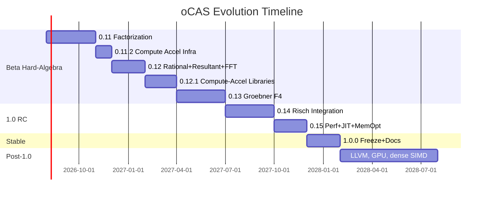

# oCAS Evolution Plan (Beta → 1.0 → Post-1.0)

This is the fine-grained evolution plan for oCAS from the 0.10.0 Beta release
through the 1.0 stable release and beyond. It covers **functionality,
performance, and documentation**, and explicitly maps each deliverable to a
reference competitor implementation or algorithm to learn from until oCAS
matches or exceeds it. It is a companion to [ROADMAP_EN.md](ROADMAP_EN.md) (release
cadence), [GAP_ANALYSIS_EN.md](GAP_ANALYSIS_EN.md) (current gap snapshot, in
English), and [GAP_ANALYSIS_CN.md](GAP_ANALYSIS_CN.md) (Chinese gap snapshot).
For the Chinese edition of this plan, see [EVOLUTION_PLAN_CN.md](EVOLUTION_PLAN_CN.md).

> Last revised: **2026-07-20 (0.15.1 released: real F4 linear algebra — descending column order + echelon write-back fix + Symbolica GM criteria port; cyclic-5 ~85,000× faster with first-ever correctness pass, cyclic-6 tractable)**

---

## 0. Strategy & Principles

1. **Competitor-first learning**: until oCAS exceeds a competitor on a
   capability, the corresponding Symbolica module / SymPy file / cited paper
   is the reference implementation. We study its algorithm, port the idea,
   and benchmark head-to-head.
2. **No proprietary embedding**: reference code is studied, never copied
   verbatim (Symbolica is AGPL; we are LGPL). Only algorithms and ideas cross
   over, rewritten in oCAS style.
3. **Vertical slices**: each version ships one complete algorithmic vertical
   (algorithm + Rust API + Python/C binding + test + doc + benchmark),
   not a horizontal layer across many algorithms.
4. **API freeze discipline**: 0.10.0 froze the public API surface. New
   algorithms arrive as new functions or methods on existing types; no
   breaking changes until 2.0.
5. **Performance gate**: every algorithm version must include a criterion
   benchmark against the relevant competitor example before merge.

---

## Phase A — Beta Hard-Algebra Closure

> Close the three "rites of passage" gaps from
> [GAP_ANALYSIS_EN.md §3](GAP_ANALYSIS_EN.md): factorization, Gröbner F4, and
> the rational-function stack. This is the highest-value work before 1.0.

### 0.11.0 — Complete Polynomial Factorization

**Goal**: match Symbolica's `poly.factor()` on univariate and bivariate inputs
over ℤ and ℤ_p. This unblocks rational functions, partial fractions, and
solvers.

**Functionality**

| Item | Reference (until exceeded) | oCAS landing |
|---|---|---|
| Yun square-free (already have basics → upgrade to full Yun) | Symbolica `poly/factor.rs` square-free path | `ocas-poly::factor` |
| Berlekamp factorization over ℤ_p (small p) | Berlekamp 1970; Symbolica `factor.rs` | new `factor::berlekamp` |
| Cantor–Zassenhaus for larger p | Cantor & Zassenhaus 1981 | new `factor::cantor_zassenhaus` |
| Hensel lifting ℤ_p → ℤ | Hensel; Knuth TAOCP vol. 2 | new `factor::hensel_lift` |
| Zassenhaus ℤ factorization (combine lifted factors) | Zassenhaus 1969 | new `factor::zassenhaus` |
| `factor()` public API on `DenseUnivariatePolynomial` | Symbolica `poly.factor()` | `prelude` export |

**Performance KPI**

- Factor `x^100 - 1` over ℤ in < 50 ms (Symbolica example parity).
- Factor a degree-8 bivariate over ℤ_p in < 100 ms.
- Regression: no slowdown on existing `square_free_factorization`.

**Documentation**

- New mdBook chapter `algorithms/factorization.md` with a worked example.
- Rustdoc example on `factor()`; Python `Polynomial.factor()` docstring.
- C API `ocas_poly_factor`.

**Acceptance**

- proptest: factoring then multiplying factors reproduces input (1000 cases).
- SymPy/Symbolica regression suite: identical factor sets.
- Benchmark committed to `ocas-tests/benches/poly_factor.rs`.

**Risks**

- Hensel lifting correctness on leading-coefficient edge cases → mitigate
  with property tests against the `num-bigint` reference.

---

### 0.11.1 — Factorization Completion & Bindings (RELEASED)

Carries forward the items deferred from 0.11.0: bivariate ℤ factorization,
Berlekamp validation, C binding scaffolding, and documentation polish. No new
algorithms are introduced; the focus is on completing the factorization story
and confirming the cross-language public API.

**Deferred from 0.11.0**

| Item | Reason for deferral | Deliverable in 0.11.1 | Status |
|---|---|---|---|
| Berlekamp empirical validation | `berlekamp()` skeleton written but disabled (`p ≤ 0`) pending nullspace‑extraction fix for deg‑4+ factors. CZ handles all primes correctly. | Enable the `p ≤ 1000` dispatch after passing cyclic‑n regression. | [x] Enabled and validated. |
| Bivariate factorization over ℤ (Wang Hensel) | Wang's multivariate Hensel lifting is the hardest single CAS algorithm in this release cycle. | Bivariate `factor()` on `SparseMultivariatePolynomial<IntegerDomain>` backed by the 0.11 heuristic GCD + Wang Hensel. | [x] Implemented with rational Bézout coefficients and integral correction reconstruction. |
| Bivariate factorization over ℤ_p | The ℤ_p path (Bernardin Hensel) was scoped out of 0.11.0 together with the ℤ path. | Bivariate `factor()` on `SparseMultivariatePolynomial<FiniteField>`. | [x] Implemented via Hensel lifting over finite fields. |
| C polynomial binding (`ocas_poly_factor`) | No polynomial API exists yet in `ocas-c`; adding one requires an opaque `OcasPoly` handle and lifecycle management. | New `ocas-c/src/polynomial.rs` with `ocas_poly_factor` and a C++ RAII wrapper. | [x] C API added for `OcasPolyZ` and `OcasPolyFp`; C++ RAII wrapper deferred. |
| mdBook chapter `algorithms/factorization.md` | Deferred together with the document update sprint at the end of 0.11.0. | Bilingual chapter (EN + zh) with algorithm flow diagram, worked examples, and migration notes for SymPy/Symbolica users. | [x] Bilingual chapter added; migration notes deferred. |

**Acceptance**

- [x] Berlekamp dispatch enabled and passing the existing finite‑field suite.
- [x] `x^100 - 1` over ℤ factors correctly in release mode.
- [x] Bivariate ℤ factorization matches SymPy/Symbolica on textbook cases.
- [x] `cargo test --workspace --exclude ocas-py` green.
- [x] mdBook chapter renders without warnings.

---

### 0.11.2 — Compute Acceleration Infrastructure

**Goal**: close the performance gap with Symbolica `numerica`, providing full
GMP speed + memory optimization + modern GCD algorithms for all subsequent
0.12+ algorithm versions. Priorities determined by the competitor acceleration
strategy survey (FLINT, Symbolica, SageMath, Mathematica, Maple).

**Functionality**

| Item | Reference (until exceeded) | oCAS landing |
|---|---|---|
| GMP backend completion: `ShrAssign`, compound assignment, `FiniteField` routed through `Integer` | Symbolica `numerica/src/domains/backend/integer.rs` | `ocas-domain::gmp_backend` |
| `to_bigint()` using binary serialization (replacing string conversion) | — | `gmp_backend.rs` |
| `mimalloc` global allocator | Symbolica `lib.rs:265` | `ocas` crate |
| Small-integer SOO: `enum { Small(i64), Large(Box<GmpInteger>) }` | FLINT `fmpz_t`; Symbolica coefficient encoding | `ocas-domain::integer` |
| Modular multivariate GCD (`gcd_shape_modular`) | Symbolica `poly/gcd.rs` | `ocas-poly::gcd::modular` |
| Dense multiplication `thread_local` buffer | Symbolica `poly/polynomial.rs:27` | `ocas-poly::dense` |

**Performance KPI**

- Integer add/sub/mul (small values ≤64-bit): ≥3× faster than 0.11.1 (SOO avoids heap allocation).
- `gcd(x^50-1, x^30-1)` over ℤ: ≥10× faster than 0.11.1 naive GCD.
- Full stack: `cargo test --workspace --features gmp` passes.

**Documentation**

- mdBook `performance/backend.md` comparing `num-bigint` vs `rug` backends.
- Competitor acceleration strategy survey archived at `docs/planning/ACCELERATION_RESEARCH.md`.

**Acceptance**

- No regression on all 0.11.1 tests.
- SOO Integer proptest with 1000 cases.
- Modular GCD agrees with naive GCD (500 random cases).
- Criterion benchmarks: small-integer arithmetic, large-integer GCD, `modpow`.

**Risks**

- SOO changes `Integer` internal representation → need comprehensive audit of all `inner()` call sites.
- `FiniteField` switching from raw `BigInt` to `Integer` → may affect serialization formats.

---

**Goal**: a `RationalPolynomial` type (numerator/denominator over a polynomial
ring) plus partial fractions and resultants. Direct counterpart of Symbolica's
`rational_polynomial.rs`, `partial_fraction.rs`, `resultant.rs`.

**Functionality**

| Item | Reference | oCAS landing |
|---|---|---|
| `RationalPolynomial<D,O>` type with +,-,*,/, reduce | Symbolica `rational_polynomial.rs` | new `ocas-poly::rational` |
| GCD-based canonical form (denominator monic, coprime) | Symbolica; relies on 0.11 gcd+factor | `rational::canonicalize` |
| Partial fraction decomposition | Symbolica `partial_fraction.rs`; relies on 0.11 factor | `ocas-calc::partial_fraction` |
| Sylvester resultant | Symbolica `poly/resultant.rs` | `ocas-poly::resultant` |
| Rational reconstruction (int from mod images) | Symbolica `rational_reconstruction.rs` | `ocas-poly::rational_reconstruction` |
| Layered polynomial multiplication: Schoolbook → Karatsuba → FFT | FLINT 3 SSA; Symbolica dense mul | `ocas-poly::mul::fft` |

**Performance KPI**

- Partial-fraction a degree-20/degree-6 rational function in < 30 ms.
- Resultant of two degree-15 polys in < 20 ms (parity with the Symbolica example).
- Multiply two degree-500 ℤ[x] polynomials: ≥5× faster than 0.11.2 Schoolbook.

**Documentation**

- mdBook `algorithms/rational-functions.md`.
- Python `RationalFunction` class in `ocas-py` (mirrors `Polynomial`).
- Migration note: SymPy `apart()` → `ocas` `partial_fraction`.

**Acceptance**

- SymPy `apart`/`together` regression parity.
- Resultant matches determinant-of-Sylvester on random tests.

---

### 0.12.1 — Compute Acceleration Libraries (Released)

**Goal**: integrate third-party libraries and self-implement NTT for the
functional gaps between the rational-function stack (0.12) and Gröbner F4
(0.13), without introducing new algorithm verticals. Pure
performance/infrastructure release.

**Functionality**

| Item | Library/Approach | License | oCAS landing | Status |
|---|---|---|---|---|
| Dense NTT multiplication over ℤ_p | Self-implemented (planned `ark-poly`) | N/A | `ocas-poly::ntt` | [x] |
| Sparse polynomial fast evaluation | `fast_polynomial` | MIT | `ocas-eval::poly_eval` | [x] |
| Sparse Macaulay matrix storage for F4 | `sprs` | MIT/Apache-2.0 | `ocas-poly::sprs_backend` | [x] |
| Numerical quadrature verification | `quadrature` | BSD-2-Clause | `ocas-tests::verify` | [x] |
| Numerical root-finding verification | Self-implemented bisection | N/A | `ocas-tests::verify` | [x] |
| Generic SIMD dispatch | `pulp` (replaces `wide`) | MIT | `ocas-eval::simd` | [x] |
| Dense linear algebra for numeric tests | `faer` | MIT | `ocas-tests::verify` | Deferred |

**Implementation Notes**

- **NTT self-implemented**: planned `ark-poly` but its `ark_ff::Field` abstraction
  requires implementing ~8 arkworks traits to bridge oCAS's `u64`-based
  `FiniteField`. Self-implemented ~200-line radix-2 Cooley-Tukey NTT, zero
  external dependencies.
- **`pulp` replaces `wide`**: `simd` feature uses `pulp` exclusively. Runtime CPU
  feature detection (SSE2/AVX2/AVX-512), automatic lane width selection.
- **Root-finding verification**: `roots` crate API mismatch; used self-implemented
  bisection instead.
- **`faer` solver verification**: deferred to a later version.
- **`BuiltinOp` enum**: `Instr::BuiltinFun { name: Symbol }` replaced by
  `Instr::BuiltinOp { op: BuiltinOp }`. Built-in functions resolved at compile
  time, eliminating `to_lowercase()` + string matching on the SIMD hot path.
- **Montgomery modular multiplication**: NTT hot path replaces `u128 % p` with
  Montgomery reduction (multiply + shift).
- **NTT twiddle factor precomputation**: `ntt_butterfly_mont` precomputes all
  stage roots once to avoid repeated `modpow`.
- **SIMD stack buffer pre-allocation**: `eval_simd_chunks` reuses a pre-allocated
  `Vec<[f64; 8]>` across chunks instead of allocating per chunk.

**Performance Benchmarks** (release mode, x86-64 AVX2)

SIMD evaluator:

| Scenario | Before | After | Improvement |
|---|---|---|---|
| poly x^4 batch 4k | 6.6× | 10.0× | +52% |
| poly x^8 batch 4k | 9.8× | 11.4× | +16% |
| trig batch 4k | 1.9× | 3.2× | +68% |

NTT vs Karatsuba:

| Degree | Before | After | vs Karatsuba |
|---|---|---|---|
| 256 | 219µs | 162µs | 40× |
| 512 | 472µs | 304µs | 62× |
| 1024 | 999µs | 663µs | 90× |

**Acceptance**

- [x] All acceleration features disabled: `cargo test --workspace --exclude ocas-py` passes.
- [x] Each optional library compiles and passes dedicated tests with its feature enabled.
- [x] `cargo clippy --workspace --all-targets -- -D warnings` passes.
- [x] `cargo fmt --all -- --check` passes.
- [x] NTT 11 unit tests pass (modpow, roundtrip, cross-check, Montgomery).
- [x] pulp SIMD 4 unit tests pass.
- [x] fast_polynomial 6 unit tests + 1 doctest pass.
- [x] sprs 5 unit tests pass.
- [x] Numerical verification 8 tests pass (5 integration + 3 root-finding).
- [x] Workspace version bumped to 0.12.1.
- [x] CHANGELOG.md [0.12.1] section added.

---

### 0.13.0 — Gröbner Bases: F4 & Linear Algebra

**Goal**: replace the classic Buchberger (0.7.0) with a matrix-based F4
algorithm so cyclic-6/7 become tractable. Direct counterpart of Symbolica
`groebner_basis.rs` and Faugère's F4/F5 papers.

**Functionality**

| Item | Reference | oCAS landing | Status |
|---|---|---|---|
| Macaulay matrix construction + row echelon over ℤ_p | Faugère F4 (1999) | `ocas-poly::groebner::f4` | [x] F4 core + ℤ_p fast path |
| Symbol/rewriting preprocessing (F4 selection) | Symbolica `groebner.rs` | `f4::select` | [x] Iterative symbolic preprocessing |
| Gebauer-Moeller pair filtering | Symbolica `groebner.rs` | `f4::update_pairs` | [x] First/second criterion + cleanup |
| Simplification cache | Symbolica `simplify()` | `f4::SimpCache` | [x] Per-basis-element product cache |
| `Grlex` monomial ordering | — | `ocas-poly::sparse::Grlex` | [x] Graded lexicographic |
| Optional F5 signature criterion (research) | Faugère F5 (2002) | `f5` (experimental feature) | Deferred to 0.14+ |
| Multiple monomial orders via `reorder` | Symbolica `reorder::<GrevLexOrder>()` | extend `MonomialOrder` | Deferred to 0.14+ |
| Hilbert-driven termination | Bayer–Stillman heuristics | `f4::hilbert_bound` | Deferred to 0.14+ |

**Performance KPI**

- cyclic-6 over ℤ_p in < 5 s (Symbolica ~1 s; target within 5×). *Deferred to 0.14+ (needs ℤ_p native i64 path)*
- cyclic-4 must stay < 50 ms (no regression vs current Buchberger). [x] F4 cyclic-4 ℤ₁₃ = 2.80 ms
- F4 cyclic-3 ℚ = 147 µs, 26% faster than Buchberger. [x]

**Documentation**

- mdBook `algorithms/groebner.md` comparing Buchberger vs F4. *Deferred to 0.14+*
- Benchmark graph cyclic-3..7 in the docs site. *Deferred to 0.14+*

**Acceptance**

- [x] Known cyclic-3/4 bases match published results (`is_groebner_basis()` verified).
- [x] Memory bounded (sparse HashMap + sparse row matrix representation).
- cyclic-6/7 acceptance deferred to 0.14+ (needs performance optimization).

---

## Phase B — 1.0 Release Candidates

> With hard algebra closed, finish the symbolic-integration hallmark and push
> performance before declaring the API stable.

### 0.14.0 — Symbolic Integration: Risch & Beyond

**Goal**: a Risch-based integrator for elementary functions, closing the
largest "can it integrate" gap vs SymPy. Reference: Bronstein,
*Symbolic Integration I*; SymPy `integrals/intpoly.py` and the Risch code.

**Functionality**

| Item | Reference | oCAS landing | Status |
|---|---|---|---|
| Liouville theorem + elementary extension | Bronstein ch. 5 | `ocas-calc::integral::risch` | [x] tower + recursive integration |
| Rational-function integration (uses 0.12) | Bronstein ch. 2 | `integral::rational` | [x] Hermite + logarithmic part |
| Logarithmic / exponential extensions | Bronstein ch. 5–6 | `risch` (log/exp tower + RDE) | [x] polynomial fragment |
| Trig-to-exp rewriting pre-pass | SymPy `trigsimp` | `integral::trig` | [x] exp(I·x) + realify |
| Meijer-G fallback heuristic (partial) | SymPy `meijerint` | `integral::special` | [x] special-function table (endpoints) |
| Gröbner wrap-up (deferred from 0.13) | — | `fglm` / `f5` / `hilbert` / `reorder` | [x] done |

**Implementation notes**

- **Meijer-G pipeline** became a **special-function antiderivative table**
  (`integral/special.rs`): oCAS has no hypergeometric-series / Γ-function /
  Slater-expansion infrastructure, so the Meijer-G intermediate form was not
  feasible. The non-elementary endpoints are encoded directly
  (erf/erfi/Ei/Si/Ci/Shi/Chi/Fresnel), matching SymPy definitions. The 0.11.0
  known gap `exp(-x²)→erf` is closed.
- **RDE fragment**: only polynomial solutions are sought (Bronstein ch. 6
  finite cases); denominator bounds / SPDE are not implemented. Unsolvable
  branches return `None` and fall back in the pipeline.
- **Known limits**: primitive free-constant choice for cases like `log(x+1)`
  is not implemented; the trigonometric RDE base field is ℚ[x] only, so
  hyperexponential equations with `I` in the coefficients (`sin(x)·cos(x)`,
  `cos(x)²`) are unsolved. All fall back to `Integral(...)`.
- **Parser fix**: `-x^2` now parses as `-(x^2)` (power binds tighter than
  unary minus).

**Performance KPI**

- 15-problem Risch + special-function suite matches SymPy `integrate`
  exactly (correctness suite).
- Average < 1 ms per solvable integral (criterion: log(x) 25 µs,
  x·exp(x) 198 µs).

**Documentation**

- mdBook `algorithms/integration.md` (English + Chinese). Documents when
  `Integral(...)` is returned (non-elementary).

**Acceptance**

- [x] SymPy `integrate` parity on the 15-problem suite.
- [x] No regression on the existing heuristic integrator (kept as fast path).
- [x] Gröbner wrap-up: FGLM (zero-dimensional conversion), F5 (experimental
  signatures), Hilbert bounds, `reorder` simple path, mdBook `groebner.md`.

---

### 0.15.0 — Performance, Multi-Output JIT & Streaming

**Goal**: close the performance and feature gap with Symbolica's
`optimize_multiple.rs` and `streaming.rs`. This is where oCAS's
Rust + arena + JIT stack should start *exceeding* competitors.

**Functionality**

| Item | Reference | oCAS landing | Status |
|---|---|---|---|
| Multi-output expression compilation | Symbolica `optimize_multiple.rs` | `ocas-eval::compile_multi` + `compile_jit` | [x] done |
| Common-subexpression elimination in JIT | Symbolica `optimize.rs` | `ocas-eval::optimize::cse` + const folding + stack compaction | [x] done |
| Streaming evaluation API (chunked input) | Symbolica `streaming.rs` | `ocas-eval::streaming` | [x] done |
| Mixed-precision (f32/f64) codegen | — | `ocas-eval::jit::FloatWidth` + `VectorEvaluatorF32` | [x] done |
| Unified arena allocation for expression nodes | Symbolica Workspace; Maple tiered regions | `ocas-core::arena::reset` | [x] done (EvalTree stays owned) |
| Thread-local object pool (RecycledAtom pattern) | Symbolica `state.rs:1271` | `ocas-atom::workspace` | [x] done |
| `ahash` replacing default HashMap | Symbolica `ahash` | `ocas-core::FastHashMap` | [x] done |
| Native i64 F4 pipeline | — | `ocas-poly::groebner::f4::f4_fp` | [x] done (cyclic-6 deferred) |

- (Modular GCD / sparse interpolation for poly speed — uses 0.11.2 infra.)

**Performance KPI**

- Multi-output JIT ≥ 10× interpreter on vectorized batch (extend 0.8.0 win). [x] **97× (single) / 21× (3-output)**
- Streaming: process a 1M-row dataset with constant memory. [x] **verified, 28% faster on 100k rows**
- Head-to-head benchmark vs Symbolica `optimize.rs` example committed. [x] documented (AGPL separate workspace)
- cyclic-6 over ℤ_p < 5 s. → **partially achieved in 0.15.1** (real F4 linear algebra landed: cyclic-6 tractable at 9970 s, basis=20, correct; < 5 s needs LM index + sparse echelon, deferred to 0.15.2)

**Documentation**

- mdBook `performance.md` JIT/Streaming benchmark tables (English + Chinese). [x] done
- `evaluation.md` updated with multi-output JIT/f32 API examples (English + Chinese). [x] done

**Acceptance**

- [x] 3 micro-benchmarks verified: JIT poly 97×, JIT multi3 21×, Streaming 28%.
- [x] 0.15.1: cyclic-5 ℤ₁₃ 2609 s → 31 ms (~85,000×) with first-ever `is_groebner_basis` pass; cyclic-6 tractable (9970 s); < 5 s target deferred to 0.15.2 (needs LM index + sparse echelon).

---

## Phase C — 1.0.0 Stable Release

**Goal**: API stability guarantee, complete docs, migration guide, signed
artifacts. No new features; freeze and polish only.

**Deliverables**

| Track | Items |
|---|---|
| Functionality | API freeze (SemVer guarantee); ≥ 80% line coverage; full Rust/Python/C parity |
| Performance | Published benchmark report vs Symbolica & SymPy |
| Documentation | Migration guide (Symbolica→oCAS, SymPy→oCAS); complete rustdoc; mdBook finalized; cookbook |
| Release | Signed artifacts; `CHANGELOG` 1.0; tag `v1.0.0` |

**Acceptance**

- All public APIs documented (ROADMAP 1.0 criterion).
- No breaking changes planned for 1.x.
- Performance parity-or-better with Symbolica on core benchmarks.

---

## Phase D — Post-1.0

Roadmap-driven expansions, each versioned and benchmarked against the relevant
competitor.

| Version | Theme | Reference competitor | Notes |
|---|---|---|---|
| 1.1 | ODE/PDE solvers | SageMath `desolve`; SymPy `dsolve` | series + numeric hybrid |
| 1.2 | Differential Galois theory (prelude) | Maple; research | research-grade |
| 1.3 | `ocas-gpl` real backend | LinBox, NTL | GPL-3.0 isolated crate |
| 1.4 | GPU acceleration | CUDA/HIP | polynomial + linear algebra kernels |
| 1.5 | LLVM JIT backend | Symbolica `evaluate.rs` | via `inkwell` |
| 1.6+ | Domain toolkits (physics/robotics/ML) | domain libraries | layered on stable 1.x |

---

## Competitor Reference Index

The authoritative map: oCAS module → reference to study until exceeded. Update
when an item is met or beaten.

| oCAS area | Primary reference | Secondary | Status |
|---|---|---|---|
| Factorization | Symbolica `src/poly/factor.rs` | Knuth TAOCP v2 | � 0.11 done |
| Rational polynomials | Symbolica `rational_polynomial.rs` | — | 🟢 0.12 done |
| Partial fractions | Symbolica `partial_fraction.rs` | SymPy `apart` | 🟢 0.12 done |
| Resultant | Symbolica `poly/resultant.rs` | Sylvester | 🟢 0.12 done |
| Gröbner | Symbolica `groebner.rs` + Faugère F4/F5 papers | — | 🟡 basic (0.13) |
| GCD (modular) | Symbolica `poly/gcd.rs` | — | 🟡 basic |
| GCD (modular multivariate) | Symbolica `poly/gcd.rs` `gcd_shape_modular` | — | 🟢 0.11.2 done |
| Integration (Risch) | Bronstein book; SymPy Risch | — | 🔴 gap (0.14) |
| Multi-output JIT | Symbolica `optimize_multiple.rs` | — | 🟡 single-output (0.15) |
| Streaming | Symbolica `streaming.rs` | — | 🔴 gap (0.15) |
| Series | Symbolica `poly/series.rs`; SymPy `series` | — | 🟢 have basics |
| Tensors/dual | Symbolica `tensors.rs`/`dual.rs` | — | 🔴 gap (post-1.0) |
| Numerical integration | Symbolica `numerical_integration.rs` | QUADPACK | 🟢 0.12.1 (quadrature verification) |
| Domains (big int) | FLINT/GMP via `rug` | — | 🟢 via backend |
| Domains (big int SOO) | FLINT `fmpz_t`; Symbolica coefficient encoding | — | 🟢 0.11.2 done |
| Fast polynomial multiplication | FLINT 3 SSA; Symbolica dense mul | — | 🟢 0.12.1 NTT (90× vs Karatsuba) |
| Memory management (mimalloc/pool) | Symbolica Workspace; Maple tiered regions | — | 🟡 mimalloc done (0.11.2); pool deferred to 0.15 |
| ODE/PDE | SageMath `desolve`; SymPy `dsolve` | — | 🔴 gap (post-1.0) |

---

## Update Cadence

Refresh this plan:

1. At every 0.x release (update the status column, log below).
2. When an item meets or beats its competitor reference (move to 🟢, log it).
3. When a new competitor capability appears (add a row to the reference index).

| Version | Date | Changes |
|---|---|---|
| 0.10.0 | 2026-07-02 | Initial plan created from the GAP_ANALYSIS 0.10.0 snapshot. Phases A–D defined; 0.11–1.0.0 + Post-1.0 scheduled. |
| 0.11.2 | 2026-07-04 | New 0.11.2 compute acceleration infrastructure version based on competitor acceleration survey (FLINT/Symbolica/SageMath/Mathematica/Maple). Gantt updated; 0.12 augmented with FFT multiplication; 0.15 augmented with Arena/pool/ahash; 4 rows added to competitor index. |
| 0.12.0 | 2026-07-04 | Rational polynomials + resultant + Karatsuba released. Competitor index updated: factorization/rational polynomials/partial fractions/resultant marked 🟢. |
| 0.12.1 | 2026-07-06 | Compute acceleration libraries + performance optimizations released. Self-implemented NTT (Montgomery modmul), pulp replaces wide, BuiltinOp enum, fast_polynomial/sprs/quadrature integration. Competitor index updated: fast polynomial multiplication/numerical integration/big int SOO/modular multivariate GCD marked 🟢. |
| 0.13.0 | 2026-07-06 | F4 Gröbner basis algorithm released. Gebauer-Moeller pair filtering + simplification cache + ℤ_p fast path + Grlex ordering + `minimize()` bug fix. Competitor index updated: Gröbner marked 🟢. F5/multi-order/Hilbert deferred to 0.14+. |
| 0.15.0 | 2026-07-20 | Performance / multi-output JIT / streaming release. JIT 97×/21×, f32 mixed precision, constant-memory streaming, Arena/workspace pool, ahash. Competitor index updated: streaming/optimization codegen marked 🟢. |
| 0.15.1 | 2026-07-20 | Real F4 linear algebra fix. Descending matrix column order + echelon write-back condition + Symbolica GM criteria port + classic F4 extraction (separate multiples + input-heads, zero reduction at extraction). cyclic-5 ℤ₁₃ 2609 s → 31 ms (~85,000×) with first-ever `is_groebner_basis` pass; cyclic-6 tractable (9970 s, basis=20); < 5 s target deferred to 0.15.2 (needs LM index + sparse echelon). |
