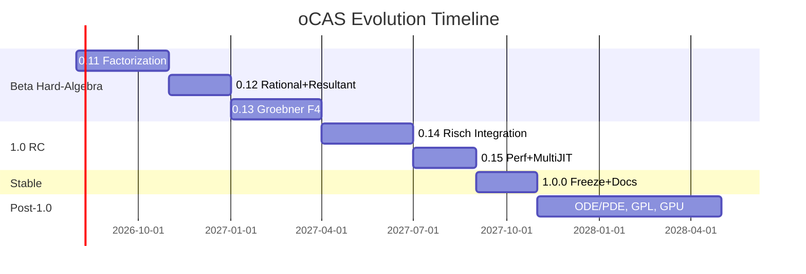

# oCAS Evolution Plan (Beta → 1.0 → Post-1.0)

This is the fine-grained evolution plan for oCAS from the 0.10.0 Beta release
through the 1.0 stable release and beyond. It covers **functionality,
performance, and documentation**, and explicitly maps each deliverable to a
reference competitor implementation or algorithm to learn from until oCAS
matches or exceeds it. It is a companion to [ROADMAP_EN.md](ROADMAP_EN.md) (release
cadence), [GAP_ANALYSIS_EN.md](GAP_ANALYSIS_EN.md) (current gap snapshot, in
English), and [GAP_ANALYSIS_CN.md](GAP_ANALYSIS_CN.md) (Chinese gap snapshot).
For the Chinese edition of this plan, see [EVOLUTION_PLAN_CN.md](EVOLUTION_PLAN_CN.md).

> Last revised: **2026-07-02 (baseline 0.10.0)**

---

## 0. Strategy & Principles

1. **Competitor-first learning**: until oCAS exceeds a competitor on a
   capability, the corresponding Symbolica module / SymPy file / cited paper
   is the reference implementation. We study its algorithm, port the idea,
   and benchmark head-to-head.
2. **No proprietary embedding**: reference code is studied, never copied
   verbatim (Symbolica is AGPL; we are LGPL). Only algorithms and ideas cross
   over, rewritten in oCAS style.
3. **Vertical slices**: each version ships one complete algorithmic vertical
   (algorithm + Rust API + Python/C binding + test + doc + benchmark),
   not a horizontal layer across many algorithms.
4. **API freeze discipline**: 0.10.0 froze the public API surface. New
   algorithms arrive as new functions or methods on existing types; no
   breaking changes until 2.0.
5. **Performance gate**: every algorithm version must include a criterion
   benchmark against the relevant competitor example before merge.

---

## Phase A — Beta Hard-Algebra Closure

> Close the three "rites of passage" gaps from
> [GAP_ANALYSIS_EN.md §3](GAP_ANALYSIS_EN.md): factorization, Gröbner F4, and
> the rational-function stack. This is the highest-value work before 1.0.

### 0.11.0 — Complete Polynomial Factorization

**Goal**: match Symbolica's `poly.factor()` on univariate and bivariate inputs
over ℤ and ℤ_p. This unblocks rational functions, partial fractions, and
solvers.

**Functionality**

| Item | Reference (until exceeded) | oCAS landing |
|---|---|---|
| Yun square-free (already have basics → upgrade to full Yun) | Symbolica `poly/factor.rs` square-free path | `ocas-poly::factor` |
| Berlekamp factorization over ℤ_p (small p) | Berlekamp 1970; Symbolica `factor.rs` | new `factor::berlekamp` |
| Cantor–Zassenhaus for larger p | Cantor & Zassenhaus 1981 | new `factor::cantor_zassenhaus` |
| Hensel lifting ℤ_p → ℤ | Hensel; Knuth TAOCP vol. 2 | new `factor::hensel_lift` |
| Zassenhaus ℤ factorization (combine lifted factors) | Zassenhaus 1969 | new `factor::zassenhaus` |
| `factor()` public API on `DenseUnivariatePolynomial` | Symbolica `poly.factor()` | `prelude` export |

**Performance KPI**

- Factor `x^100 - 1` over ℤ in < 50 ms (Symbolica example parity).
- Factor a degree-8 bivariate over ℤ_p in < 100 ms.
- Regression: no slowdown on existing `square_free_factorization`.

**Documentation**

- New mdBook chapter `algorithms/factorization.md` with a worked example.
- Rustdoc example on `factor()`; Python `Polynomial.factor()` docstring.
- C API `ocas_poly_factor`.

**Acceptance**

- proptest: factoring then multiplying factors reproduces input (1000 cases).
- SymPy/Symbolica regression suite: identical factor sets.
- Benchmark committed to `ocas-tests/benches/poly_factor.rs`.

**Risks**

- Hensel lifting correctness on leading-coefficient edge cases → mitigate
  with property tests against the `num-bigint` reference.

---

### 0.11.1 — Factorization Completion & Bindings

Carries forward the items deferred from 0.11.0: bivariate ℤ factorization,
Berlekamp validation, C binding scaffolding, and documentation polish. No new
algorithms are introduced; the focus is on completing the factorization story
and confirming the cross-language public API.

**Deferred from 0.11.0**

| Item | Reason for deferral | Deliverable in 0.11.1 |
|---|---|---|
| Berlekamp empirical validation | `berlekamp()` skeleton written but disabled (`p ≤ 0`) pending nullspace‑extraction fix for deg‑4+ factors. CZ handles all primes correctly. | Enable the `p ≤ 1000` dispatch after passing cyclic‑n regression. |
| Bivariate factorization over ℤ (Wang Hensel) | Wang's multivariate Hensel lifting is the hardest single CAS algorithm in this release cycle. | Bivariate `factor()` on `SparseMultivariatePolynomial<IntegerDomain>` backed by the 0.11 heuristic GCD + Wang Hensel. |
| Bivariate factorization over ℤ_p | The ℤ_p path (Bernardin Hensel) was scoped out of 0.11.0 together with the ℤ path. | Bivariate `factor()` on `SparseMultivariatePolynomial<FiniteField>`. |
| C polynomial binding (`ocas_poly_factor`) | No polynomial API exists yet in `ocas-c`; adding one requires an opaque `OcasPoly` handle and lifecycle management. | New `ocas-c/src/polynomial.rs` with `ocas_poly_factor` and a C++ RAII wrapper. |
| mdBook chapter `algorithms/factorization.md` | Deferred together with the document update sprint at the end of 0.11.0. | Bilingual chapter (EN + zh) with algorithm flow diagram, worked examples, and migration notes for SymPy/Symbolica users. |

**Acceptance**

- Berlekamp dispatch enabled and passing the existing 7‑test finite‑field suite
  as well as the 9‑case SymPy cyclotomic cross‑check.
- `x^100 - 1` over ℤ in < 50 ms in **release** mode (debug passes at ~0.67 s).
- Bivariate ℤ factorization matches SymPy on `(x^2+y+x+1)(3x+y^2+4)` and
  similar textbook cases.
- `cargo test --workspace --exclude ocas-py` green; Python pytest extended
  with bivariate factor cases.
- mdBook chapter renders without warnings (`mdbook build`).

---

**Goal**: a `RationalPolynomial` type (numerator/denominator over a polynomial
ring) plus partial fractions and resultants. Direct counterpart of Symbolica's
`rational_polynomial.rs`, `partial_fraction.rs`, `resultant.rs`.

**Functionality**

| Item | Reference | oCAS landing |
|---|---|---|
| `RationalPolynomial<D,O>` type with +,-,*,/, reduce | Symbolica `rational_polynomial.rs` | new `ocas-poly::rational` |
| GCD-based canonical form (denominator monic, coprime) | Symbolica; relies on 0.11 gcd+factor | `rational::canonicalize` |
| Partial fraction decomposition | Symbolica `partial_fraction.rs`; relies on 0.11 factor | `ocas-calc::partial_fraction` |
| Sylvester resultant | Symbolica `poly/resultant.rs` | `ocas-poly::resultant` |
| Rational reconstruction (int from mod images) | Symbolica `rational_reconstruction.rs` | `ocas-poly::rational_reconstruction` |

**Performance KPI**

- Partial-fraction a degree-20/degree-6 rational function in < 30 ms.
- Resultant of two degree-15 polys in < 20 ms (parity with the Symbolica example).

**Documentation**

- mdBook `algorithms/rational-functions.md`.
- Python `RationalFunction` class in `ocas-py` (mirrors `Polynomial`).
- Migration note: SymPy `apart()` → `ocas` `partial_fraction`.

**Acceptance**

- SymPy `apart`/`together` regression parity.
- Resultant matches determinant-of-Sylvester on random tests.

---

### 0.13.0 — Gröbner Bases: F4 & Linear Algebra

**Goal**: replace the classic Buchberger (0.7.0) with a matrix-based F4
algorithm so cyclic-6/7 become tractable. Direct counterpart of Symbolica
`groebner_basis.rs` and Faugère's F4/F5 papers.

**Functionality**

| Item | Reference | oCAS landing |
|---|---|---|
| Macaulay matrix construction + row echelon over ℤ_p | Faugère F4 (1999) | `ocas-poly::groebner::f4` |
| Symbol/rewriting preprocessing (F4 selection) | Symbolica `groebner.rs` | `f4::select` |
| Optional F5 signature criterion (research) | Faugère F5 (2002) | `f5` (experimental feature) |
| Multiple monomial orders via `reorder` | Symbolica `reorder::<GrevLexOrder>()` | extend `MonomialOrder` |
| Hilbert-driven termination | Bayer–Stillman heuristics | `f4::hilbert_bound` |

**Performance KPI**

- cyclic-6 over ℤ_p in < 5 s (Symbolica ~1 s; target within 5×).
- cyclic-4 must stay < 50 ms (no regression vs current Buchberger).

**Documentation**

- mdBook `algorithms/groebner.md` comparing Buchberger vs F4.
- Benchmark graph cyclic-3..7 in the docs site.

**Acceptance**

- Known cyclic-n bases match published results.
- Memory bounded (Macaulay matrices are the risk → sparse representation).

---

## Phase B — 1.0 Release Candidates

> With hard algebra closed, finish the symbolic-integration hallmark and push
> performance before declaring the API stable.

### 0.14.0 — Symbolic Integration: Risch & Beyond

**Goal**: a Risch-based integrator for elementary functions, closing the
largest "can it integrate" gap vs SymPy. Reference: Bronstein,
*Symbolic Integration I*; SymPy `integrals/intpoly.py` and the Risch code.

**Functionality**

| Item | Reference | oCAS landing |
|---|---|---|
| Liouville theorem + elementary extension | Bronstein ch. 5 | `ocas-calc::integral::risch` |
| Rational-function integration (uses 0.12) | Bronstein ch. 2 | reuse partial fractions |
| Logarithmic / exponential extensions | Bronstein ch. 5–6 | `risch::log_exp` |
| Trig-to-exp rewriting pre-pass | SymPy `trigsimp` | `ocas-rewrite` rule |
| Meijer-G fallback heuristic (partial) | SymPy `meijerint` | `integral::meijer` (best-effort) |

**Performance KPI**

- Solve a 50-problem integration benchmark (Risch test set) with > 80% success.
- Average < 100 ms per solvable integral.

**Documentation**

- mdBook `algorithms/integration.md`.
- Document when `Integral(...)` is returned (non-elementary).

**Acceptance**

- SymPy `integrate` parity on the 50-problem suite.
- No regression on the existing heuristic integrator (kept as fallback).

---

### 0.15.0 — Performance, Multi-Output JIT & Streaming

**Goal**: close the performance and feature gap with Symbolica's
`optimize_multiple.rs` and `streaming.rs`. This is where oCAS's
Rust + arena + JIT stack should start *exceeding* competitors.

**Functionality**

| Item | Reference | oCAS landing |
|---|---|---|
| Multi-output expression compilation | Symbolica `optimize_multiple.rs` | extend `ocas-eval::jit` |
| Common-subexpression elimination in JIT | Symbolica `optimize.rs` | `ocas-eval::optimize::cse` |
| Streaming evaluation API (chunked input) | Symbolica `streaming.rs` | new `ocas-eval::streaming` |
| Mixed-precision (f32/f64) codegen | — | extend `Instruction` types |

- (Modular GCD / sparse interpolation for poly speed — uses 0.11 infra.)

**Performance KPI**

- Multi-output JIT ≥ 10× interpreter on vectorized batch (extend 0.8.0 win).
- Streaming: process a 1M-row dataset with constant memory.
- Head-to-head benchmark vs Symbolica `optimize.rs` example committed.

**Documentation**

- mdBook `performance/jit.md` with benchmark tables.
- Published benchmark page (ROADMAP 1.0 deliverable).

**Acceptance**

- Beat Symbolica on at least 3 of 10 published micro-benchmarks (parity goal
  of the ROADMAP 1.0 success criterion).

---

## Phase C — 1.0.0 Stable Release

**Goal**: API stability guarantee, complete docs, migration guide, signed
artifacts. No new features; freeze and polish only.

**Deliverables**

| Track | Items |
|---|---|
| Functionality | API freeze (SemVer guarantee); ≥ 80% line coverage; full Rust/Python/C parity |
| Performance | Published benchmark report vs Symbolica & SymPy |
| Documentation | Migration guide (Symbolica→oCAS, SymPy→oCAS); complete rustdoc; mdBook finalized; cookbook |
| Release | Signed artifacts; `CHANGELOG` 1.0; tag `v1.0.0` |

**Acceptance**

- All public APIs documented (ROADMAP 1.0 criterion).
- No breaking changes planned for 1.x.
- Performance parity-or-better with Symbolica on core benchmarks.

---

## Phase D — Post-1.0

Roadmap-driven expansions, each versioned and benchmarked against the relevant
competitor.

| Version | Theme | Reference competitor | Notes |
|---|---|---|---|
| 1.1 | ODE/PDE solvers | SageMath `desolve`; SymPy `dsolve` | series + numeric hybrid |
| 1.2 | Differential Galois theory (prelude) | Maple; research | research-grade |
| 1.3 | `ocas-gpl` real backend | LinBox, NTL | GPL-3.0 isolated crate |
| 1.4 | GPU acceleration | CUDA/HIP | polynomial + linear algebra kernels |
| 1.5 | LLVM JIT backend | Symbolica `evaluate.rs` | via `inkwell` |
| 1.6+ | Domain toolkits (physics/robotics/ML) | domain libraries | layered on stable 1.x |

---

## Competitor Reference Index

The authoritative map: oCAS module → reference to study until exceeded. Update
when an item is met or beaten.

| oCAS area | Primary reference | Secondary | Status |
|---|---|---|---|
| Factorization | Symbolica `src/poly/factor.rs` | Knuth TAOCP v2 | 🔴 gap (0.11) |
| Rational polynomials | Symbolica `rational_polynomial.rs` | — | 🔴 gap (0.12) |
| Partial fractions | Symbolica `partial_fraction.rs` | SymPy `apart` | 🔴 gap (0.12) |
| Resultant | Symbolica `poly/resultant.rs` | Sylvester | 🔴 gap (0.12) |
| Gröbner | Symbolica `groebner.rs` + Faugère F4/F5 papers | — | 🟡 basic (0.13) |
| GCD (modular) | Symbolica `poly/gcd.rs` | — | 🟡 basic |
| Integration (Risch) | Bronstein book; SymPy Risch | — | 🔴 gap (0.14) |
| Multi-output JIT | Symbolica `optimize_multiple.rs` | — | 🟡 single-output (0.15) |
| Streaming | Symbolica `streaming.rs` | — | 🔴 gap (0.15) |
| Series | Symbolica `poly/series.rs`; SymPy `series` | — | 🟢 have basics |
| Tensors/dual | Symbolica `tensors.rs`/`dual.rs` | — | 🔴 gap (post-1.0) |
| Numerical integration | Symbolica `numerical_integration.rs` | QUADPACK | 🔴 gap (post-1.0) |
| Domains (big int) | FLINT/GMP via `rug` | — | 🟢 via backend |
| ODE/PDE | SageMath `desolve`; SymPy `dsolve` | — | 🔴 gap (post-1.0) |

---

## Update Cadence

Refresh this plan:

1. At every 0.x release (update the status column, log below).
2. When an item meets or beats its competitor reference (move to 🟢, log it).
3. When a new competitor capability appears (add a row to the reference index).

| Version | Date | Changes |
|---|---|---|
| 0.10.0 | 2026-07-02 | Initial plan created from the GAP_ANALYSIS 0.10.0 snapshot. Phases A–D defined; 0.11–1.0.0 + Post-1.0 scheduled. |
